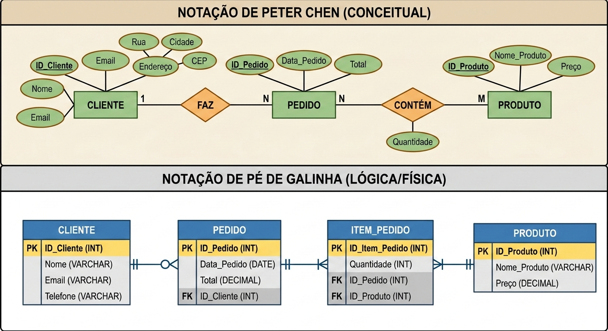

# Aula 01

## Bancos de Dados Relacionais - Revisão[^1]

[^1]: Traduzido e adaptado de https://grokipedia.com/page/Relational_database

Um Banco de Dados Relacional é um tipo de Sistema de Gerenciamento de Banco de Dados (**SGBD**) que organiza os dados em relações, as quais consistem em estruturas tabulares contendo linhas (**tuplas**) e colunas (**atributos**), aderindo ao modelo relacional introduzido por [Edgar F. Codd](https://grokipedia.com/page/Edgar_F._Codd) em 1970. Esse modelo representa os dados como conjuntos de relações onde cada relação é composta por **entidades** e suas **associações** através de atributos compartilhados, o que permite o armazenamento, recuperação e manipulação eficientes sem depender de detalhes de armazenamento físico.

Os princípios fundamentais de bancos de dados relacionais enfatizam a [**independência dos dados**](https://grokipedia.com/page/Data_independence), [**integridade**](https://grokipedia.com/page/Data_integrity) e **consulta declarativa**. 

- A independência lógica dos dados garante que mudanças no esquema conceitual, como a adição de novas relações, não afetam programas que estejam usando o banco. A independência física dos dados protege os usuários contra alterações nas estruturas de armazenamento ou nos métodos de acesso.
- A integridade dos dados é garantida por meio de restrições como **chaves primárias**, as quais identificam **exclusivamente** cada tupla em uma relação, e **regras de integridade referencial**, as quais mantêm a consistência através das relações.
- As consultas consistem em operações sobre conjuntos como **seleção**, **projeção** e **junção**, as quais tratam os dados como conjuntos matemáticos, o que permite aos usuários especificar quais dados são necessários sem a necessidade de detalhar como recuperá-los.

### Transações

Uma **transação** é definida como um **[unidade de trabalho](https://grokipedia.com/page/Unit_of_work) lógica** consistindo em uma sequência de operações, como leitura e escrita, as quais são executadas como uma entidade única e indivisível de forma a manter a integridade dos dados.

As transações normalmente começam com uma declaração `BEGIN`, seguida de uma série de operações de banco de dados, sendo concluídas com um `COMMIT`, para aplicar permanentemente as mudanças, ou um `ROLLBACK` para desfazê-las, o que garante que falhas parciais não deixem o banco de dados em um estado inconsistente. Esse mecanismo permite que operações complexas, como a transferência de fundos entre contas, sejam tratadas **atomicamente**, prevenindo situações problemáticas caso haja falha em alguma operação.

### ACID

The reliability of transactions in relational databases is ensured through the ACID properties (atomicity, consistency, isolation, durability), a set of guarantees that ensure reliable transaction processing; the acronym was coined by Theo Härder and Andreas Reuter in 1983.[67] Atomicity requires that a transaction is executed completely or not at all; if any operation fails, the entire transaction is rolled back, restoring the database to its pre-transaction state. Consistency mandates that a transaction brings the database from one valid state to another, preserving integrity constraints such as primary keys, foreign keys, and check constraints after completion. Isolation ensures that concurrent transactions do not interfere with each other, making each transaction appear to execute in isolation even when running in parallel. Durability guarantees that once a transaction is committed, its effects are permanently stored, surviving subsequent system failures through techniques like write-ahead logging.

A confiabilidade das transações em um banco de dados relacional é garantido atraveás das propriedades **ACID**:

- **A**tomicidade: requer que uma transação seja executada por completo; se alguma operação falhar, a transação inteira é revertida, levando o banco de dados para seu estado anterior à transação.
- **C**onsistência: exige que uma transação leve o banco de dados de um estado válido para outro, preservando as restrições de integridade, como chaves primárias, chaves estrangeiras e restrições de verificação, após a conclusão.
- **I**solamento: garante que as transações simultâneas não interfiram umas com as outras, fazendo com que cada transação pareça ser executada isoladamente, mesmo quando em paralelo.
- **D**urabilidade: garante que, uma vez confirmada uma transação, seus efeitos sejam armazenados permanentemente, sobrevivendo a falhas subsequentes do sistema.

### Domínios e Esquemas

Um domínio representa o conjunto de valores atômicos permitidos a partir dos quais os valores de um atributo específico são extraídos, garantindo a consistência dos dados e a segurança de tipos entre as relações. Esse conceito, introduzido por E.F. Codd, define domínios como conjuntos finitos ou infinitos de valores, como o domínio dos inteiros para atributos numéricos ou o domínio das strings para atributos textuais, impedindo entradas inválidas, como valores não numéricos em um campo de idade. Por exemplo, o domínio para o atributo de idade de um funcionário pode ser restrito a inteiros entre 18 e 65, limitando os valores a esse intervalo e excluindo dados estranhos, como números negativos ou decimais.

O esquema (*scheme*) define a estrutura básica, compreendendo esquemas de relação que especificam os atributos de cada tabela juntamente com seus domínios associados, e o esquema geral do banco de dados como a coleção integrada desses esquemas de relação, incluindo definições para **visões** (*views*), **índices** e **restrições** (*constraints*), quando aplicável. Os **esquemas de relação** servem, portanto, como descritores fundamentais, nomeando a tabela e mapeando cada atributo ao seu domínio, enquanto o **esquema do banco de dados** fornece uma visão holística da organização entre as tabelas sem se aprofundar nas instâncias de dados. Essa separação permite um design abstrato independente do armazenamento físico, facilitando a manutenção e a escalabilidade em sistemas de grande porte.

### Modelo Entidade-Relacionamento (MER)

O **Modelo Entidade-Relacionamento** (MER) é a base do design de bancos de dados relacionais. Ele serve como uma planta arquitetônica, descrevendo a estrutura lógica dos dados de forma independente de como eles serão implementados fisicamente. Seus dois principais componentes são as **entidades** e seus **relacionamentos**.

#### Entidades

Representam objetos do mundo real (ex: Cliente, Produto) ou conceitos abstratos (ex: Venda). As entidades têm suas características descritas através de diferentes tipos de **atributos**:

- **Atributo Simples**: Indivisível (ex: CPF, Idade).
- **Atributo Composto**: Pode ser dividido em partes menores (ex: Endereço, que se divide em Rua, Número, CEP).
- **Atributo Monovalorado**: Possui apenas um valor para uma instância (ex: Data de Nascimento).
- **Atributo Multivalorado**: Pode ter vários valores (ex: Telefone, Habilidades). Geralmente representado por uma elipse dupla.
- **Atributo Derivado**: Seu valor depende de outro atributo (ex: Idade, que é calculada a partir da Data de Nascimento). Representado por uma elipse tracejada.
- **Atributo Chave (Identificador)**: Identifica unicamente uma instância da entidade (ex: ID_Cliente). Texto sublinhado.

#### Relacionamentos

Descrevem como as entidades interagem entre si (ex: Cliente compra Produto). Podem classificados de acordo com o **grau** (número de entidades envolvidas) e de acordo com sua **cardinalidade** (número de instâncias de uma entidade que podem estar associadas a instâncias de outra entidade).

De acordo com o grau:

- **Unário (Auto-relacionamento)**: Uma entidade se relaciona com ela mesma (ex: Empregado gerencia Empregado).
- **Binário**: Envolve duas entidades (o mais comum).
- **Ternário**: Envolve três entidades simultaneamente (ex: Fornecedor, Peça e Projeto).

De acordo com a cardinalidade:

- **1:1 (Um para Um)**: Cada registro de A se relaciona com apenas um de B.
- **1:N (Um para Muitos)**: Um registro de A pode se relacionar com vários de B.
- **N:N (Muitos para Muitos)**: Vários registros de A se relacionam com vários de B.

### Diagrama de Entidade-Relacionamento

O Diagrama de Entidade-Relacionamento (**DER**) é uma forma visual de representar as entidades e seus respectivos relacionamentos. Existem duas notações bastante comuns: **Peter Chen** e **Pé de Galinha** (ou *Crow's foot*).

A Notação de Peter Chen é comumente associada à **fase conceitual**, pois foca na semântica. É excelente para discutir o modelo com pessoas que não são da área técnica, pois usa formas geométricas para separar claramente o que é objeto, ação e característica.

A Notação de Pé de Galinha é mais associada à **fase lógica**. É mais "limpa" para diagramas complexos porque os atributos ficam dentro dos retângulos e a cardinalidade é representada por símbolos nas extremidades das linhas.

Comparativo das estruturas:

