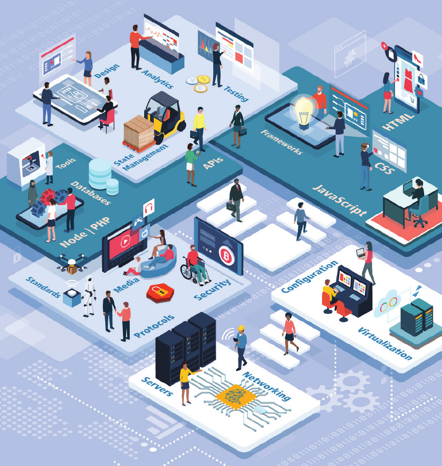

# Aula 01

## Breve histórico da Internet

### 1961 - 1972: Desenvolvimento da Comutação de Pacotes

- **Década de 60:** Início do Programa de Ciência da Computação na **ARPA** (*Advanced Research Projects Agency* - Agência de Projetos de Pesquisa Avançada), órgão do Departamento de Defesa dos Estados Unidos.
  - **1967:** A ARPA apresentou suas ideias para a **Rede da Agência de Projetos de Pesquisa Avançados** ([ARPANET](https://en.wikipedia.org/wiki/ARPANET) - *ARPA NETwork*). A ideia era que cada computador (não necessariamente do mesmo fabricante) seria ligado a um computador especializado, chamado de **Processador de Mensagens de Interface** (IMP - *Interface Message Processor*). Os IMPs seriam ligados uns aos outros.
  - **Maio de 1969:** Foi instalado o primeiro roteador de pacotes na UCLA (Universidade da Califórnia em Los Angeles). Pouco tempo depois foram instalados três roteadores de pacotes adicionais no *Stanford Research Institute* (SRI), na Universidade da Califórnia em Santa Bárbara e na Universidade de Utah.

### 1972 - 1980: Redes proprietárias e interligação de redes

Além da ARPANET (que era uma rede fechada) outras redes foram surgindo:

- **ALOHA**net (no Havaí), utilizando microondas.
- Redes de pacote por satélite ([RFC 829](https://www.rfc-editor.org/info/rfc829)), e por rádio, da DARPA.
- [Telenet](https://en.wikipedia.org/wiki/Telenet), rede comercial de comutação de pacotes da [BBN](https://en.wikipedia.org/wiki/RTX_BBN_Technologies).
- [CYCLADES](https://en.wikipedia.org/wiki/CYCLADES), na França.
- SNA da IBM.

A DARPA (*Defense Advanced Research Projects Agency* - Agência de de Projetos de Pesquisa Avançada de Defesa), foi pioneira na interconexão de redes, ou redes de redes. O termo cunhado naquele tempo: *internetting*. Eles tiveram a ideia de um dispositivo chamado ***gateway***** para atuar como o hardware intermediário na transferência de dados de uma rede para outra.

Os princı́pios de arquitetura da *internetting* foram incorporadas ao TCP (*Transmission Control Protocol*). [RFC 761](https://datatracker.ietf.org/doc/html/rfc761), primeiro RFC do TCP.

### 1980 - 1990: Proliferação de redes

- Ao fim da década de 70, cerca de 200 máquinas estavam conectadas à ARPANET. 
- Ao fim da década de 80 a rede alcançou a marca de 100 mil! 
- Muito esforço foi feito para interligar universidades, e em **01 Janeiro de 1983** o TCP/IP foi oficialmente adotado como o novo padrão de protocolo das máquinas na rede ARPANET. O **DNS** (*Domain Name System*) foi desenvolvido nesse perı́odo também.
- Na França a Rede Minitel teve bastante sucesso e incentivo governamental.

### Década de 1990: A explosão da Internet

- A ARPANET deixou de existir, mas tivemos o surgimento da ***World Wide Web*** (WWW), criada no CERN (*European Center for Nuclear Physics*) pelo Físico e Cientista da Computação [Tim Berners-Lee](https://pt.wikipedia.org/wiki/Tim_Berners-Lee) entre 1989 e 1991.
- **A partir de 1996:** guerra entre os navegadores Netscape e Internet Explorer ([TecMundo: Guerra dos Navegadores](https://www.youtube.com/watch?v=3yTDZTKwj-o)). Além disso, milhares de novas empresas foram surgindo, propondo os mais diversos serviços pela Web. Os principais: correio eletrônico (e-mail), serviço de mensagem instantânea e compartilhamento *peer-to-peer* (**P2P**).

### Década de 2000

- **2002:** Estourou a [Bolha da Internet](https://pt.wikipedia.org/wiki/Bolha_da_Internet).
- Países emergentes, como o Brasil, tiveram amplo aumento de sua infraestrutura.
  - Início da implementação da **banda larga**, começando com velocidades entre 256 kbps e 512 kbps.
- **2004:** Início da popularização de redes sociais (saudoso Orkut), e também do Google.
- **2005:** Início do YouTube.
- **2006:** *Amazon Web Services* (AWS) lança o Amazon S3 (*Simple Storage Service*).
- **2007:** Implantação da TV Digital no Brasil. 
  - Lançamento do iPhone: Internet em dispositivos móveis se expande.
  - Netflix começa com o *streaming*.
- **2008:** Serviços de armazenamento em nuvem *consumer-friendly* (Dropbox).

### Década de 2010

- **2010:** Banda Larga (no Brasil) já alcançava velocidades de 30 Mbps.
- **2011:** Popularização de serviços de *streamings* (Netflix passa a operar no Brasil).
- **2012:** Facebook passa a ser a rede social dominante.
  - *Deep Learning* se populariza: início de vários sistemas e serviços de processamento avançado de imagens e vídeos.
- Velocidade da Internet passa dos 100 Mbps.
- Serviços de mensagem (WhatsApp e similares) se popularizam.
- Serviço de armazenamento em nuvem massivos (Google Drive, iCloud, etc.).
- **2017:** [*Attention Is All You Need*](https://proceedings.neurips.cc/paper_files/paper/2017/file/3f5ee243547dee91fbd053c1c4a845aa-Paper.pdf), artigo onde é proposta uma nova arquitetura de *Deep Learning* chamada de *Transformer* - a base para as IAs generativas modernas.

### Década de 2020

- **2020:** Pandemia obriga bilhões de pessoas a passarem mais tempo em casa, o que gera enorme demanda e pressão sobre serviços online.
- **2022:** Lançamento do ChatGPT (*Chat Generative Pre-trained Transformer*).
- Advento de diversas outras IAs generativas.
- Explosão da demanda de *data-centers*, e surgimento de *mega data-centers*.

## O *back end* e seu lugar no ecossistema web

<figure style="text-align:center;">
    
    <figcaption>O ecossistema de desenvolvimento web (fonte: CONNOLY; HOAR, 2022)</figcaption>
</figure>

Resumidamente, o *back end* é o lado do servidor (*server-side*) de uma aplicação. Algumas de suas principais funções são:

1. **Interligar o *front end* e o banco de dados**.
2. **Gerenciar os dados e a lógica de negócios**.
3. **Lidar com autenticação e autorização**.
4. **Comunicar-se com serviços de terceiros - permissões e integrações de APIs**.

Mais recentemente passou a fazer parte dessa *stack* o gerenciamento da comunicação entre agentes de IA e seus serviços (**MCP** - *Model Context Protocol*). Isso se encaixa em qual dos tópicos acima?

### Componentes essenciais do *back end*

1. **Servidores** - aqui devem ser gerenciadas as requisições e respostas HTTP/HTTPS, e portas da Camada de Transporte.
2. **Bancos de Dados** - armazenamento e gerenciamento dos dados usados pela aplicação.
3. **APIs** - para comunicação entre diversos sitemas.
4. **Frameworks** e **bibliotecas** - fornecem ferramentas e componentes pré-prontos para a simplificação do desenvolvimento no *back end*. Alguns dos mais populares, por linguagem:
   1. C#/.NET: ASP.NET Core.
   2. Java: Spring [Boot].
   3. JavaScript/Node.js: Express.js.
   4. PHP: Laravel.
   5. Python: Django, FastAPI e Flask.
   6. Ruby: Ruby on Rails.

### Conceitos fundamentais

A seguir uma lista de alguns dos conceitos fundamentais a serem aprendidos para o desenvolvimento *back end* (esses conceitos não necessariamente são aplicados em todos os casos):

- **Servidores** e **hospedagem**
  - Aqui fica a maior parte dos conteúdos de desenvolvimento *back end*.
  - **CDN** (*Content Delivery Network*)
    - Replica arquivos estáticos em servidores espalhados.
  - O *loop* de funcionamento (*data flow*) de um servidor:
    1. *Listen* - portas 80 ou 443.
    2. *Receive* - com a chegada de uma requisição o servidor vai ler o método, a URL, cabeçalhos e corpo.
    3. *Route* - a partir da leitura anterior, o servidor vai definir qual parte do código (*handler*) vai lidar com a requisição.
    4. *Middleware* - uma camada extra intermediária que funciona como *pipeline* modular para a organização de tarefas como validações, autenticação e/ou registro (*logging*).
    5. *Process* - a execução da lógica de negócios, incluindo leitura e escrita no banco de dados.
    6. *Respond* - o servidor monta a resposta HTTP e envia de volta.
    7. *Repeat* - volta ao passo 1.
- **Bancos de Dados**
  - ACID e transações.
  - Bancos relacionais e NoSQL, incluindo os vetorizados.
- **APIs**
  - Alguns dos principais tipos de API são REST, JSON e GraphQL.
- **Segurança**, **autenticação** e **autorização**
  - Melhores práticas.
  - Tratamento de erros.
  - *Cross-Site Scripting* (XSS), *Cross-Site Request Forgery* (CSRF), *Rate Limiting*, *HTTPS*, *OWASP*.
  - *JSON Web Tokens* (JWT), OAuth, *Single Sign-On* (SSO), etc.
  - *Role-Based Access Control* (RBAC).
- **Otimização de desempenho**
  - ***Caching***.
  - ***Load Balancing***.
  - ***Message Queues*** (Kafka, RabbitMQ).
  - ***Database Indexing***.
  - Domínio sobre os conceitos de processos e *threads*.
- ***Reverse Proxy***
  - Faz parte tanto de segurança quanto otimização.
  - Consiste em um servidor intermediário entre a aplicação e o(s) servidor(es) real(is). É utilizado para:
    - Segurança, ao ocultar o IP do servidor real.
    - ***SSL Termination***, que lida com a criptografia do HTTPS.
    - ***Load Balancing***.
    - ***Caching***.
    - **Compressão** de dados.
- **Arquiteturas de Sistemas**
  - Monolítica.
  - Distribuída.
  - Em camadas.
  - *Pipeline*.
  - Microkernel.
  - Baseada em serviço (*service-based*).
  - Dirigida a eventos (*event-driven*).
  - *Space-based*.
  - *Orchestration-Driven Service-Oriented*.
  - Microsserviços.
- **Conteinerização**
  - Docker, Kubernetes.
- **Observability**
  - Técnicas e ferramentas de *logging*, métricas e rastreamento.
- **DevOps**
  - **CI/CD** (*Continuous Integration/Continuous Deployment*) a partir de *pipelines* permite o teste e *deploy* automáticos.
  - Ciclos de entrega (*release*) mais curtos com *downtime* mínimo.