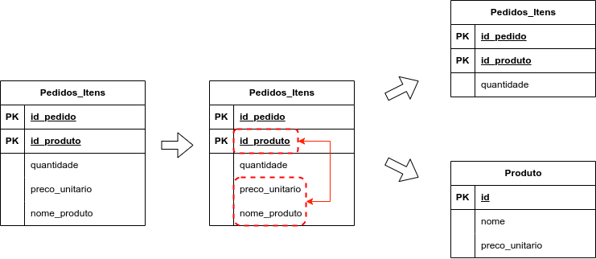
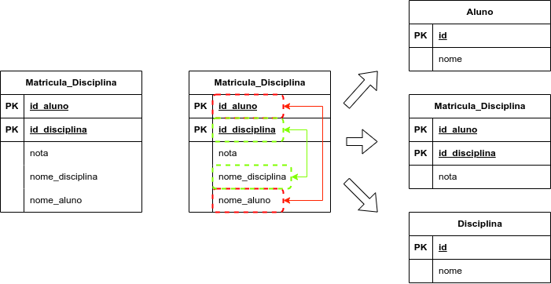
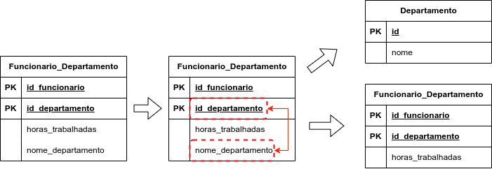
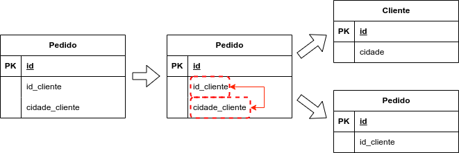

# Aula 02

## Normalização

> **Normalização** é um procedimento que examina e **simplifica os atributos** de uma entidade com o objetivo de **evitar anomalias** que possam ocorrer na inclusão, na exclusão ou na alternação de uma ocorrência especı́fica em uma entidade.

Anomalias:

1. **Anomalia de Inserção**: Impedir que você seja incapaz de inserir um dado porque falta outra informação (ex: não conseguir cadastrar um curso porque ainda não há alunos).
2. **Anomalia de Exclusão**: Evitar que, ao deletar um registro, informações importantes e não relacionadas sejam perdidas.
3. **Anomalia de Alteração**: Garantir que, ao mudar um dado (como o preço de um produto), você não precise atualizar centenas de linhas manualmente, correndo o risco de deixar dados inconsistentes.

Ao longo do tempo (a partir de 1970 até 2003) foram propostas **10 formas normais**. Entretanto, um banco de dados relacional que tenha alcançado os critérios da **Terceira Forma Normal**, já pode ser considerado normalizado, pois estará livre das anomalias de adição, edição e inclusão de dados.

As formas normais:

- Primeira Forma Normal - **1FN**.
- Segunda Forma Normal - **2FN**.
- Terceira Forma Normal - **3FN**.
- Forma Normal de Chave Elementar - **FNCE**.
- Forma Normal de Boyce-Codd - **FNBC**.
- Quarta Forma Normal - **4FN**.
- Forma Normal de Tupla Essencial - **FNTE**.
- Quinta Forma Normal - **5FN**.
- Forma Normal de Chave de Domı́nio - **FNCD**.
- Sexta Forma Normal - **6FN**.

### Primeira Forma Normal

A **1FN** estabelece que uma entidade está em conformidade se:

- Não possui atributos multivalorados ou grupos repetitivos, ou seja, os valores dos atributos devem ser **atômicos** (ou **indivisíveis**).
- Todos os atributos estão no formato atômico, ou seja, não são compostos por múltiplas partes.
- Existe uma chave primária que identifica apenas uma ocorrência.
- As ocorrências da entidade são todas distintas entre si.

Para normalizar é necessário:

1. **Identificar** a(s) **coluna**(s) que possui(em) dados multivalorados e compostos, e **removê-la**(s).
2. **Construir outra tabela** (ou seja, outra entidade) com o atributo identificado e removido e, em seguida, estabelecendo uma relação entre as duas entidades.

#### Exemplo 1

- **Antes**: `CLIENTE(clienteID, nome, telefones)`
  | clienteID | nome | telefones |
  |---|---|---|
  | 1 | Fulano | 89 999998888, 89 988887777 |
  | 2 | Cicrano | 86 999887766, 86 988776655 |
- **Depois**: `CLIENTE(clienteID, nome)` **1:N** `TEL_CLIENTE(telID, clienteID_FK, numero)`
  | clienteID | nome |
  |---|---|
  | 1 | Fulano |
  | 2 | Cicrano |

  | telID | clienteID | numero |
  |---|---|---|
  | 1 | 1 | 89 999998888 |
  | 2 | 1 | 89 988887777 |
  | 3 | 2 | 86 999887766 |
  | 4 | 2 | 86 988776655 |

<figure style="text-align:center;">
  
  <figcaption>DER do Exemplo 1</figcaption>
</figure>

#### Exemplo 2

- **Antes**: `LOJA(lojaID, nome, endereco_completo)`
  | **lojaID** | **nome** | **endereco_completo** |
  |---|---|---|
  | 1 | Shopeecos | Rua A, bairro B, Picos, PI |
  | 2 | PicosExpress | Rua B, bairro C, Picos, PI |
- **Depois**: `LOJA(lojaID, nome, logradouro, bairro, cidade, uf)`
  | **lojaID** | **nome** | **logradouro** | **bairro** | **cidade** | **uf** |
  |---|---|---|---|---|---|
  | 1 | Shopeecos | Rua A | B | Picos | PI |
  | 2 | PicosExpress | Rua B | C | Picos | PI |

#### Exemplo 3

- **Antes**: `PEDIDO(pedidoID, data, itens)`
  | **pedidoID** | **data** | **itens** |
  |---|---|---|
  | 1 | 2026-03-11 | 1xProd. 1, 2xProd. 2, 1xProd. 3 |
  | 2 | 2026-03-12 | 2xProd. 1, 1xProd. 4, 3xProd. 5 |

- **Depois**: `PEDIDO(pedidoID, data)` **1:N** `ITEM_PEDIDO(itemID, pedidoID_FK, produtoID_FK, qtd)`
  | **pedidoID** | **data** |
  |---|---|
  | 1 | 2026-03-11 |
  | 2 | 2026-03-12 |

  | **itemID** | **pedidoID_FK** | **produtoID_FK** | **qtd** |
  |---|---|---|---|
  | 1 | 1 | 1 | 1 |
  | 2 | 1 | 2 | 2 |
  | 3 | 1 | 3 | 1 |
  | 4 | 2 | 1 | 2 |
  | 5 | 2 | 4 | 1 |
  | 6 | 2 | 5 | 3 |

### Segunda Forma Normal

Uma entidade está em conformidade com a Segunda Forma Normal (**2FN**) se:

- Estiver na 1FN.
- Todos os atributos não chave **dependem totalmente** da chave primária (PK).

Para normalizar é necessário:

- **Identificar** os **atributos** que não dependem totalmente da chave primária.
- **Construir nova(s) tabela(s)** para que os atributos dependam totalmente de suas chaves.

Exemplos:

    
    
    

### Terceira Forma Normal

Uma entidade está em conformidade com a Terceira Forma Normal (**3FN**) se:

- Estiver na 2FN.
- Não haja dependências transitivas (atributos não-chave dependendo de outros não-chave).

Para normalizar é necessário:

- **Identificar** os **atributos** que não dependem totalmente da chave primária.
- **Construir nova(s) tabela(s)** para que os atributos dependem somente de suas chaves.

Exemplos:

     
     
    

### Forma Normal de Boyce-Codd

Uma entidade está em conformidade com a Forma Normal de Boyce-Codd (**FNBC**) se:

- Estiver na 3FN.
- Para toda `dependência funcional` $X \rightarrow Y$, $X$ é `superchave`.
  - Isso significa que $X$ (também chamado de **determinante**) precisa ser uma `chave candidata` da tabela.

**Conceitos**:
- Dada uma relação $R$ e um conjunto de atributos $X, Y \subseteq R$, é dito que $X$ **determina funcionalmente** $Y (X \rightarrow Y)$ se cada valor de $X$ é associado com precisamente um valor de $Y$. Duas **tuplas**  que possuem os mesmos valores de $X$ necessariamente terão os mesmos valores de $Y$.
- `superchave`: qualquer **conjunto de atributos** que identifica exclusivamente uma tupla de uma.
- `chave candidata`: o conjunto com a menor quantidade de atributos necessários para identificar exclusivamente uma tupla.

Para normalizar é necessário:

- **Identificar** as **dependências funcionais** onde o **determinante** não é chave candidata.
- **Construir nova(s) tabela(s)** para que o(s) determinante(s) seja(m) chave candidata.

Exemplo: tabela `Matricula(EstudanteID, Disciplina, Professor)`

| **EstudanteID** | **Disciplina** | **Professor** |
|---|---|---|
| 1234 | SISTEMAS INTELIGENTES | ROMUERE SILVA |
| 1221 | PROGRAMAÇÃO PARA A WEB I | EVANDRO SILVA |
| 1234 | GERÊNCIA DE PROJETOS | EVANDRO SILVA |
| 1201 | ALGORITMOS E PROGRAMAÇÃO I | ALCILENE DE SOUSA |
| 1201 | LÓGICA PARA COMPUTAÇÃO | JOSÉ DENES ARAÚJO |

- **Chaves candidatas**: {`EstudanteID`, `Disciplina`} e {`EstudanteID`, `Professor`}

- **Dependências funcionais**
  - {`EstudanteID`, `Professor`} $\rightarrow$ `Disciplina`.
  - {`EstudanteID`, `Disciplina`} $\rightarrow$ `Professor`.
  - `Disciplina` $\rightarrow$ `Professor`
    - `Disciplina` **não é chave candidata**.

**Solução**:

- Tabela `Disciplina`
  | **Disciplina** (PK) | **Professor** |
  |---|---|
  | SISTEMAS INTELIGENTES | ROMUERE SILVA |
  | PROGRAMAÇÃO PARA A WEB I | EVANDRO SILVA |
  | GERÊNCIA DE PROJETOS | EVANDRO SILVA |
  | ALGORITMOS E PROGRAMAÇÃO I | ALCILENE DE SOUSA |
  | LÓGICA PARA COMPUTAÇÃO | JOSÉ DENES ARAÚJO |

- Tabela `Matricula`
  | **EstudanteID** (PK) | **Disciplina** (PK/FK) |
  |---|---|
  | 1234 | SISTEMAS INTELIGENTES |
  | 1221 | PROGRAMAÇÃO PARA A WEB I |
  | 1234 | GERÊNCIA DE PROJETOS |
  | 1201 | ALGORITMOS E PROGRAMAÇÃO I |
  | 1201 | LÓGICA PARA COMPUTAÇÃO |

### Quarta Forma Normal

Uma entidade está em conformidade com a Quarta Forma Normal (**4FN**) se:

- Estiver na FNBC.
- Não contiver **dependências multivaloradas não triviais**.

Exemplo (entidade `Funcionario`):

| **FuncionarioID** | **Habilidade** | **Idioma** |
|---|---|---|
| 1 | Jiujitsu | Português |
| 1 | Aikido | Japonês |
| 2 | Karate | Inglês |
| 3 | Krav-Magá | Hebraico |

A partir de `Funcionario` teremos as entidades `Habilidade` e `Idioma`. Além dessas duas, outras entidades para o mapeamento entre `Funcionario`, `Habilidade` e `Idioma`.

Entidade `Habilidade`:

| **HabilidadeID** | **Nome** |
|---|---|
| 1 | Jiujitsu |
| 2 | Aikido |
| 3 | Karate |
| 4 | Krav-Magá |

Entidade `Idioma`:

| **IdiomaID** | **Nome** |
|---|---|
| 1 | Português |
| 2 | Japonês |
| 3 | Inglês |
| 4 | Hebraico |

Entidade `Funcionario_Habilidade`:

| **FuncionarioID** | **HabilidadeID** |
|---|---|
| 1 | 1 |
| 1 | 2 |
| 2 | 3 |
| 3 | 4 |

Entidade `Funcionario_Idioma`:

| **FuncionarioID** | **IdiomaID** |
|---|---|
| 1 | 1 |
| 1 | 2 |
| 2 | 3 |
| 3 | 4 |

### Quinta Forma Normal

Uma entidade está em conformidade com a Quinta Forma Normal (**5FN**) se:

- Estiver na 4FN.
- O conteúdo de cada ocorrência não puder ser reconstruı́do a partir de ocorrências menores.

Deve ser aplicada sempre que existirem relacionamentos ternários ou n-ários, com o objetivo de reduzir os relacionamentos ao nível binário.

Exemplo:

        

Pode ser reorganizado da seguinte forma:

    

Entidades:

- `Veiculo(id, marca, ano, ...)`.
- `Motorista(id, nome, cnh, ...)`.
- `Corrida(id, id_veiculo_fk, id_motorista_fk)`.

## Exercícios

Realize a normalização dos casos a seguir:

1. **Biblioteca**: `LIVRO {Cod_ISBN, Titulo, Autores_Lista, Editora_Nome, Cidade_Editora}` e `EMPRESTIMO {ID_Emp, Data_Saida, Data_Devolucao, Nome_Usuario, CPF_Usuario, Telefone_Usuario}`. Considere múltiplos autores e múltiplos telefones de usuário.
2. **Clínica**: `CONSULTA {ID_Con, Data, Hora, Paciente_Nome, CPF_Pac, Nascimento_Pac, Medico_CRM, Nome_Medico, Especialidade_Med}`. Considere múltiplas especialidades do médico.
3. **Frotas**: `VEICULO {Placa, Modelo, Marca, Fabricante_Sede, ID_Motorista, Nome_Motorista, CNH_Motorista, Validade_CNH}`. Considere múltiplos múltiplos motoristas.
4. **Streaming**: `FILME {ID_Filme, Titulo, Ano, Diretor_Nome, Nacionalidade_Diretor, Generos_Lista, Premios_Ganhos_Lista}`. Considere múltiplos gêneros e prêmios.
5. **Oficina**: `OS {Num_OS, Data_Abertura, Placa_Carro, Modelo_Carro, Cor_Carro, Nome_Mecanico, Especialidade_Mecanico, Pecas_Utilizadas_Lista}`. Considere múltiplos mecânicos, cada um com múltiplas especialidades.
6. **Software**: `LICENCA {ID_Lic, Chave_Ativacao, Software_Nome, Versao, Data_Compra, Empresa_Fabricante, CNPJ_Fabricante, Email_Suporte_Fabricante}`. Considere múltiplas versões.
7. `Aluno (ID_Aluno, Nome, Telefones, Cursos_Matriculados, Nota_Curso)`; `Curso (ID_Curso, Professor, Departamento)`. Exemplo: Aluno (1, 'João', '123-456, 789-012', 'Matemática, História', '8.5, 7.0'); Curso (101, 'ProfA', 'Ciências').
8. `Livro (ID_Livro, Título, Autores, Editoras, Ano_Publicação)`; `Autor (ID_Autor, Nacionalidade)`. Exemplo: Livro (201, 'Aventura', 'AutorA, AutorB', 'EditoraX, EditoraY', 2020); Autor (301, 'Brasileiro').
9. `Filme (ID_Filme, Título, Atores, Diretores, Gênero_Diretor)`; `Diretor (ID_Dir, Experiência)`. Exemplo: Filme (1201, 'Ação', 'AtorA, AtorB', 'DirA, DirB', 'Ação, Drama'); Diretor (1301, '10 anos').
10. `Banda (ID_Banda, Nome, Membros, Instrumentos, Gênero_Membro)`; `Membro (ID_Membro, Origem)`. Exemplo: Banda (2601, 'Rockers', 'Vocal, Guitarrista', 'Voz, Guitarra', 'Rock, Pop'); Membro (2701, 'Brasil').
11. **Hospital**: `PACIENTE {ID_Pac, Nome, Sangue}`, `MEDICO {ID_Med, Nome, CRM}`, `QUARTO {ID_Quarto, Num, Ala, Equipamentos_Disponiveis_Lista}` e `INTERNACAO {ID_Int, ID_Pac, ID_Med, ID_Quarto, Data_Ent, Medicamentos_Lista}`.
12. **Imobiliaria**: `IMOVEL {ID_Imov, Endereco, Valor_Aluguel, Caracteristicas_Lista}`, `PROPRIETARIO {ID_Prop, Nome, Telefone}`, `CORRETOR {ID_Corr, Nome, Agencia_ID, Nome_Agencia, Endereco_Agencia}` e `CONTRATO {ID_Cont, ID_Imov, ID_Prop, ID_Corr, Data_Assinatura}`.
13. **Academia**: `ALUNO {ID_Alu, Nome, Peso, Altura}`, `INSTRUTOR {ID_Ins, Nome, CREF}`, `EXERCICIO {ID_Exe, Nome, Musculos_Alvo_Lista}` e `TREINO {ID_Alu, ID_Ins, ID_Exe, Series, Repeticoes, Carga}`.
14. `Departamento (ID_Depto, Nome, Funcionários, Habilidades_Func, Gerente)`; `Funcionário (ID_Func, Salário)`; `Projeto (ID_Projeto, Orçamento_Depto)`; `Habilidade (ID_Hab, Nível)`. Exemplo: Departamento (1, 'TI', 'FuncA, FuncB', 'Prog, Design', 'GerA'); Funcionário (101, 5000); etc.
15. `Hospital (ID_Hospital, Nome, Especialidades, Médicos_Esp, Diretor_Med)`; `Médico (ID_Med, Pacientes)`; `Paciente (ID_Paciente, Doenças)`; `Especialidade (ID_Esp, Departamento)`. Exemplo: Hospital (3, 'Central', 'Cardio, Neuro', 'Med1, Med2', 'DirC'); Médico (301, 'Pac1, Pac2'); etc.
16. `Loja (ID_Loja, Endereço, Produtos, Fornecedores_Prod, Gerente_Loja)`; `Produto (ID_Produto, Preço)`; `Fornecedor (ID_Forn, Contratos)`; `Contrato (ID_Cont, Termos)`. Exemplo: Loja (4, 'Rua A', 'Item1, Item2', 'FornA, FornB', 'GerD'); Produto (401, 10); etc.
17. `Universidade (ID_Uni, Nome, Cursos, Professores_Curso, Reitor)`; `Curso (ID_Curso, Disciplinas)`; `Professor (ID_Prof, Publicações)`; `Disciplina (ID_Disc, Pré_Req)`; `Reitor (ID_Rei, Mandato)`. Exemplo: Universidade (11, 'UniX', 'CursoA, CursoB', 'ProfM, ProfN', 'ReiO'); Curso (1101, 'Disc1, Disc2'); etc.
18. `Rede_Social (ID_Rede, Usuários, Amigos_User, Postagens)`; `Usuário (ID_User, Perfil)`; `Amigo (ID_Amigo, Relações)`; `Postagem (ID_Post, Conteúdos)`; `Perfil (ID_Perf, Detalhes)`. Exemplo: Rede_Social (12, 'SocialNet', 'User1, User2', 'AmigoP, AmigoQ', 'Post1, Post2'); Usuário (1201, 'PerfilR'); etc.
19. **Plataforma_EAD**: `USUARIO {ID_Usu, Nome, Email}`, `CURSO {ID_Cur, Titulo, Tags_Lista}`, `MODULO {ID_Mod, ID_Cur, Nome}`, `AULA {ID_Aul, ID_Mod, Titulo, Recursos_Extras_Lista (Tipo, URL)}`, `PROFESSOR {ID_Pro, Nome, Bio}` e `CERTIFICADO {ID_Cert, ID_Usu, ID_Cur, Data_Emissao, Cod_Autenticacao}`.
20. **Banco**: `CONTA {ID_Con, Numero, Tipo_Conta}`, `TITULAR {ID_Tit, Nome, CPF, Historico_Investimentos_Lista}`, `AGENCIA {ID_Age, Codigo, Endereco}, GERENTE {ID_Ger, Nome, ID_Age}`, `TRANSACAO {ID_Tra, ID_Con, Valor, Data, Destinatario_Nome, Banco_Destino}` e `INVESTIMENTO {ID_Inv, ID_Con, Tipo, Valor_Aplicado, Taxas_Multivaloradas_Lista}`.
21. **Ads_Streaming**: `USUARIO {ID_Usu, Idade, Preferencias_Lista}`, `CONTEUDO {ID_Con, Titulo, Produtora_ID}`, `PRODUTORA {ID_Pro, Nome}`, `ANUNCIANTE {ID_Anu, Nome}`, `CAMPANHA {ID_Cam, ID_Anu, Orcamento, Conteudos_Relacionados_Lista}` e `DISPOSITIVO {ID_Dis, ID_Usu, Tipo, Modelo}`.
22. **Software_House**: `PROJETO {ID_Proj, Nome, Metodologia}`, `SPRINT {ID_Spr, ID_Proj, Data_Fim}`, `STORY {ID_Sto, ID_Spr, Pontos}`, `DEV {ID_Dev, Nome, Senioridade}`, `TAREFA {ID_Tar, ID_Sto, ID_Dev, Status}` e `BUG {ID_Bug, ID_Tar, Gravidade, Descricao}`.
23. **Agro_Export**: `LOTE {ID_Lot, Tipo_Grao}`, `FAZENDA {ID_Faz, Nome, Certificacoes_Lista}`, `SILO {ID_Sil, Local, Capacidade}`, `TRANSPORTE {ID_Tra, Tipo, Vagoes_Qtd}`, `COMPRADOR {ID_Com, Nome, Pais}`, e `CONTRATO {ID_Con, ID_Lot, ID_Com, Valor_Tonelada, Incoterm}`.
24. `Sistema_Vendas (ID_Sistema, Lojas, Vendedores_Loja, Vendas, Produtos_Venda)`; `Loja (ID_Loja, Endereços, Gerentes)`; `Vendedor (ID_Vend, Comissões, Clientes)`; `Venda (ID_Venda, Datas, Pagamentos)`; `Produto (ID_Prod, Estoques, Fornecedores)`; `Gerente (ID_Ger, Equipes)`; `Cliente (ID_Cli, Históricos)`. Exemplo: Sistema_Vendas (5, 'CorpSales', 'Loja3, Loja4', 'VendX, VendY', 'Venda3, Venda4', 'ProdA, ProdB'); Loja (501, 'Rua C, Rua D', 'GerAA, GerBB'); etc.