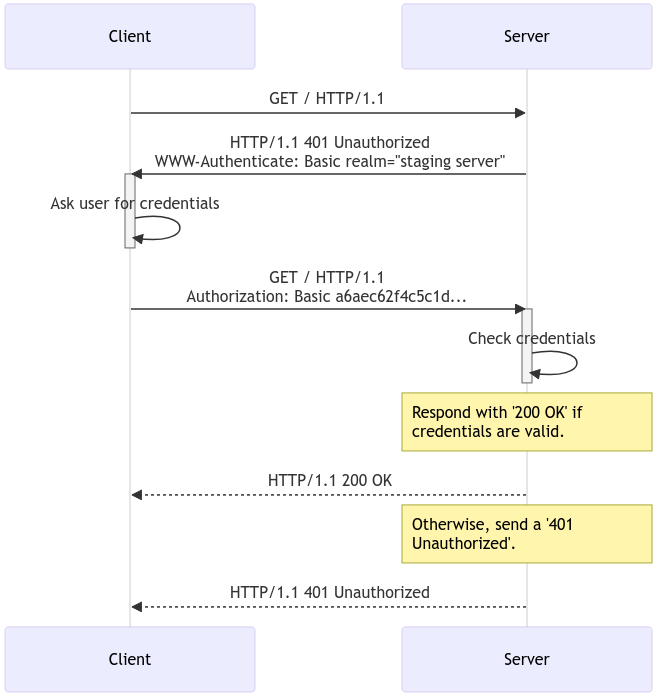
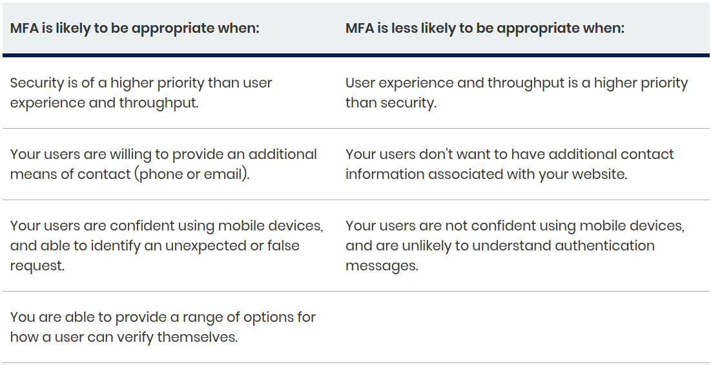
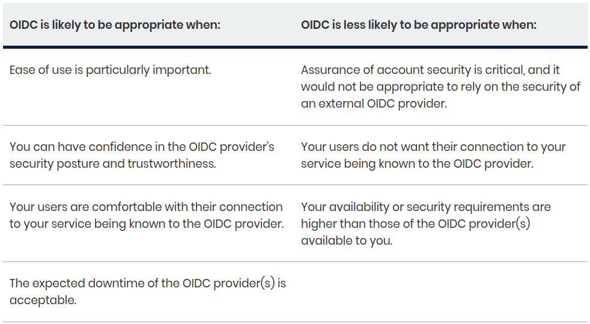
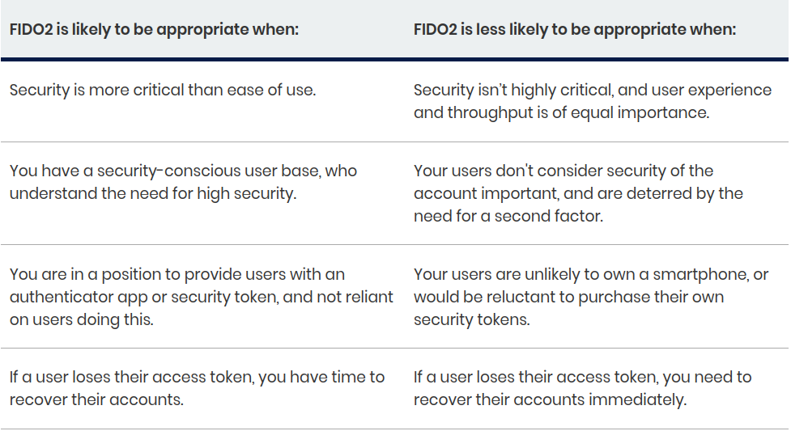
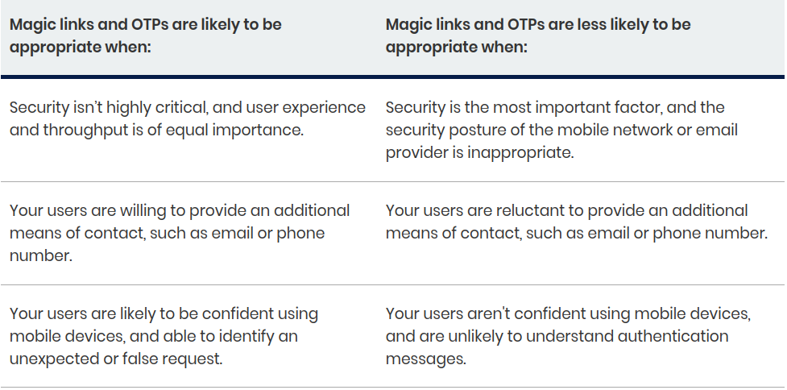

# Aula 04

Sumário

- [Aula 04](#aula-04)
  - [Autenticação e gerenciamento de usuários](#autenticação-e-gerenciamento-de-usuários)
  - [Armazenamento de credenciais](#armazenamento-de-credenciais)
  - [Exemplo conceitual](#exemplo-conceitual)
  - [Autenticação HTTP](#autenticação-http)
    - [Fluxo do framework](#fluxo-do-framework)
    - [Esquemas de autenticação](#esquemas-de-autenticação)
    - [Autenticação na "vida real"](#autenticação-na-vida-real)
    - [Autenticação usando Python](#autenticação-usando-python)

## Autenticação e gerenciamento de usuários

O fluxo básico:

1. **Login**: o usuário preenche um formulário e envia credenciais (`username` e `password`/senha) ao servidor (rota `/login`).
   1. O servidor busca o registro de usuário no banco e verifica se o <u>hash de senha</u> fornecida no banco bate o <u>hash</u> armazenado no banco.
   2. Se válidas, o servidor gera um identificador de sessão (`session ID`) e envia ao usuário via `cookie` (flags `HttpOnly`, `Secure`, `SameSite`), ou gera um `token`.
2. **Persistência de sessão**: em requisições subsequentes, o cliente envia o `cookie` ou o `token` ou identificador e o servidor reconhece quem é o usuário autenticado.
3. **Logout**: o usuário envia requisição para a rota `/logout` e o servidor invalida a sessão correspondente, excluindo a `session` do armazenamento ou revogando o `token`.
   1. Servidor envia resposta ao cliente instruindo remover o cookie (por exemplo `Set-Cookie: sid=; Max-Age=0`).
   2. Cliente limpa mecanismos de armazenamento locais (`cookies`, `tokens`, `localStorage`).

## Armazenamento de credenciais

- **NUNCA** armazenar senha em texto puro no cliente (browser).
- **NUNCA** armazenar tokens sensíveis em `localStorage` ou `sessionStorage` se puder evitar, pois esses objetos são acessíveis via JavaScript e vulneráveis a [XSS](https://developer.mozilla.org/en-US/docs/Glossary/Cross-site_scripting) (*Cross-Site Scripting*).
  - Em vez disso, utilizar `cookies` com as flags `HttpOnly` e `Secure` para armazenar `session ID` ou `token`, de modo que o JS no cliente não consiga ler o valor diretamente. E tabém a flag `SameSite` para limitar envio em contextos cross-site.
- Implemente expiração de sessão e timeout de inatividade.
- Regenerar a sessão (novo `session ID`) após ações de privilégio elevado.

## Exemplo conceitual

```pseudo
// Back-end (servidor)

POST /login
  recebe { username, password }
  user = db.findUserByUsername(username)
  if user == null ou !verifyHash(password, user.passwordHash) then
    retornar 401 Unauthorized
  fim
  sessionId = generateSecureRandomId()
  storeSession(sessionId, user.id, timestamp, expiration)
  // envia cookie de sessão para cliente
  setCookie("sid", sessionId, HttpOnly, Secure, SameSite)
  retornar 200 OK (talvez JSON com usuário sem credenciais)

GET /protectedResource
  cookie = request.getCookie("sid")
  if cookie == null then
    retornar 401
  fim
  session = lookupSession(cookie)
  if session inválida ou expirada então
    retornar 401
  fim
  // usuário autenticado
  user = db.findUserById(session.userId)
  retornar recurso para user

POST /logout
  cookie = request.getCookie("sid")
  if cookie != null then
    invalidateSession(cookie)
    // remover cookie no cliente
    setCookie("sid", "", maxAge=0, HttpOnly, Secure, SameSite)
  fim
  retornar 200 OK

// Funções auxiliares:

function generateSecureRandomId() { ... }  
function verifyHash(password, hash) { ... }  
function storeSession(id, userId, createdAt, expiration) { ... }  
function lookupSession(id) { ... }  
function invalidateSession(id) { ... }
```

## [Autenticação HTTP](https://developer.mozilla.org/en-US/docs/Web/HTTP/Guides/Authentication?utm_source=chatgpt.com)

O HTTP fornece um framework geral (definido no [RFC 7235](https://datatracker.ietf.org/doc/html/rfc7235)) para controle de acesso e autenticação, o qual pode ser usado por um servidor para "desafiar" (`challenge`) uma requisição de cliente. O framework é utilizado pelo cliente para fornecer informações de autenticação.

<blockquote cite="https://developer.mozilla.org/en-US/docs/Glossary/Challenge">
    <p>
        Um <code>challenge</code> consiste em dados enviados por um servidor ao cliente de forma a gerar respostas diferentes por vez. É uma forma de se prevenir contra ataques do tipo <code>replay</code>, onde um hacker captura mensagens anteriores e as reenvia posteriormente para ter acesso às mesmas credenciais da mensagem original.
    </p>
</blockquote>

### Fluxo do framework

1. O servidor responde ao cliente com uma resposta [401 Unauthorized](https://developer.mozilla.org/en-US/docs/Web/HTTP/Reference/Status/401) e fornece informação sobre como conseguir autorização com um campo de cabeçalho [WWW-Authenticate](https://developer.mozilla.org/en-US/docs/Web/HTTP/Reference/Headers/WWW-Authenticate) contendo pelo menos um `challenge`.
2. O cliente envia uma nova requisição, porém inserindo no cabeçalho o campo [Authorization](https://developer.mozilla.org/en-US/docs/Web/HTTP/Reference/Headers/Authorization) com as credenciais.
3. O cliente solicitao ao usuário uma senha e esta será inclusa à requisição que, desta vez, estará com o cabeçalho [Authorization](https://developer.mozilla.org/en-US/docs/Web/HTTP/Reference/Headers/Authorization) correto.



Esse esquema básico de autenticação envia as credenciais do usuário codificadas, mas não criptografadas.

### Esquemas de autenticação

O framework de autenticação HTTP geral é a base para vários outros esquemas.

A IANA (*Internet Assigned Numbers Authority*) mantém uma [lista de esquemas de autenticação](https://www.iana.org/assignments/http-authschemes/http-authschemes.xhtml), mas existem outros esquemas fornecidos por serviços de hospedagem, como a AWS da Amazon.

Os esquemas comuns incluem:

- **Básico**: [RFC 7617](https://datatracker.ietf.org/doc/html/rfc7617), com credenciais codificadas em base64.
- **Bearer**: [RFC 6750](https://datatracker.ietf.org/doc/html/rfc6750), tokens *bearer* para acessar recursos protegidos por OAuth 2.0.
- **HOBA**: [RFC 7486](https://datatracker.ietf.org/doc/html/rfc7486), **H**TTP **O**rigin-**B**ound **A**uthentication, baseado em assinatura digital.
- **Mutual**: [RFC 8120](https://datatracker.ietf.org/doc/html/rfc8120).
- **Negotiate** / **NTLM**: [RFC 4599](https://datatracker.ietf.org/doc/html/rfc4559).
- **VAPID**: [RFC8292](https://datatracker.ietf.org/doc/html/rfc8292).
- **SCRAM**: [RFC 7804](https://datatracker.ietf.org/doc/html/rfc7804).
- **AWS4-HMAC-SHA256**: [AWS docs](https://docs.aws.amazon.com/AmazonS3/latest/API/sigv4-auth-using-authorization-header.html).

### Autenticação na "vida real"

Em uma pesquisa rápida encontrei os seguintes materiais (do mais antigo para o mais recente):

- [Which Authentication to Use? A Comparison of 4 Popular Approaches](https://dev.to/leapcell/which-authentication-to-use-a-comparison-of-4-popular-approaches-24jc): [**dev.to**](https://dev.to/), em 04/02/2025. Abordagem citadas:
  - Autenticação clássica, baseada em sessão, ideal para aplicações simples renderizadas pelo servidor.
  - Autenticação **JWT** (*JSON Web Token*), adequado para arquiteturas modernas sem estado e aplicativos móveis.
  - Autenticação **SSO** (*Single Sign-On*), a melhor para ambientes corporativos com múltiplos serviços relacionados.
  - Autenticação **OAuth 2.0**, a escolha preferida para integrações de terceiros e acesso com API.
- [Top 9 User Authentication Methods to Stay Secure in 2025](https://www.loginradius.com/blog/identity/top-authentication-methods): **Login Radius**, em 11/04/2025.
  - Métodos citados:
    1. Autenticação sem senha (*passwordless*).
    2. Autenticação com múltiplos fatores (*Multi-Factor Authentication* - **MFA**).
    3. Autenticação com biometria.
    4. Autenticação baseada em token.
    5. Login "social", o login a partir de outras contas (ex.: login com a conta do Google, Facebook, etc.).
    6. Autenticação adaptativa, que avalia o contexto (local, dispositivo, comportamento do usuário, etc.).
    7. Autenticação baseada em certificado.
    8. Chaves de acesso (*passkeys*).
    9. MFA com notificação por *push*.
  - Protocolos de autenticação:
    - **OIDC** (*OpenID Connect*).
    - **SAML** (*Security Assertion Markup Language*).
    - **FIDO2/WebAuthn**.
    - **OAuth 2.0**.
- [Authentication methods: choosing the right type](https://www.ncsc.gov.uk/guidance/authentication-methods-choosing-the-right-type): **NCSC** (*National Cyber Security Centre*), Reino Unido. Publicado em 21/09/2022 e revisado em 12/06/2025. Métodos citados:
  - **MFA**
    
    
  - *Federated* **SSO** $\rightarrow$ **OIDC**.
    
    
  - **FIDO2**
    
    
  - *Magic links* e **OTPs** (*One Time Passwords*)
    
    
- [Types of Authentication Protocols](https://www.geeksforgeeks.org/computer-networks/types-of-authentication-protocols/): **Geeks for Geeks**, última atualização em 23/07/2025. Tipos de protocolo de autenticação citados:
  - **Kerberos**.
  - **LDAP** (*Lightweight Directory Access Protocol*).
  - **OAuth 2.0**.
  - **SAML**.
  - **RADIUS** (*Remote Authentication Dial-In User Service*).

### Autenticação usando Python

<!--
TODO
  - Trazer a visão geral de cada artigo citado acima.
  - Estudar como fazer autenticação com Python: materiais a seguir:
    - [Pesquisa Google: authentication example with python](https://www.google.com/search?q=authentication+example+with+python&client=ubuntu-sn&hs=ub1&sca_esv=1e7dfcb5e01aab5a&channel=fs&biw=1920&bih=933&sxsrf=AE3TifNPnGcZK0TBmgZguBXll5dcHlR-FA%3A1759960329544&ei=Cd3maODwILTM1sQP34y24AY&oq=authentication+example+with+py&gs_lp=Egxnd3Mtd2l6LXNlcnAiHmF1dGhlbnRpY2F0aW9uIGV4YW1wbGUgd2l0aCBweSoCCAAyBRAhGKABMgUQIRigATIFECEYnwUyBRAhGJ8FMgUQIRifBTIFECEYnwUyBRAhGJ8FMgUQIRifBTIFECEYnwUyBRAhGJ8FSOSHAVC-DViXfnADeAGQAQCYAb0CoAHVNaoBCDAuMjQuOS4xuAEDyAEA-AEBmAIloAKXOKgCFMICChAAGLADGNYEGEfCAgcQIxgnGOoCwgIQEAAYAxi0AhjqAhiPAdgBAcICEBAuGAMYtAIY6gIYjwHYAQHCAgoQIxiABBgnGIoFwgISECMY8AUYgAQYExgnGMkCGIoFwgIEECMYJ8ICCxAAGIAEGLEDGIMBwgIFEAAYgATCAhEQLhiABBixAxiDARjUAhiKBcICCxAuGIAEGLEDGIMBwgIEEAAYA8ICDBAjGIAEGBMYJxiKBcICCxAuGIAEGNEDGMcBwgIIEAAYgAQYsQPCAgoQABiABBhDGIoFwgIIEAAYgAQYywHCAhEQLhiABBixAxjRAxiDARjHAcICDhAAGIAEGLEDGIMBGIoFwgIFEC4YgATCAggQLhiABBixA8ICCxAAGIAEGJIDGIoFwgINEAAYgAQYsQMYQxiKBcICDhAuGIAEGLEDGNEDGMcBwgIQEAAYgAQYsQMYQxiDARiKBcICChAAGIAEGBQYhwLCAgYQABgWGB7CAggQABgWGAoYHsICBRAAGO8FmAMW8QV755-jwemgeogGAZAGCLoGBggBEAEYCpIHCTMuMTYuMTcuMaAHnIECsgcJMC4xNi4xNy4xuAfpN8IHCzAuMy4xNy4xNi4xyAfsAQ&sclient=gws-wiz-serp)
    
    ```python
      import requests
      from requests.auth import HTTPBasicAuth

      # Define the API endpoint that requires basic authentication
      api_url = "https://postman-echo.com/basic-auth"

      # Define the username and password for authentication
      username = "postman"
      password = "password"

      # Make a GET request with basic authentication
      # The HTTPBasicAuth object handles the Base64 encoding and setting of the Authorization header
      response = requests.get(api_url, auth=HTTPBasicAuth(username, password))

      # Check the response status code
      if response.status_code == 200:
          print("Authentication successful!")
          print("Response content:", response.json())  # Assuming the API returns JSON
      elif response.status_code == 401:
          print("Authentication failed: Invalid credentials.")
      else:
          print(f"An error occurred: Status code {response.status_code}")
          print("Response content:", response.text)
    ```

    - [Authetication and Authorization with FastAPI: A Complete Guide](https://betterstack.com/community/guides/scaling-python/authentication-fastapi/)
    - [Implementing Basic Authentication with Python FastAPI](https://pykestrel.medium.com/implementing-basic-authentication-with-python-fastapi-12f9718ff0ad)
-->

Sobre a implementação de autenticação com Python, encontrei as seguintes alternativas para lidar com autenticação:

- Usando módulos nativos do Python: [secrets](https://docs.python.org/3/library/secrets.html#module-secrets), [string](https://docs.python.org/3/library/string.html#module-string), [hashlib](https://docs.python.org/3/library/hashlib.html#module-hashlib) e [getpass](https://docs.python.org/3/library/getpass.html#module-getpass).
  - Material/tutorial: [Designing A Login Register and User Authentication System in Python](https://rs-punia.medium.com/designing-a-login-register-and-user-authentication-script-in-python-326a11821504).
- [Requests](https://requests.readthedocs.io/en/latest/), que afirma ser uma biblioteca HTTP simples e elegante, feita para seres humanos. Alguns materiais/tutoriais:
  - [Python's Requests Library (Guide)](https://realpython.com/python-requests/), do site Real Python.
  - [Authentication using Python requests](https://www.geeksforgeeks.org/python/authentication-using-python-requests/), do site Geeks for Geeks.
- Framework [Flask](https://flask.palletsprojects.com/en/stable/):
  - Com as bibliotecas de apoio [Flask-Login](https://flask-login.readthedocs.io/en/latest/), [Flask-Bcrypt](https://flask-bcrypt.readthedocs.io/en/1.0.1/), [Flask-WTF](https://flask-wtf.readthedocs.io/en/1.0.x/), [Flask-Migrate](https://flask-migrate.readthedocs.io/en/latest/), [Flask-SQLAlchemy](flask-sqlalchemy.palletsprojects.com/en/stable/), [Flask-Testing](https://pythonhosted.org/Flask-Testing/) e [Python Decouple](https://pypi.org/project/python-decouple/).
    - Material: [How to Set Up Basic User Authentication in a Flask App](https://www.freecodecamp.org/news/how-to-setup-user-authentication-in-flask/), de 2023.
  - Com [Login Radius](https://www.loginradius.com/).
    - Material: [Implementing User Authentication in a Python Application](https://www.loginradius.com/blog/engineering/guest-post/user-authentication-in-python).
  - Com [Flask-Secutiry](https://flask-security-too.readthedocs.io/en/stable/) que integra várias extensões do Flask.
- Bibliotecas para esquemas específicos:
  - [Authlib](https://docs.authlib.org/en/latest/) para OAuth e OpenID.
  - [PyJWT](https://pyjwt.readthedocs.io/en/stable/).
  - [OAuthLib](https://oauthlib.readthedocs.io/en/latest/).
  - [ItsDangerous]([ItsDangerous](https://itsdangerous.palletsprojects.com/en/stable/))

Aparentemente, o mais simples de ser estudado de início é a bilbioteca [Requests](https://requests.readthedocs.io/en/latest/).