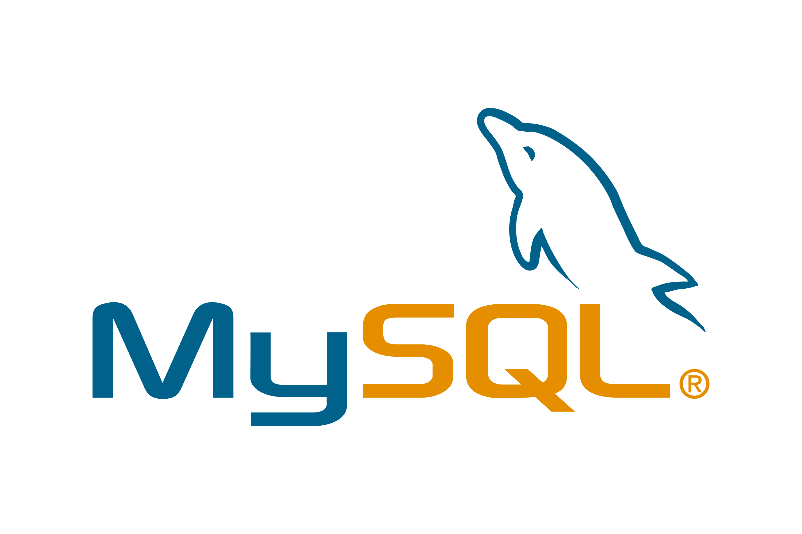
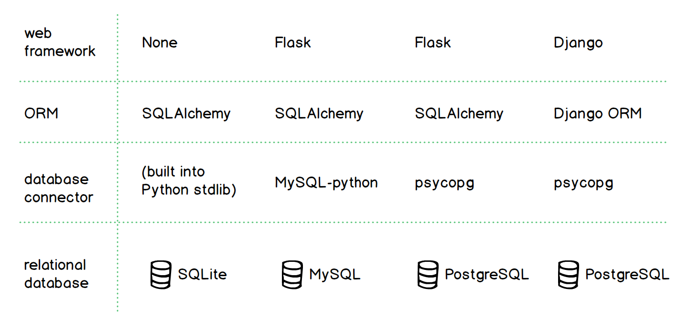

# Aula 04

Sumário

- [Aula 04](#aula-04)
  - [Autenticação e gerenciamento de usuários](#autenticação-e-gerenciamento-de-usuários)
  - [Armazenamento de credenciais](#armazenamento-de-credenciais)
  - [Exemplo conceitual](#exemplo-conceitual)
  - [Autenticação HTTP](#autenticação-http)
    - [Fluxo do framework](#fluxo-do-framework)
    - [Esquemas de autenticação](#esquemas-de-autenticação)
    - [Autenticação na "vida real"](#autenticação-na-vida-real)
    - [Autenticação usando Python](#autenticação-usando-python)

## Bancos de Dados

### [SQLite](https://sqlite.org/index.html)

<figure style="text-align:center;">
  
</figure>

O SQLite é uma biblioteca de software, escrita em C, que fornece um sistema de gerenciamento de banco de dados relacional (RDBMS). Diferente da maioria dos outros bancos de dados (como MySQL ou PostgreSQL), ele não funciona como um processo de servidor separado, ou seja, o motor (ou *engine*) do banco reside dentro da própria aplicação. O banco de dados inteiro — tabelas, índices e os próprios dados — é armazenado em um único arquivo comum no disco.

**Principais características**:

- **Serverless** (Sem Servidor): Não requer um processo de servidor separado ou sistema para operar. O acesso ao arquivo é feito diretamente pela biblioteca integrada ao código.
- **Configuração Zero**: Não há necessidade de instalar, configurar ou gerenciar usuários e permissões complexas antes de começar a usar.
- **Transacional** (ACID): Mesmo sendo leve, ele garante que todas as transações sejam seguras. Se houver uma queda de energia ou erro no sistema, os dados permanecem íntegros.
- **Multiplataforma**: O arquivo do banco de dados é altamente portável. Você pode criar um banco no Windows e movê-lo para um Mac, Linux ou Android sem qualquer conversão.
- **Pequeno**: A biblioteca completa é muito leve (geralmente menos de 1MB), consumindo poucos recursos de memória e CPU.

**Por que/quando usar**:

- **Desenvolvimento de Aplicativos Móveis**: É o padrão ouro para Android e iOS. Quase todos os apps que salvam dados localmente no seu celular usam SQLite.
- **Aplicações Desktop**: Ideal para softwares que precisam salvar preferências de usuário ou grandes catálogos de informações sem forçar o usuário a instalar um servidor SQL.
- **Internet das Coisas (IoT)**: Por ser extremamente econômico em termos de hardware, é perfeito para dispositivos inteligentes e sistemas embarcados.
- **Formato de Arquivo de Aplicativo**: Muitos programas usam o SQLite como seu formato de arquivo principal (em vez de arquivos XML ou JSON), permitindo buscas complexas e proteção contra corrupção de dados.
- **Testes e Prototipagem**: Ótimo para desenvolvedores web que querem criar um protótipo rápido sem perder tempo configurando infraestrutura de banco de dados pesada.

### [PostgreSQL](https://www.postgresql.org/)

<figure style="text-align:center;">
  
</figure>

O PostgreSQL (frequentemente chamado de Postgres) é amplamente considerado o sistema de banco de dados de **código aberto mais avançado e poderoso do mundo**. Diferente do SQLite, ele é um sistema Cliente-Servidor, projetado para lidar com grandes volumes de dados e alta concorrência.

Além de ser um banco de dados SQL tradicional, ele suporta conceitos mais complexos, como herança de tabelas e tipos de dados personalizados, funcionando quase como uma mistura de banco relacional com recursos de bancos NoSQL.

**Principais características**:

- **Arquitetura Cliente-Servidor**: Ele roda como um serviço centralizado. Várias aplicações ou usuários podem se conectar a ele simultaneamente através da rede.
- **Extensibilidade Absoluta**: Você pode adicionar novos tipos de dados, funções personalizadas e até escrever procedimentos em diferentes linguagens (como Python, Java ou C) dentro do banco.
- **Concorrência Avançada (MVCC)**: Utiliza o *Multi-Version Concurrency Control*, que permite que vários usuários leiam e escrevam ao mesmo tempo sem que um bloqueie o outro.
- **Conformidade Padrão**: É extremamente rigoroso com os padrões SQL e oferece suporte nativo a JSONB, permitindo armazenar e consultar dados não estruturados com altíssima performance.
- **Confiabilidade de Dados**: Possui recursos robustos de recuperação de desastres, como o *Write-Ahead Logging* (WAL) e replicação sofisticada.

**Por que/quando usar**:

- **Escalabilidade e Complexidade**: o PostgreSQL é otimizado para ambientes que demandam alta performance em operações de leitura e escrita simultâneas. Sua arquitetura processa com eficiência esquemas de dados extensos e consultas SQL de alta complexidade, mantendo a estabilidade sob cargas de trabalho elevadas.
- **Integridade de Dados Rigorosa**: em sistemas onde a fidedignidade da informação é crítica — como em aplicações financeiras ou registros governamentais —, o PostgreSQL destaca-se por sua rigorosa conformidade com as propriedades ACID. Ele oferece mecanismos avançados de restrições (*constraints*) e validações que mitigam riscos de corrupção ou inconsistência de dados.
- **Geoprocessamento (PostGIS)**: por meio da extensão PostGIS, o sistema consolida-se como a solução líder de mercado para o armazenamento e manipulação de dados geoespaciais. Ele permite a execução de análises geográficas complexas e cálculos de coordenadas com precisão milimétrica.
- **Híbrido Relacional + Documento**: A implementação do suporte nativo ao tipo JSONB permite que o PostgreSQL atue de forma híbrida. Ele oferece a flexibilidade de esquemas não estruturados (típicos de bancos NoSQL) aliada à segurança e às capacidades de indexação e consulta de um banco de dados relacional tradicional.
- **Comunidade e Ecossistema**: Sendo um projeto de código aberto com décadas de desenvolvimento contínuo, o PostgreSQL beneficia-se de um ecossistema vasto de ferramentas de terceiros, drivers otimizados e uma documentação técnica exaustiva, garantindo longevidade e suporte especializado para qualquer implementação de larga escala.

### MySQL

<figure style="text-align:center;">
  
</figure>

O MySQL é um dos sistemas de gerenciamento de banco de dados relacionais (RDBMS) mais difundidos globalmente, fundamentado na linguagem SQL e desenvolvido sob um modelo de **código aberto**. Atualmente **mantido pela Oracle Corporation**, ele é o pilar de grande parte da infraestrutura da Web moderna.

Utiliza uma arquitetura cliente-servidor e é reconhecido por sua eficiência operacional e facilidade de integração. Ele foi projetado para oferecer alta performance em aplicações web, priorizando a velocidade de leitura e a disponibilidade do sistema.

**Principais características**:

- **Arquitetura de Motores de Armazenamento (*Storage Engines*)**: Diferente de outros RDBMS, o MySQL permite escolher entre diferentes motores (como InnoDB para transações ACID ou MyISAM para leituras rápidas), oferecendo flexibilidade conforme a carga de trabalho.
- **Replicação e Alta Disponibilidade**: Possui mecanismos nativos e robustos de replicação (Master-Slave ou Master-Master), fundamentais para a criação de sistemas redundantes e escaláveis.
- **Ecossistema Amplo**: Devido à sua longevidade e popularidade, possui integração nativa com praticamente todas as linguagens de programação e plataformas de nuvem (AWS, Azure, Google Cloud).
- **Segurança de Camadas**: Oferece um sistema de privilégios granular e robusto, permitindo o controle rigoroso de acessos e a criptografia de dados em trânsito e em repouso.

**Por que/quando usar**:

- **Otimização para Aplicações Web**: o MySQL é a escolha de referência para sistemas de gerenciamento de conteúdo (CMS) como WordPress e Drupal. Sua capacidade de processar um volume massivo de consultas de leitura de forma extremamente rápida o torna ideal para portais de conteúdo e e-commerce.
- **Facilidade de Operação e Manutenção**: comparado ao PostgreSQL, o MySQL tende a exigir uma curva de aprendizado menor para administradores de banco de dados (DBAs), com ferramentas de interface gráfica (como o MySQL Workbench) altamente maduras e intuitivas.
- **Escalabilidade Horizontal**: Através de técnicas de sharding e replicação, o MySQL permite distribuir a carga de dados entre múltiplos servidores, suportando o crescimento de aplicações que evoluem de pequenos projetos a plataformas com milhões de acessos.
- **Custo-Benefício em Infraestrutura**: por ser um padrão de mercado, o custo de hospedagem e suporte para MySQL é frequentemente mais competitivo, com uma vasta oferta de profissionais qualificados e documentação resolutiva disponível.

### Tabela comparativa

| | **SQLite** | **PostgreSQL** | **MySQL** |
|---|---|---|---|
| **Arquitetura** |	Embutida (*Serverless*) |	Cliente-Servidor |	Cliente-Servidor |
| **Ponto Forte** |	Portabilidade e Simplicidade | Extensibilidade e Rigor | Performance Web e Replicação |
| **Concorrência** |	Baixa (1 escritor por vez) |	Altíssima (MVCC avançado) |	Alta (Otimizado p/ Leitura) |
| **Tipos de Dados** |	Limitados/Dinâmicos |	Complexos, Customizados e Geospaciais |	Padrão SQL e JSON |
| **Ideal para** |	Mobile, IoT, Desktop e Testes |	Sistemas complexos e Analíticos |	Web, CMS e Aplicações SaaS |
| **Ideal para** |	Mobile, IoT, Desktop e Testes |	Sistemas complexos e Analíticos |	Web, CMS e Aplicações SaaS |
| **Instalação** |	Zero (Arquivo único) |	Complexidade Média/Alta |	Complexidade Média |

## *Object-relational Mappers* (ORMs) [^1]

[^1]: Fonte - [Full Stack Python](https://www.fullstackpython.com/object-relational-mappers-orms.html). Com edições minhas, e outros materiais.

An object-relational mapper (ORM) is a code library that automates the transfer of data stored in relational database tables into objects that are more commonly used in application code.

<figure style="text-align:center;">
  
</figure>

### Why are ORMs useful?

ORMs provide a high-level abstraction upon a relational database that allows a developer to write Python code instead of SQL to create, read, update and delete data and schemas in their database. Developers can use the programming language they are comfortable with to work with a database instead of writing SQL statements or stored procedures.

For example, without an ORM a developer would write the following SQL statement to retrieve every row in the USERS table where the zip_code column is 94107:

```SQL
SELECT * FROM USERS WHERE zip_code=94107;
```

The equivalent [Django ORM](https://www.fullstackpython.com/django-orm.html) query would instead look like the following Python code:

```python
# obtain everyone in the 94107 zip code and assign to users variable
users = Users.objects.filter(zip_code=94107)
```

The ability to write Python code instead of SQL **can speed up web application development**, especially at the beginning of a project. The potential development speed boost comes from not having to switch from Python code into writing declarative paradigm SQL statements. While some software developers may not mind switching back and forth between languages, it's typically easier to knock out a prototype or start a web application using a single programming language.

ORMs also make it **theoretically possible to switch an application between various relational databases**. For example, a developer could use SQLite for local development and MySQL in production. A production application could be switched from MySQL to PostgreSQL with minimal code modifications.

In practice however, it's best to use the same database for local development as is used in production. Otherwise unexpected errors could hit in production that were not seen in a local development environment. Also, it's rare that a project would switch from one database in production to another one unless there was a pressing reason.

### Do I have to use an ORM for my web application?

Python ORM libraries are not required for accessing relational databases. In fact, the low-level access is typically provided by another library called a database connector, such as [psycopg](https://www.psycopg.org/) (for PostgreSQL) or [MySQL-python](https://pypi.org/project/MySQL-python/1.2.5) (for MySQL). Take a look at the table below which shows how ORMs can work with different web frameworks and connectors and relational databases.

<figure style="text-align:center;">
  
</figure>

The above table shows for example that **SQLAlchemy can work with varying web frameworks and database connectors**. Developers can also use ORMs without a web framework, such as when creating a data analysis tool or a batch script without a user interface.

### What are the downsides of using an ORM?

There are numerous downsides of ORMs, including

1. Impedance mismatch
2. Potential for reduced performance
3. Shifting complexity from the database into the application code

#### Impedance mismatch

The phrase "impedance mismatch" is commonly used in conjunction with ORMs. **Impedance mismatch is a catch-all term for the difficulties that occur when moving data between relational tables and application objects**. The gist is that the way a developer uses objects is different from how data is stored and joined in relational tables.

[This article on ORM impedance mismatch](http://www.agiledata.org/essays/impedanceMismatch.html) does a solid job of explaing what the concept is at a high level and provides diagrams to visualize why the problem occurs.

#### Potential for reduced performance

One of the concerns that's associated with any higher-level abstraction or framework is potential for reduced performance. With ORMs, the performance hit comes from the translation of application code into a corresponding SQL statement which may not be tuned properly.

**ORMs are also often easy to try but difficult to master**. For example, a beginner using Django might not know about the `select_related()` function and how it can improve some queries' foreign key relationship performance. **There are dozens of performance tips and tricks for every ORM**. It's possible that investing time in learning those quirks may be better spent just learning SQL and how to write stored procedures.

There's a lot of hand-waving "may or may not" and "potential for" in this section. In large projects **ORMs are good enough for roughly 80-90% of use cases** but in 10-20% of a project's database interactions there can be major performance improvements by having a knowledgeable database administrator write tuned SQL statements to replace the ORM's generated SQL code.

#### Shifting complexity from the database into the app code

The code for working with an application's data has to live somewhere. Before ORMs were common, database stored procedures were used to encapsulate the database logic. With an ORM, the data manipulation code instead lives within the application's Python codebase. The addition of data handling logic in the codebase generally isn't an issue with a sound application design, but it does increase the total amount of Python code instead of splitting code between the application and the database stored procedures.

### Python ORM Implementations

There are numerous ORM implementations written in Python, including

1. [SQLAlchemy](https://www.fullstackpython.com/sqlalchemy.html)
2. [Peewee](https://www.fullstackpython.com/peewee.html)
3. [The Django ORM](https://www.fullstackpython.com/django-orm.html)
4. [PonyORM](https://www.fullstackpython.com/pony-orm.html)
5. [SQLObject](http://sqlobject.org/)
6. [Tortoise ORM](https://tortoise-orm.readthedocs.io/en/latest/) ([source code](https://github.com/tortoise/tortoise-orm/))
7. [ORM](https://github.com/encode/orm): a lightweight and async-ready ORM that is designed to work with FastAPI and Starlette. It's particularly suited for applications that require asynchronous database operations.
8. [Gino](https://python-gino.org/): an async ORM built on SQLAlchemy core. It's designed for async programming with asyncio and provides a simple and intuitive API for interacting with the database asynchronously.

There are other ORMs, such as Canonical's [Storm](https://storm.canonical.com/), but most of them do not appear to currently be under active development. Learn more about the major active ORMs below.

#### Django's ORM

The Django web framework comes with [its own built-in object-relational mapping module](https://www.fullstackpython.com/django-orm.html), generally referred to as "the Django ORM" or "Django's ORM".

[Django's ORM](https://docs.djangoproject.com/en/dev/topics/db/) **works well for simple and medium-complexity database operations**. However, there are often complaints that the **ORM makes complex queries much more complicated than writing straight SQL or using [SQLAlchemy](http://www.sqlalchemy.org/)**.

It is technically possible to drop down to SQL but it ties the queries to a specific database implementation. **The ORM is coupled closely with Django so replacing the default ORM with SQLAlchemy is currently a hack workaround**. Note though it is possible that swappable ORM backends will be possible in the future as it is now possible to change the template engine for rendering output in Django.

Since the majority of Django projects are tied to the default ORM, it is best to read up on advanced use cases and tools for doing your best work within the existing framework.

#### SQLAlchemy ORM

[SQLAlchemy](http://www.sqlalchemy.org/) is a well-regarded Python ORM because it gets the abstraction level "just right" and seems to make complex database queries easier to write than the Django ORM in most cases. **There is [an entire page on SQLAlchemy](https://www.fullstackpython.com/sqlalchemy.html) that you should read if you want to learn more about using the library**.

#### Peewee ORM

[Peewee](https://peewee.readthedocs.org/en/latest/) is a Python ORM implementation that is written to be "[simpler, smaller and more hackable](http://charlesleifer.com/blog/the-case-for-peewee-small-hackable-and-fun/)" than SQLAlchemy. Read the [full Peewee page](https://www.fullstackpython.com/peewee.html) for more information on the Python ORM implementation.

#### Pony

[Pony ORM](http://ponyorm.com/) is another Python ORM available as open source, under the Apache 2.0 license.

#### SQLObject ORM

[SQLObject](http://sqlobject.org/) is an ORM that has been under active open source development for over 14 years, since before 2003.