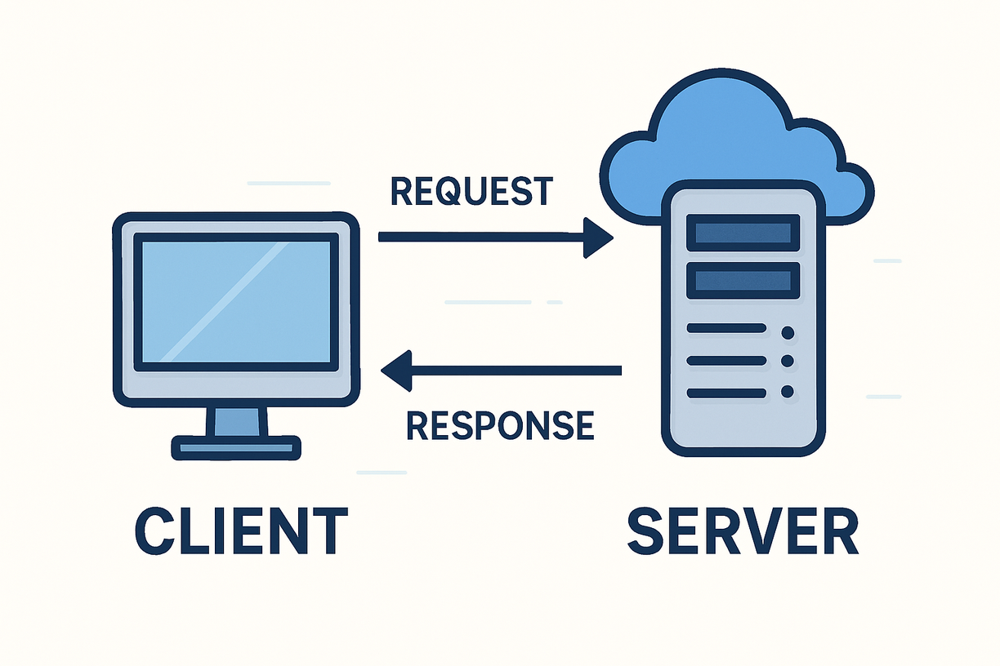
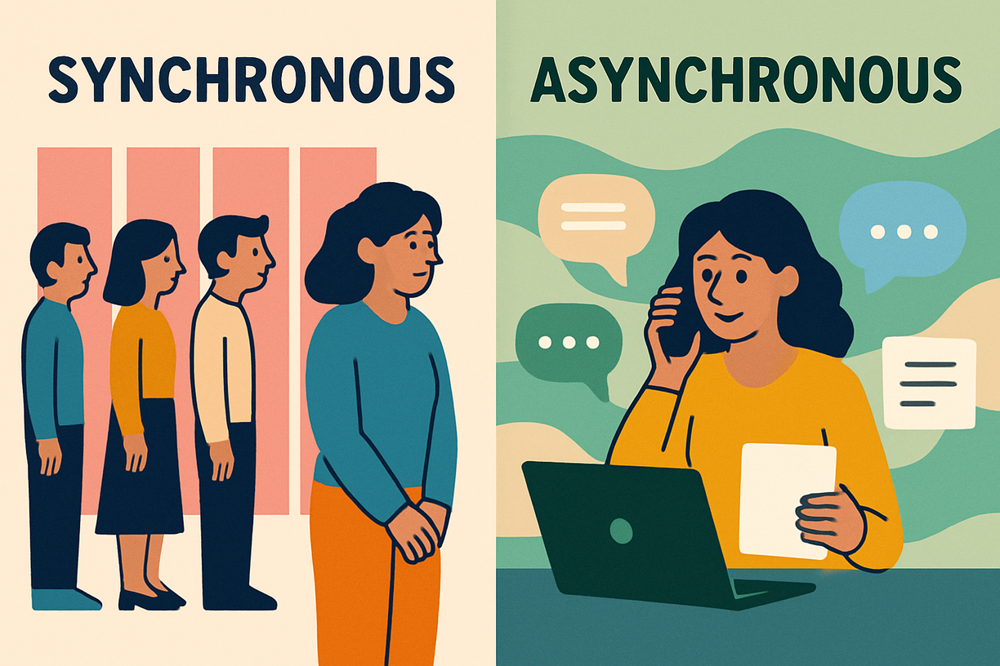

# Aula 05

**Sumário**
- [Aula 05](#aula-05)
  - [Comunicação Síncrona vs. Assíncrona](#comunicação-síncrona-vs-assíncrona)
    - [Comunicação síncrona](#comunicação-síncrona)
    - [Comunicação assíncrona](#comunicação-assíncrona)
  - [AJAX](#ajax)
    - [Exemplos](#exemplos)
    - [Exercícios](#exercícios)
      - [Fácil](#fácil)
      - [Médio](#médio)
      - [Difícil](#difícil)

## Comunicação Síncrona vs. Assíncrona

Para começar vamos relembrar um pouco de como funciona o modelo Cliente-Servidor:

<figure style="text-align: center; width:700px;">
  
</figure>

Melhor ainda, vamos ver isso acontecendo em um navegador.

O ponto principal para esta aula é a **comunicação** que está ocorrendo entre navegador (cliente) e servidor. Essa comunicação pode ocorrer de duas formas: **síncrona** e **assíncrona**.

### Comunicação síncrona

A comunicação síncrona é aquela que ocorre em **tempo real**, ou seja, quando duas ou mais partes trocam informação ao mesmo tempo sem qualquer atraso. Exemplos do dia-a-dia:

- Conversa no WhatsApp (quando o(a) crush responde, obviamente, e melhor ainda, responde logo).
- Reunião no Meet, ou live na Twitch (considerando o chat ao vivo).
- Ligações telefônicas.
- Conversa entre amigos.

Por mais que seja "ao mesmo tempo", é importante notar que isso significa que as partes estão se ouvindo e uma requisição é prontamente respondida. Contudo, note o fato de que a resposta vem **APÓS** uma requisição. Ou seja, na comunicação síncrona as operações são executadas **sequencialmente**.

Um servidor que esteja em comunicação síncrona com um cliente vai receber uma requisição por vez, passando para a seguinte somente após concluir a atual. Como consequência temos que a comunicação síncrona é:

- **Simples**: fácil de entender e implementar.
- **Previsível**: a execução em ordem é garantida.
- **Bloqueante**: bloqueia a execução durante operações demoradas.
- **Ineficiente**: recursos ficam ociosos durante a espera.

**[Exemplo de requisição síncrona](exemplos/exemplo_sincrono.html)**.

<figure style="text-align: center; width:700px;">
  
</figure>

### Comunicação assíncrona

É a comunicação que **não** ocorre em tempo real, ou seja, a resposta a uma requisição sofrerá atraso (isso não é necessariamente ruim). Em outras palavras, não há resposta ou feedback imediato. Exemplos do dia-a-dia:

- Conversa no WhatsApp, quando o(a) crush sempre demora para responder.
- Troca de e-mails.
- YouTube (ou outra plataforma de vídeos), quando você assiste conteúdo novo dias depois.

Um servidor que esteja em comunicação assíncrona com um cliente vai recebendo as requisições e respondendo à medida em que as execuções terminam. Como consequência temos que a comunicação assíncrona é:

- **Não-bloqueante**: permite continuar a execução durante operações demoradas.
- **Eficiente**: melhor utilização de recursos e tempo.
- **Complexa**: mais difícil de implementar e depurar.
- **Não previsível**: não garante ordem de execução sem tratamento adequado.

**[Exemplo de requisição assíncrona](exemplos/exemplo_assincrono.html)**.

## AJAX

AJAX (**A**synchronous **J**avaScript **A**nd **X**ML), JavaScript Assíncrono e XML (em tradução livre) é um conjunto de **técnicas de desenvolvimento web que usa várias tecnologias** (HTML, CSS, JavaScript, DOM e XMLHttpRequest object) no **lado cliente** para criar aplicações web assíncronas. Foi inicialmente desenvolvido por [Jesse James Garret](https://en.wikipedia.org/wiki/Jesse_James_Garrett) em um [artigo publicado em 2005](https://web.archive.org/web/20150910072359/http://adaptivepath.org/ideas/ajax-new-approach-web-applications/).

Com o AJAX é possível que partes de uma página web possam ser atualizadas sem a necessidade de carregar a página inteira novamente. Além disso, apesar do XML fazer parte do nome, seu uso não é obrigatório e atualmente o JSON é mais utilizado que o XML devido às suas vantagens, como ser mais leve e ser parte do JavaScript.

Sua implementação se dá com o uso da API XMLHttpRequest ([MDN](https://developer.mozilla.org/en-US/docs/Web/API/XMLHttpRequest), [Documentação](https://xhr.spec.whatwg.org/)).

### Exemplos

O [exemplo 1](./exemplos/ajax1.html) mostra como usar o AJAX para carregar o conteúdo de um [arquivo de texto](./exemplos/conteudo.txt) (.txt) e exibi-lo em uma página web sem a necessidade de recarregá-la.

O [exemplo 2](./exemplos/ajax2.html) mostra o uso do AJAX para carregar o conteúdo de um [arquivo JSON](./exemplos/dados.json) e exibindo os dados em uma lista.

### Exercícios

#### Fácil

1. Crie um botão “Carregar Mensagem”. Ao clicar, faça uma requisição GET para o arquivo mensagem.txt e coloque o conteúdo dentro de `
`.
2. Adicione um botão “Mostrar Saudação”. Ao clicar, carregue saudacao.json (conteúdo: {"texto": "Bem-vindo ao sistema!") e atualize um `<h2>` com o valor da propriedade texto.
3. Crie um botão “Carregar Imagem”. Ao clicar, use XMLHttpRequest para obter a URL https://picsum.photos/300/200 e defina como src de um ``.
4. Ao clicar em um botão “Atualizar Título”, carregue o arquivo titulo.txt e substitua o texto de um `<h1 id="titulo-pagina">`.
5. Crie um `<select>` com opções “Post 1”, “Post 2”, “Post 3”. Ao mudar a seleção, carregue https://jsonplaceholder.typicode.com/posts/1 (ou 2 ou 3) e mostre o título no `
`.
6. Botão “Carregar Nome”. Carregue usuario.json ({"nome": "Ana Silva"}) e atualize um ``.
7. Ao clicar em “Ler Bio”, carregue bio.txt e insira o texto em um `<textarea id="bio">` (read-only).
8. Crie um botão “Mostrar Foto de Perfil”. Carregue https://jsonplaceholder.typicode.com/photos/1 e use a propriedade url para atualizar um ``.
9. Ao clicar em qualquer lugar de uma `
`, carregue frase.txt e substitua todo o conteúdo da div.
10. Botão “Atualizar Rodapé”. Carregue rodape.html (um fragmento simples) e use innerHTML para colocar dentro de `<footer>`.
11. Selecione um usuário em um `<select>` (1 a 5) → carregue https://jsonplaceholder.typicode.com/users/{id} e mostre apenas o nome e email em dois ``.
12. Botão “Carregar Lista Simples”. Carregue lista.txt (uma linha por item) e transforme em `<ul>` dentro de `
`.
13. Ao clicar em “Ver Status”, carregue https://jsonplaceholder.typicode.com/todos/1 e atualize um `` com “✅Concluído” ou “⭕ Pendente” conforme o campo completed.
14. Crie um botão que carregue logo.png (colocado na mesma pasta) e substitua o src de uma imagem já existente.
15. Ao digitar qualquer coisa em um `<input>` e pressionar Enter, carregue https://jsonplaceholder.typicode.com/comments/1 e mostre o nome do autor em um badge.
16. Botão “Atualizar Contador”. Carregue contador.json ({"valor": 42}) e coloque o número em um `<h3>` com emoji de fogo.
17. Clique em um card → carregue https://jsonplaceholder.typicode.com/albums/1 e atualize o título do card.
18. Botão “Carregar Dica do Dia”. Use arquivo dica.txt e mostre dentro de um `<blockquote>` com fundo amarelo.
19. Ao clicar em “Ver Avatar”, carregue https://jsonplaceholder.typicode.com/users/3 e use o campo avatar (ou uma URL fixa de picsum) para atualizar uma imagem circular.
20. Crie três botões (Texto, JSON, Imagem). Cada um carrega seu respectivo recurso e atualiza o mesmo `
` (limpe antes de cada requisição).
21. **Carregamento de TXT**: Crie um botão que, ao ser clicado, busque um arquivo mensagem.txt e exiba o conteúdo dentro de uma `
`.
22. **Boas-vindas Personalizado**: Consuma o JSON de https://jsonplaceholder.typicode.com/users/1 e atualize um `<h1>` com o nome do usuário retornado.
23. **Alterar ID de Elemento**: Ao clicar em um botão, busque um número aleatório em uma API e defina-o como o id de um parágrafo no HTML.
24. **Troca de Imagem**: Crie um botão "Ver Foto". Ao clicar, busque a URL de uma imagem em https://jsonplaceholder.typicode.com/photos/1 e atualize o atributo src de uma tag ``.
25. **Contador de Postagens**: Busque a lista de posts de um usuário e atualize um `` com o texto: "Este usuário tem X posts".
26. **Status de Carregamento**: Exiba a frase "Carregando..." em um parágrafo enquanto o readyState for menor que 4, e limpe-o ao terminar.
27. **Botão Desabilitado**: Desabilite um botão de "Enviar" via JavaScript assim que o AJAX começar e reabilite-o apenas no onload.
28. **Cópia de Conteúdo**: Busque o corpo de um e-mail em uma API e coloque-o como o valor (value) de uma `<textarea>`.
29. **Alerta de Erro no HTML**: Se a requisição para uma URL inexistente falhar (status 404), escreva "Erro: Conteúdo não encontrado" em vermelho dentro de uma div.
30. **Atualizar Link**: Busque o site de um usuário no JSONPlaceholder e atualize o href e o texto de um link `<a>` na página.
31. **Estilo Dinâmico**: Se o título de um post recebido via AJAX tiver mais de 20 caracteres, mude a cor da fonte do título no HTML para azul.
32. **Título da Página**: Altere o document.title da aba do navegador para o título do post recuperado via AJAX.
33. **Data da Última Atualização**: Adicione um texto no rodapé da página com a data e hora atual toda vez que uma requisição AJAX for concluída com sucesso.
34. **Placeholder Dinâmico**: Busque o "username" de um perfil e defina-o como o placeholder de um campo de comentário.
35. **Esconder Card**: Crie um botão "Remover". Ao clicar, dispare um DELETE (simulado) para a API e, no sucesso, use display: none para sumir com o card no HTML.
36. **Verificar Checkbox**: Se uma tarefa (todo) vinda da API estiver com completed: true, marque um checkbox HTML automaticamente.
37. **Lista de Endereço**: Extraia "rua", "suíte" e "cidade" do JSON de usuário e concatene-os em um único parágrafo `
`.
38. **Tooltip Simples**: Ao passar o mouse sobre um elemento, busque o "email" do usuário e coloque-o no atributo title de uma div.
39. **Mudar Fundo de Parágrafo**: Busque um post. Se o id do post for par, mude o fundo da div de resultado para cinza claro.
40. **Limpar Resultados**: Crie um botão que, além de disparar um novo AJAX, limpe todo o conteúdo gerado pela requisição anterior antes de exibir o novo.

#### Médio

1. **Lista Dinâmica de Títulos:** Busque os 10 primeiros posts e gere uma lista `<ul>` onde cada `<li>` contém o título do post.
2. **Tabela de Contatos:** Preencha uma `<table>` com colunas de Nome, Email e Telefone de 10 usuários vindos da API.
3. **Galeria de Miniaturas:** Busque um álbum de fotos e crie 5 elementos `` dentro de um container, definindo as dimensões via CSS.
4. **Filtro de Busca Local:** Carregue uma lista de nomes via AJAX. Conforme o usuário digita em um `<input>`, esconda os elementos da lista que não correspondem.
5. **Seleção de Usuário:** Crie um `<select>` com IDs. Ao mudar a opção (`change`), busque os detalhes daquele usuário e preencha um card lateral.
6. **Comentários de um Post:** Ao clicar no título de um post, dispare uma segunda requisição para buscar os comentários daquele ID e exiba-os abaixo dele.
7. **Formulário de Cadastro:** Capture dados de inputs, envie via POST e, no retorno de sucesso, adicione o novo usuário no topo de uma lista HTML existente.
8. **Barra de Progresso:** Simule o carregamento de um arquivo e atualize o `width` de uma `div` interna (barra) proporcionalmente ao evento `onprogress`.
9. **Validação de Nickname:** Ao tirar o foco de um campo (`onblur`), verifique na API se o nome já existe e mostre uma mensagem de status ao lado do campo.
10. **Remover da Lista (UI):** Em uma lista gerada via AJAX, inclua um botão "Excluir" em cada linha que remove o elemento do DOM após a confirmação do servidor.
11. **Somatório de Valores:** Busque uma lista de preços, converta-os para números, some-os e atualize um elemento `<h3>Total: R$ ...</h3>`.
12. **Alternar Visualização:** Crie botões "Grade" e "Lista". Ao clicar, renderize os mesmos dados do AJAX aplicando classes CSS diferentes ao container.
13. **Acordeão de Perguntas:** Busque uma lista de "FAQ". Renderize apenas as perguntas; ao clicar em uma, exiba ou esconda a resposta correspondente.
14. **Carregamento Incremental:** Crie um botão "Carregar Mais" que busca os próximos 5 itens da API e os anexa ao final da lista atual usando `appendChild`.
15. **Uso de `<template>`:** Defina um template HTML. No `onload` do AJAX, clone o template e preencha-o para cada item recebido.
16. **Gráfico de Barras:** Receba 5 números de uma API e ajuste a propriedade `height` de 5 `divs` verticais para criar uma representação visual.
17. **Atualização de Perfil:** Crie um formulário preenchido via GET. Ao salvar, envie um PUT e atualize o cabeçalho da página com o novo nome sem recarregar.
18. **Notificação de Sucesso (Toast):** Após um POST bem-sucedido, crie dinamicamente uma `div` de aviso que desaparece sozinha após 3 segundos.
19. **Preview de Post:** Ao digitar o ID em um input, mostre um "mini preview" (apenas o título) em uma pequena caixa antes de carregar o conteúdo completo.
20. **Dashboard de Status:** Faça 3 requisições independentes (posts, álbuns e todos). Atualize 3 contadores diferentes no HTML conforme cada uma finalizar.
21. Botão “Carregar Posts”. GET `/posts` → crie cards (título + body resumido) em `
`.
22. `<select>` de usuários (1–10) → carregue `/users/{id}/posts` → tabela com ID, Título e Body (resumido).
23. Formulário (título + corpo) → botão “Publicar” (POST `/posts`) → mostre “✅ Post criado com ID: X” e limpe campos.
24. Botão “Atualizar Todos”. Carregue `/todos` → mostre os 10 primeiros com checkbox (marcar os `completed`).
25. `<input>` de busca + Enter → carregue `/comments` → filtre por `name` contendo o termo → liste resultados.
26. Botão “Carregar Álbum + Fotos”. Carregue `/albums/3` → depois `/albums/3/photos` → título + 4 miniaturas.
27. `<select>` “Posts / Comments / Albums” → carregue recurso correspondente → tabela com colunas diferentes por tipo.
28. Botão “Carregar e Ordenar”. `/users` → ordene por nome → `<ol>` com nome + cidade (`address.city`).
29. Formulário busca TODO por ID → carregue `/todos/{id}` → atualize título, status (cor) + botão “Marcar como feito” (PUT simulado).
30. Botão “Atualizar Dashboard”. 3 requisições paralelas (users, posts, todos) → 3 cards com contagens totais.
31. “Like” em post estático → POST `/comments` → atualize contador de likes (simulado +1).
32. `<input>` “Pesquisar usuário” com debounce 500ms → `/users` filtrado por nome → sugestões em dropdown.
33. Botão “Carregar Galeria”. `/photos` (limite 8) → grid clicável → ao clicar, mostra imagem maior abaixo.
34. `<select>` “Inicial da Cidade” → filtre `/users` cujo `address.city` comece com a letra escolhida.
35. Formulário “Editar Post”: carregue `/posts/5`, preencha, salve com PUT → mostre “Post atualizado!” + título novo.
36. Botão “Carregar Timeline Mista”: posts + comments → intercale em uma única lista.
37. Botão “Modo Noturno” → carregue `tema.json` (`{"cor": "#333", "texto": "#fff"}`) → aplique `style` no `body`.
38. Mini-chat: botão “Enviar” → POST `/comments` → adicione mensagem imediatamente em `<ul id="chat">`.
39. `<select>` “Álbum” (1–10) → título + carrossel simples de 3 fotos com setas (controle por índice).
40. Botão “Atualizar Tudo”: 4 requisições → atualize header, sidebar, main e footer com conteúdos distintos.

#### Difícil

1. Botão “Carregar Posts com Progresso”. Mostre `<progress>` via `onprogress`. Em erro, mensagem vermelha + “Tentar novamente”.
2. “Infinite Scroll” simulado: botão “Carregar mais” → `/posts?_page=X&_limit=5` → adicionar ao final → desabilitar após página 5.
3.  Botão “Cancelar Requisição”: inicie GET longa → mostre “Carregando…” → botão cancelar com `xhr.abort()` → status “Cancelado”.
4.  Formulário “Criar Usuário” com validação → POST → sucesso: atualizar tabela + toast com ID; erro: mensagem específica.
5.  Buscador avançado: nome + email → duas requisições sequenciais → juntar resultados → cards com nome + último comentário.
6.  “Editor de Perfil em Tempo Real”: `blur` em campo → PATCH `/users/1` com campo alterado → atualizar navbar (avatar + nome).
7.  3 abas (Posts, Todos, Fotos) → ao trocar aba: `abort()` requisição anterior + loader específico + novo conteúdo.
8.  “Jogo de Memória com API”: 6 cards → clique carrega foto aleatória de `/photos` → comparar `thumbnailUrl` → marcar par + pontuação.
9.  “Notificações Simuladas”: botão simular → GET `/todos` → notificação aleatória no topo (fade-in) + botão “Marcar como lida”.
10. **Projeto Final – Dashboard Completo**  
    - Botão “Atualizar Dashboard Completo”  
    - 4 requisições paralelas (users, posts, todos, photos)  
    - Atualizar: contador usuários, feed posts, tarefas pendentes, galeria 4 fotos  
    - Tratamento de erro individual por seção + botão “Recarregar apenas esta seção” nos cards com falha
11. **Upload com Porcentagem:** Implemente o envio de um arquivo via `FormData` e XHR, mostrando a porcentagem textual da subida em tempo real.
12. **Busca com Debounce:** Implemente um campo de busca que só dispara o AJAX 500ms após o usuário parar de digitar, atualizando os resultados no HTML.
13. **Sistema de Paginação:** Crie botões "Anterior" e "Próximo" que limpam a tela e carregam o próximo conjunto de dados da API.
14. **Polling de Notificações:** Crie uma função que a cada 10 segundos verifica novos dados na API e atualiza um contador de "Notificações" no topo da página.
15. **Botão de Retry:** Se a requisição falhar por erro de conexão, exiba um botão no HTML que permite ao usuário tentar disparar o mesmo AJAX novamente.
16. **Sincronização de Cliques:** Permita "curtir" vários itens. O HTML deve mudar a cor do botão imediatamente (UI otimista), mas voltar à cor original se o AJAX falhar.
17. **Leitor de RSS/XML:** Consuma um arquivo XML, percorra os nós usando `responseXML` e gere um layout de notícias dinâmico.
18. **Destaque de Mudanças:** Ao atualizar uma lista de preços via AJAX, aplique uma classe CSS de animação apenas nas células cujos valores mudaram.
19. **Skeleton Screen:** Insira blocos cinzas pulsantes no HTML antes de iniciar o AJAX e remova-os apenas quando os dados reais forem renderizados.
20. **Requisições Encadeadas:** Busque um post e, usando o `userId` retornado, faça uma segunda requisição para buscar o nome do autor, exibindo ambos juntos no final.