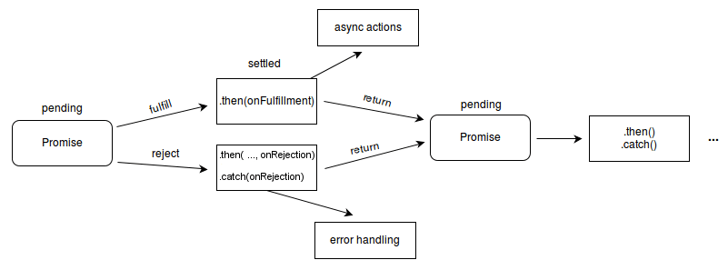

# Aula 06

## [Web Storage API](https://developer.mozilla.org/en-US/docs/Web/API/Web_Storage_API)

Muitas vezes uma aplicação web precisa **guardar informações do usuário**:  

- Preferências (tema claro/escuro, idioma).  
- Dados de login e autenticação.  
- Itens de um carrinho de compras.  

Existem três mecanismos principais para isso:  
1. **Cookies** – armazenamento leve, também acessível pelo servidor.  
2. **sessionStorage** – dados temporários, válidos apenas enquanto a aba/janela está aberta.  
3. **localStorage** – dados persistentes, mantidos mesmo após fechar o navegador.

### Cookies (HTTP)

Um [cookie HTTP](https://datatracker.ietf.org/doc/html/rfc6265#section-5.4) (um cookie web ou cookie de navegador) é um **pequeno fragmento de dados** que um servidor envia para o navegador do usuário. O navegador pode armazenar estes dados e enviá-los de volta na próxima requisição para o mesmo servidor. Normalmente é utilizado para identificar se duas requisições vieram do mesmo navegador — ao manter um usuário logado, por exemplo. Ele guarda informações dinâmicas para o protocolo HTTP sem estado.

Cookies são usados principalmente para três propósitos:

1. **Gerenciamento de sessão**: Logins, carrinhos de compra, placar de jogos ou qualquer outra atividade que deva ser guardada por um servidor.
2. **Personalização**: Preferências de usuário, temas e outras configurações.
3. **Rastreamento**: Registro e análise do comportamento de um usuário.

#### Funcionamento básico

1. Ao receber uma requisição HTTP, um servidor pode enviar um cabeçalho [Set-Cookie](https://developer.mozilla.org/pt-BR/docs/Web/HTTP/Reference/Headers/Set-Cookie) com a resposta. 
2. O navegador armazena o cookie e o envia (dentro do [cabeçalho HTTP](https://developer.mozilla.org/pt-BR/docs/Web/HTTP/Reference/Headers/Cookie)) em todas as novas requisições feitas para o mesmo servidor.

Exemplo do cabeçalho de uma Resposta HTTP:

```
HTTP/1.0 200 OK
Content-type: text/html
Set-Cookie: yummy_cookie=choco
Set-Cookie: tasty_cookie=strawberry

[conteúdo da página]
```

Exemplo do cabeçalho de uma Requisição HTTP:

```
GET /sample_page.html HTTP/1.1
Host: www.example.org
Cookie: yummy_cookie=choco; tasty_cookie=strawberry
```

Por que se contentar com o exemplo acima, se podemos ver de verdade?

#### [Diretivas](https://developer.mozilla.org/pt-BR/docs/Web/HTTP/Reference/Headers/Set-Cookie#diretivas)

As diretivas são as "configurações" ou "parâmetros" utilizados no `Set-Cookie`. A seguir, **algumas** diretivas:

- `Expires=<data>` (opcional)
  - Um timestamp que determina o tempo de vida máximo de um cookie. Se não for especificado, o cookie só vai existir durante a sessão.
- `Max-Age=<digito-diferente-0>` (opcional)
  - Número de segundos até o cookie expirar. Tem precedência sobre o Expires.
- `Secure` (opcional)
  - Um cookie seguro apenas será enviado para o servidor quando uma requisição utilizando os protocol SSL e HTTPS for realizada.
- `HttpOnly` (opcional)
  - Torna o cookie inacessível via JavaScript através da propriedade `Document.cookie`.

**[EXEMPLO](./exemplos/cookies.html)**

### sessionStorage e localStorage

- `sessionStorage` mantém as informações armazenadas por origem e permanece disponível enquanto há uma sessão aberta no navegador (mesmo a página sendo recarregada). Caso o browser seja fechado a sessão será limpa e as informações serão perdidas.
- `localStorage` mesmo que o navegador seja fechado, os dados permanecem armazenados.

Esses mecanismos estão disponíveis a partir das seguintes propriedades [`Window.sessionStorage`](https://developer.mozilla.org/pt-BR/docs/Web/API/Window/sessionStorage)  e [`Window.localStorage`](https://developer.mozilla.org/pt-BR/docs/Web/API/Window/localStorage) (para um maior suporte, o objeto Window implementa os objetos Window.LocalStorage e Window.SessionStorage) — ao invocar uma dessas propriedades, é criada uma instância do objeto [`Storage`](https://developer.mozilla.org/pt-BR/docs/Web/API/Storage), que fornece métodos para inserir, recuperar e remover os dados. Sempre será utilizado um **objeto diferente para cada origem** de `sessionStorage` e `localStorage`, dessa forma o controle de ambos é realizado de forma separada.

#### Interfaces

- [`Storage`](https://developer.mozilla.org/pt-BR/docs/Web/API/Storage): Permite que você insira, recupere e remova dados de um domínio no storage(session ou local).
- [`Window`](https://developer.mozilla.org/pt-BR/docs/Web/API/Window): A API de Web Storage estende o objeto [`Window`](https://developer.mozilla.org/pt-BR/docs/Web/API/Window) com duas novas propriedades — [`Window.sessionStorage`](https://developer.mozilla.org/pt-BR/docs/Web/API/Window/sessionStorage) e [`Window.localStorage`](https://developer.mozilla.org/pt-BR/docs/Web/API/Window/localStorage) — fornecendo acesso à sessão do domínio atual e local para o objeto [`Storage`](https://developer.mozilla.org/pt-BR/docs/Web/API/Storage) respectivamente.
- [`StorageEvent`]([`Storage`](https://developer.mozilla.org/pt-BR/docs/Web/API/Storage)): Um evento de storage é chamado em um objeto window do documento quando ocorre uma mudança no storage.

**EXEMPLOS**: [sessionStorate](./exemplos/sessionStorage.html) e [localStorage](./exemplos/localStorage.html).

### Comparação entre os métodos

| Mecanismo          | Duração        | Acessível pelo servidor | Capacidade | Uso típico                   |
| ------------------ | -------------- | ----------------------- | ---------- | ---------------------------- |
| **Cookies**        | Até expirar    | ✅ Sim                   | \~4 KB     | Autenticação, sessões, login |
| **sessionStorage** | Até fechar aba | ❌ Não                   | \~5 MB     | Dados temporários de sessão  |
| **localStorage**   | Persistente    | ❌ Não                   | \~5 MB     | Preferências, dados offline  |

## [`Fetch API`](https://developer.mozilla.org/en-US/docs/Web/API/Fetch_API)

Usa objetos [`Request`](https://developer.mozilla.org/en-US/docs/Web/API/Request) e [`Response`](https://developer.mozilla.org/en-US/docs/Web/API/Response) (e outras coisas e conceitos envolvidas nas requisições de redes, as quais não são nosso objetivo por enquanto).

Para fazer uma requisição de um recurso é usado o método [`fetch()`](https://developer.mozilla.org/en-US/docs/Web/API/Window/fetch). Esse método tem apenas um argumento mandatório (a URL do recurso) e returna um objeto [`Promise`](https://developer.mozilla.org/en-US/docs/Web/JavaScript/Reference/Global_Objects/Promise) que se resolve em um objeto [`Response`](https://developer.mozilla.org/en-US/docs/Web/API/Response) para a respectiva requisição.

### `Promise`

Um objeto [`Promise`](https://developer.mozilla.org/en-US/docs/Web/JavaScript/Reference/Global_Objects/Promise) é um proxy para um valor que não é necessariamente conhecido no momento em que a promessa (*promise*) é criada. Ela permite associar manipuladores (*handlers*) ao valor de sucesso ou ao motivo da falha de uma ação assíncrona. Isso permite que métodos assíncronos retornem valores como métodos síncronos: em vez de retornar imediatamente o valor final, o método assíncrono retorna uma promessa para fornecer o valor em algum momento futuro.

Uma `Promise` está em um dos seguintes estados:

- *pending*: estado inicial, nem cumprido (*fulfilled*) nem rejeitado (*rejected*).
- *fulfilled*: quando a operação foi concluída com sucesso.
- *rejected*: quando a operação falha.

A partir do estado *pending* uma `promise` pode ser tanto cumprida (*fulfilled*) quanto rejeitada (*rejected*). Quando uma dessas opções acontece os manipuladores associados, encadeados pelo método [`then`](https://developer.mozilla.org/en-US/docs/Web/JavaScript/Reference/Global_Objects/Promise/then) são chamados.

Uma `promise` é considerada *resolvida* se for cumprida ou rejeitada, mas não pendente.

<figure style="text-align:center;">
  
</figure>

Sintaxe de uma `promise`:

```javascript
const promise = new Promise((resolve, reject) => {
  // Código assíncrono aqui
  if (/* operação bem sucedida */) {
    resolve("Suuuuuuuuucessooooooo!");
  } else {
    reject("Algo de errado não está certo.");
  }
});
```

#### `Promises` em cadeia

Os métodos [`then`](https://developer.mozilla.org/en-US/docs/Web/JavaScript/Reference/Global_Objects/Promise/then), [`catch`](https://developer.mozilla.org/en-US/docs/Web/JavaScript/Reference/Global_Objects/Promise/catch) e [`finally`](https://developer.mozilla.org/en-US/docs/Web/JavaScript/Reference/Global_Objects/Promise/finally) são usados para associar uma ação adicional com uma `promise` que se torna resolvida.

O método [`then`](https://developer.mozilla.org/en-US/docs/Web/JavaScript/Reference/Global_Objects/Promise/then) aceita **até** dois argumentos:

- `onfulfilled`: função de retorno de chamada para o caso cumprido da `promise`.
- `onrejected`: função de retorno de chamada para o caso rejeitado.

Cada [`then`](https://developer.mozilla.org/en-US/docs/Web/JavaScript/Reference/Global_Objects/Promise/then) retorna um objeto de `promise` recém-gerado, que pode ser usado opcionalmente para encadeamento. Por exemplo:

```javascript
const minhaPromise = new Promise((resolve, reject) => {
  setTimeout(() => {
    resolve("foo");
  }, 300);
});

minhaPromise
  .then(handleFulfilledA)
  .then(handleFulfilledB)
  .then(handleFulfilledC)
  .catch(handleRejectedAny);
```

**EXEMPLOS**: [1](./exemplos/fetch-txt.html) e [2](./exemplos/fetch-json.html).

#### Fetch com `async` e `await`

Muitos programadores preferem utilizar `async` e `await`. Alguns dos possíveis motivos são que o código fica mais parecido com uma comunicação síncrona, e também fica mais limpo e legível. Basicamente:

- `async`: faz uma função retornar uma `Promise`.
- `await`: pausa a execução de uma função `async` até que a `Promise` seja resolvida ou rejeitada.

**EXEMPLOS:** [1](./exemplos/async-await1.html) e [2](./exemplos/async-await2.html).

## Materiais interessantes

- [Geeks for Geeks - Fetch API in JavaScript](https://www.geeksforgeeks.org/javascript/javascript-fetch-method/).
- [Understanding Promises, Async/Await, and the Fetch API in JavaScript](https://medium.com/@walidelbourdiney25/understanding-promises-async-await-and-the-fetch-api-in-javascript-84b3ca37c3ee).

## Exercícios

TODO