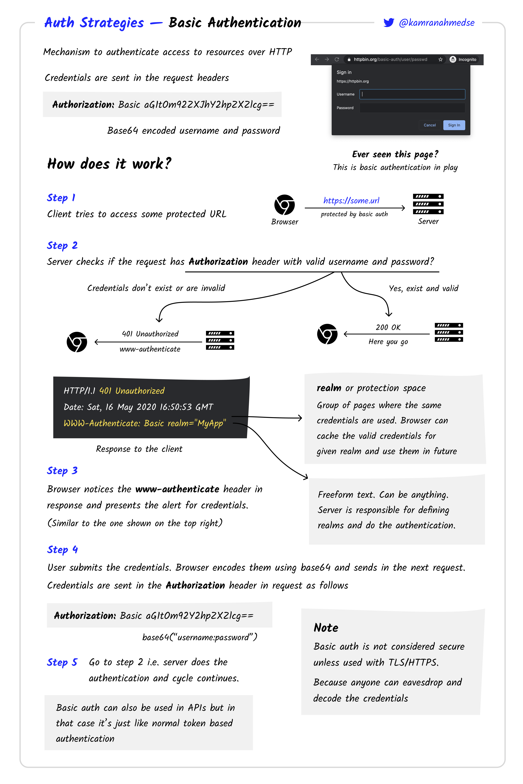
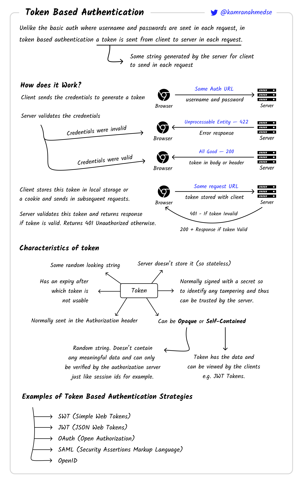
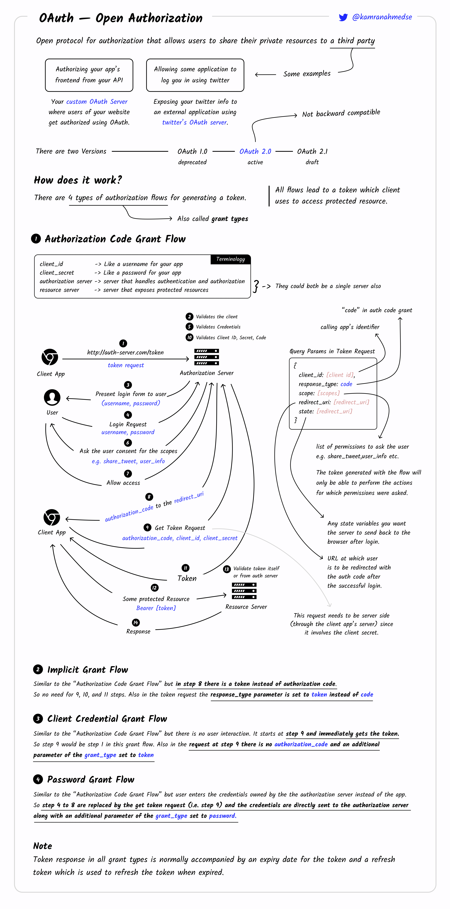
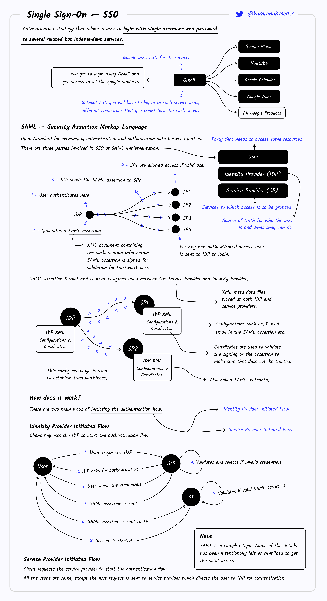
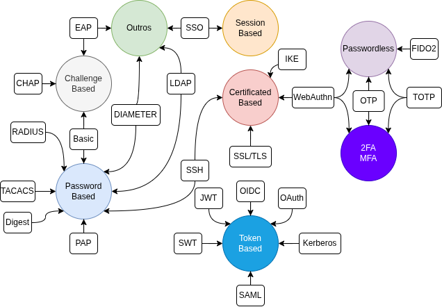

# Aula 08 - Autenticação

**Sumário**

- [Aula 08 - Autenticação](#aula-08---autenticação)
  - [1. Introdução](#1-introdução)
    - [1.1. Fatores](#11-fatores)
    - [1.2. Tipos de autenticação](#12-tipos-de-autenticação)
      - [1.2.1. Forte](#121-forte)
      - [1.2.2. Contínua](#122-contínua)
      - [1.2.3. Digital](#123-digital)
  - [2. Protocolos, métodos e processos de autenticação](#2-protocolos-métodos-e-processos-de-autenticação)
    - [2.1. PAP (*Password Authentication Protocol*)](#21-pap-password-authentication-protocol)
    - [2.2. CHAP (*Challenge-Handshake Authentication Protocol*)](#22-chap-challenge-handshake-authentication-protocol)
    - [2.3. EAP (*Extensible Authentication Protocol*)](#23-eap-extensible-authentication-protocol)
    - [2.4. TACACS, XTACACS e TACACS+](#24-tacacs-xtacacs-e-tacacs)
    - [2.5. RADIUS](#25-radius)
    - [2.6. DIAMETER](#26-diameter)
    - [2.7. Kerberos](#27-kerberos)
    - [2.8. LDAP](#28-ldap)
    - [2.9. Basic Authentication](#29-basic-authentication)
    - [2.10. Digest](#210-digest)
    - [2.11. SAML](#211-saml)
    - [2.12. OAuth](#212-oauth)
    - [2.13. OIDC](#213-oidc)
    - [2.14. TLS](#214-tls)
    - [2.15. IKE](#215-ike)
    - [2.16. SSH](#216-ssh)
    - [2.17. SSO](#217-sso)
    - [2.18. Resumo](#218-resumo)
  - [Atividade](#atividade)

## 1. Introdução

> É o processo de **verificar a identidade** de um usuário ou sistema para garantir que ele é quem afirma ser.

Por exemplo, precisamos nos autenticar antes de 

- Embarcar em um avião, ou ônibus; 
- Acessar a área de treino de uma academia;
- Acessar partes sensíveis de um sistema.

Não confundir com autorização:

| | **Autenticação** | **Autorização** |
|---|---|---|
| **Propósito** | Verificar a identidade do usuário | Determinar as permissões do usuário |
| **Exemplo** | Login com senha ou biometria | Acesso a arquivos ou recursos |
| **Quando acontece** | Primeiro passo | Após a autenticação |

### 1.1. Fatores

Existem três fatores de autenticação:

- **Fator de conhecimento**: algo que você sabe (senhas, PINs, perguntas de segurança).
- **Fator de posse**: algo que você possui (tokens físicos USB, smartphones para receber SMS ou OTP, chaves criptográficas).
- **Fator de qualidade/inerência**: algo que você é (biometria como impressão digital, reconhecimento facial, de íris ou voz).

Quando utilizamos apenas um fator temos uma **Autenticação de Único Fator** (*Single-Factor Authentication* - **SFA**). Quando são utilizados dois ou mais fatores temos uma **Autenticação Multifator** (*Multifactor Authentication* - **MFA**). Quando são utilizados exatamente dois fatores de autenticação temos uma **Autenticação de Dois Fatores** (*Two-Factor Authentication* - **2FA**).

### 1.2. Tipos de autenticação

#### 1.2.1. Forte

O [Banco Central Europeu define uma autenticação forte](https://www.ecb.europa.eu/pub/pdf/other/recommendationssecurityinternetpaymentsoutcomeofpcfinalversionafterpc201301en.pdf) como o procedimento de autenticação baseado em dois ou mais dos três fatores de autenticação. Os fatores usados devem ser mutuamente independentes e pelo menos um fator precisa ser "não-reutilizável" e "não-replicável" (exceto para o fator de inerência), e incapaz de ser roubado pela Internet.

#### 1.2.2. Contínua

Envolve a verificação em tempo real e constante da identidade de um usuário durante toda uma sessão ativa. Essa abordagem utiliza monitoramento passivo para detectar desvios dos padrões de uso estabelecidos, garantindo segurança contínua em ambientes dinâmicos, como dispositivos móveis ou redes corporativas. Diferentemente de eventos de autenticação discretos, ela opera implicitamente em segundo plano, adaptando-se às mudanças contextuais para impedir o acesso não autorizado.

Os principais mecanismos de autenticação contínua incluem análise comportamental e sensoriamento ambiental. A análise comportamental examina padrões específicos do usuário, como o reconhecimento de marcha derivado de dados de acelerômetro e giroscópio em dispositivos vestíveis, que identifica indivíduos por meio de estilos de caminhada únicos sem exigir interação ativa.

#### 1.2.3. Digital

Também conhecida como autenticação eletrônica ou *e-authentication* refere-se aos processos e mecanismos utilizados para verificar a identidade de usuários, dispositivos ou entidades em ambientes puramente digitais, com base em protocolos e padrões criptográficos para garantir uma verificação segura sem o uso de tokens físicos.

## 2. Protocolos, métodos e processos de autenticação

**Protocolos de autenticação** são um conjunto padronizado de regras para a verificação de identidades (ex.: CHAP, RADIUS). Já os **métodos de autenticação** consistem em fatores específicos utilizados para provar a identidade (ex.: senha, biometria). Por fim os **processos de autenticação** consistem no passo-a-passo para garantir acesso a um usuário, muitas vezes envolvendo múltiplos métodos e protocolos. Em outras palavras:

- **Protocolo de autenticação (As regras)**: Uma estrutura subjacente, geralmente programática, que define como os sistemas se comunicam e verificam identidades com segurança. Ela estabelece uma "linguagem" para verificação.
- **Método de autenticação (O mecanismo)**: A forma específica pela qual um usuário comprova sua identidade, geralmente em conjunto com um protocolo. Essas formas são categorizadas como algo que você sabe (senha), possui (token) ou é (biometria).
- **Processo de autenticação (O procedimento)**: O procedimento completo, passo a passo, para verificar um usuário, que pode incluir o protocolo, o método e o fluxo de trabalho do usuário. Ele garante que o usuário seja quem afirma ser, por exemplo, ao fazer login em um site.

Apesar dos três conceitos apresentados acima, o que se encontra a partir de uma pesquisa é que os termos são utilizados intercambiavelmente, ou seja, sem grandes distinções. Em vários casos o **protocolo** e o **método** são tratados como a mesma coisa. Uma possível razão é a descrição do **protocolo** permitir apenas sua implementação por completo, ou seja, não há a possibilidade de dois ou mais **métodos** para um mesmo **protocolo**. O mesmo ocorre entre **método** e **processo**.

Os tipos mais comuns são os seguintes:

- **Password-Based**: Baseados em envio direto ou uso de senhas/segredos.
- **Challenge-Based**: Autenticação baseada em desafio (o servidor envia um desafio, o cliente responde com um cálculo).
- **Token-Based**: Baseados em tokens de acesso (geralmente emitidos após login, usados em APIs/rotas).
- **Certificate‑Based**: Autenticação baseada em certificados digitais (X.509, etc.).
- **2FA/MFA**: Métodos que combinam dois ou mais fatores de autenticação.
- **Session-Based**: Autenticação baseada em sessões mantidas no servidor (cookies, identificadores de sessão).
- **Passwordless**: Autenticação sem uso de senha, baseados em dispositivo, biometria, etc.
- **Autenticação por biometria**: Autenticação feita por impressão digital, reconhecimento facial, íris, voz etc.
- **Hardware tokens**: Dispositivos USB/NFC que realizam login por chave pública ou provas de posse.
- **Link Mágico**: Envio de link único para login para o e-mail cadastrado.

A seguir, alguns dos métodos/protocolos mais conhecidos.

### 2.1. [PAP (*Password Authentication Protocol*)](https://www.rfc-editor.org/rfc/rfc1334#div-2)

Após a conclusão da fase de estabelecimento de link, um par ID/senha é enviado repetidamente pelo par ao autenticador até que a autenticação seja confirmada ou a conexão seja encerrada.

As senhas são enviadas pelo circuito em texto não criptografado, sem proteção contra reprodução ou ataques repetidos de tentativa e erro. O par controla a frequência e o momento das tentativas.

Pode ser categorizado como **Password-Based**.

### 2.2. [CHAP (*Challenge-Handshake Authentication Protocol*)](https://www.rfc-editor.org/rfc/rfc1334#div-3)

É usado para verificar periodicamente a identidade do par usando um `3-way handshake`. Isso feito após o estabelecimento inicial de link, e pode ser repetido a qualquer momento depois do link ser estabelecido.

Após a conclusão da fase de estabelecimento de link, o autenticador envia uma mensagem "desafio" (`challenge`) ao par. O par responde com um valor calculado a partir de uma função hash. O autenticador checa a resposta com o seu próprio cálculo. Se o valor for o mesmo a autenticação é confirmada.

O **CHAP** oferece proteção contra ataques de repetição por meio do uso de um identificador que muda incrementalmente e um valor de desafio variável. O uso de desafios repetidos visa limitar o tempo de exposição a qualquer ataque individual. O autenticador controla a frequência e o momento dos desafios.

Esse método de autenticação depende de um "segredo" (uma chave) conhecido somente pelo autenticador e o par. O segredo não é enviado pelo link.

Pode ser categorizado como **Challenge-Based**.

### 2.3. [EAP (*Extensible Authentication Protocol*)](https://www.rfc-editor.org/rfc/rfc5247)

Foi originalmente desenvolvido para o PPP (*Point-to-Point Protocol*), mas atualmente é amplamente utilizado nos padrões IEEE 802.3, IEEE 802.11 (WiFi) ou IEEE 802.16 como parte do framework de autenticação 802.1x.

A vantagem do EAP é que ele consiste apenas em um framework de autenticação geral para autenticação cliente-servidor. A forma específica de autenticação é definida em suas várias versões (mais de 40). As mais comuns são:

- EAP-MD5.
- EAP-TLS.
- EAO-TTLS.
- EAO-FAST.
- EAP-PEAP.

Em sua versão mais simples pode ser categorizado como **Challenge-Based**, contudo, devido à sua extensibilidade, suas modificações podem ser de outras categorias.

### 2.4. TACACS, XTACACS e TACACS+

O **TACACS** (*Terminal Access Controller Access-Control System*) é o protocolo AAA (*Authentication, Authorization, Accounting*) mais antigo, de autenticação baseada em IP e sem criptografia (usuário e senha eram transportados como texto simples). O **XTACACS** (*Extended TACACS*) adicionou autorização e contabilização (*accounting*). O **TACACS+** substituiu ambos, e separa os componentes AAA de forma que possam ser tratados em servidores separados. Usa o TCP (*Transmission Control Protocol*) para transporte e criptografa o pacote inteiro.

Pode ser categorizado como **Password-Based**.

### 2.5. RADIUS

O RADIUS (*Remote Authentication Dial-In User Service*) é um protocolo que fornece AAA centralizado para usuários que se conectam e usam um serviço de rede.

Pode ser categorizado como **Password-Based**.

### 2.6. DIAMETER

É um protocolo AAA que evoluiu do RADIUS, fornecendo novos recursos. Pode ser categorizado como **Password-Based**, contudo é extensível também.

### 2.7. [Kerberos](https://web.mit.edu/kerberos/)

O **Kerberos** V5, padronizado no [RFC 4120](https://datatracker.ietf.org/doc/html/rfc4120), usa criptografia de chave simétrica, incluindo variantes do AES como AES256-CTS-HMAC-SHA1-96, para assegurar a troca de `tickets`.

O processo de autenticação básico do **Kerberos** é da seguinte forma: um cliente envia uma requisição para o servidor de autenticação (**AS** - *Authentication Server*) para credenciais para um dado servidor. O **AS** responde com essas credenciais, criptografadas na chave do cliente. As credenciais consistem em um `ticket` para o servidor e uma chave de criptografia temporária (normalmente chamada de "chave de sessão"). O cliente transmite o `ticket` (o qual contém a identidade do cliente e uma cópia da chave de sessão, tudo criptografado na chave do servidor) para o servidor. A chave de sessão (agora compartilhada pelo cliente e servidor) é usada para autenticar o cliente e pode opcionalmente ser usada para autenticar o servidor. Ela também pode ser usada para criptografar comunicações futuras enter as duas partes ou para trocar uma chave de sub-sessão separada que será usada para criptografar comunicações futuras.

O **Kerberos** organiza a autenticação em domínios administrativos chamados *realms* (ou **domínios**), dando suporte a *cross-realm* trust por meio de chaves *inter-realm* compartilhadas, as quais permitem a autenticação em múltiplos domínios através de *Ticket Granting Tickets* (**TGTs**) encadeados.

Pode ser categorizado como **Token/Ticket-Based**.

### 2.8. LDAP

O **LDAP** (*Lightweight Directory Access Protocol*), definido no [RFC 4510](https://datatracker.ietf.org/doc/html/rfc4510) serve como padrão fundamental para autenticação em serviços de diretório. O **LDAP** suporta múltiplos modos de autenticação: acesso anônimo para operações somente leitura, autenticação simples usando um nome distinto (**DN**) e senha em texto simples, e **SASL** (*Simple Authentication and Security Layer*) para maior segurança através de mecanismos como GSSAPI (que integra o Kerberos para autenticação mútua baseada em `tickets`) ou **DIGEST-MD5** (que emprega desafios digest no estilo HTTP para evitar o envio de credenciais em texto não criptografado). Essas opções equilibram usabilidade e segurança, permitindo que as implementações escolham com base nas proteções de rede necessárias.

No processo de vinculação **LDAP**, o cliente inicia uma conexão e envia o DN do usuário juntamente com as credenciais (como uma senha para vinculações simples ou dados de negociação SASL); o servidor então verifica essas informações em seu banco de dados, aplica listas de controle de acesso (**ACLs** - *Access Control Lists*) para determinar as permissões e aceita a vinculação ou a rejeita com um código de erro. Para proteger o canal contra interceptação ou adulteração — algo especialmente crítico para vinculações simples em redes não confiáveis ​​— as implementações **LDAP** geralmente empregam o StartTLS, uma extensão que atualiza a conexão para criptografia **TLS** (*Transport Layer Security*) após o início da vinculação. Esse processo garante que a autenticação se integre perfeitamente com as consultas de diretório para recuperação de atributos, como funções ou associações a grupos, sem a necessidade de armazenamentos de credenciais separados.

Pode ser categorizado como **Directory-Based**.

### 2.9. Basic Authentication

O **Esquema de Autenticação HTTP Basic**, especificado no [RFC 7617](https://datatracker.ietf.org/doc/html/rfc7617), codifica o nome de usuário e a senha como uma string Base64 no formato `username:password` e a inclui no cabeçalho `Authorization` como `Basic credenciais-codificadas-em-base64`. Este método é simples e não requer estado no servidor, facilitando sua implementação para proteção básica de recursos. No entanto, ele transmite as credenciais em uma codificação reversível em vez de criptografia, tornando-o inseguro em conexões HTTP não criptografadas; seu uso isolado é desaconselhado e deve ser empregado apenas com HTTPS para evitar interceptação.

É uma implementação do framework geral definido no [RFC 7235](https://datatracker.ietf.org/doc/html/rfc7235). Pode ser categorizado como **Password-Based** e **Challenge-Based**.

<figure style="text-align:center;">
  
</figure>

### 2.10. Digest

O **Digest**, descrito no [RFC 7616](https://datatracker.ietf.org/doc/html/rfc7616), emprega um mecanismo de desafio-resposta para evitar o envio de credenciais em texto simples. O servidor fornece um *nonce* (um valor único gerado pelo servidor), o domínio e um parâmetro de algoritmo opcional (com MD5 como padrão, mas com suporte para SHA-256 e SHA-512-256 para maior segurança) no cabeçalho `WWW-Authenticate`. O cliente calcula uma resposta criptografada: para o algoritmo selecionado (por exemplo, SHA-256), HA1 = H(nome de usuário:domínio:senha), HA2 = H(método:digest-uri) e resposta = H(HA1:nonce:HA2) (com contagem de *nonces* adicionais e *nonce* do cliente para qop=auth [`qop` significa *quality of protection*]).

Pode ser categorizado como **Password-Based** e **Challenge-Based**.

### 2.11. SAML

Faz parte dos **Padrões de Federação de Identidade**, os quais permitem o logon único (**SSO** - *Single Sign-On*) em domínios confiáveis, permitindo que um provedor de identidade (**IdP** - *Identity Provider*) autentique usuários e emita declarações de segurança que os provedores de serviços (**SPs** - *Service Providers*) confiam para conceder acesso, sem trocar credenciais de usuário diretamente. Neste modelo, o **IdP** lida com a autenticação do usuário e gera declarações contendo detalhes de identidade e autorização, enquanto o **SP** confia nessas declarações assinadas digitalmente para tomar decisões de acesso, facilitando o acesso contínuo a recursos em todas as fronteiras organizacionais.

O **SAML** (*Security Assertion Markup Language*) fornece uma estrutura baseada em XML para troca de dados de autenticação e autorização em ambientes federados. Suporta **SSO** web através das mensagens `AuthnRequest` e `AuthnResponse`, onde um **SP** inicia a autenticação enviando um `AuthnRequest` para o **IdP**, que responde com uma declaração confirmando a identidade e os atributos do usuário. O **SAML 2.0** define vinculações a protocolos HTTP, incluindo `POST` para transmissão direta de declaração, `Redirect` para fluxos baseados em navegador e `Artifact` para resolução indireta para reduzir o tamanho da mensagem e aumentar a segurança.

Pode ser categorizado como **SSO-Based**, **Federated** e **Token-Based**.

<figure style="text-align:center;">
  
</figure>

### 2.12. OAuth

O OAuth 2.0 (Open Authorization) especificado no [RFC 6749](https://datatracker.ietf.org/doc/html/rfc6749), serve como uma estrutura de autorização principalmente para delegar acesso a APIs em nome de um proprietário de recurso, embora indiretamente suporte autenticação em cenários federados. Ele emprega tipos de concessão como a concessão de código de autorização, onde um cliente obtém um código temporário do servidor de autorização e o troca por um token de acesso (aprimorado com **PKCE** (*Proof Key for Code Exchange*) para clientes públicos para evitar interceptação), e a concessão implícita, que emite diretamente um token de acesso em clientes baseados em navegador — embora este último esteja obsoleto nas melhores práticas modernas devido a riscos de segurança como exposição de token em URLs.

Pode ser categorizado como **Token-Based**.

<figure style="text-align:center;">
  
</figure>

### 2.13. OIDC

O **OIDC** (*OpenID Connect*) é baseado no OAuth 2.0 como uma camada de autenticação para verificar a identidade do usuário final, produzindo tokens de ID no formato *JSON Web Token* (**JWT**) que transmitem informações como emissor, sujeito e expiração. Ele suporta a descoberta por meio do *endpoint* `.well-known/openid-configuration`, permitindo que os clientes recuperem dinamicamente metadados do provedor, como *endpoints* de autorização e token. O **OIDC** permite o **SSO** adicionando provas de identidade aos fluxos OAuth, com os clientes validando tokens de ID para confirmar a autenticação sem o manuseio direto de credenciais.

Pode ser categorizado como **Token-Based**.

### 2.14. TLS

Faz parte dos protocolos de certificado e PKI. A Infraestrutura de Chaves Públicas (**PKI** - *Public Key Infrastructure*) forma a base para protocolos de autenticação baseados em certificados, estabelecendo um modelo hierárquico de confiança onde certificados digitais vinculam chaves públicas a identidades verificadas. Em sua essência, a **PKI** se baseia em certificados X.509, padronizados no [RFC 5280](https://datatracker.ietf.org/doc/html/rfc5280), que codificam uma chave pública juntamente com atributos como o nome distinto do sujeito, detalhes do emissor, período de validade e extensões para fins como restrições de uso da chave. Esses certificados são emitidos e assinados por Autoridades Certificadoras (**ACs**) confiáveis, criando uma cadeia de confiança desde as **ACs** raiz até os certificados das entidades finais, permitindo que as entidades verifiquem as identidades umas das outras sem depender de segredos compartilhados. Essa abordagem de criptografia assimétrica permite autenticação escalável em sistemas distribuídos, já que qualquer verificador pode verificar a validade de um certificado em relação à chave pública do emissor.

No protocolo **TLS** (*Transport Layer Security*), conforme definido no [RFC 8446](https://datatracker.ietf.org/doc/html/rfc8446), os certificados desempenham um papel central durante o `handshake` para autenticação do servidor e autenticação mútua opcional entre cliente e servidor. O servidor apresenta seu certificado X.509, que o cliente verifica em relação a Autoridades Certificadoras (CAs) confiáveis, incluindo verificações de validade da assinatura, expiração e status de revogação. Para autenticação mútua, o cliente também fornece um certificado, comprovando a posse da chave privada por meio de uma assinatura digital no registro do `handshake` (para servidores) ou por meio da mensagem `CertificateVerify` (para clientes). Essa comprovação baseada em assinatura garante que o detentor do certificado controle a chave privada correspondente sem revelá-la, suportando comunicações web seguras, assinatura de e-mails (via S/MIME) e outras aplicações. A evolução do **TLS** a partir do **SSL** (*Secure Sockets Layer*) enfatizou o sigilo de encaminhamento por meio de trocas de chaves efêmeras Diffie-Hellman, complementando a autenticação por certificado.

Pode ser categorizado como **Certificate-Based**.

### 2.15. IKE

O protocolo **IKE** (*Internet Key Exchange*), conforme especificado no [RFC 7296](https://datatracker.ietf.org/doc/html/rfc7296), utiliza Infraestrutura de Chaves Públicas (PKI) para autenticar endpoints de VPNs **IPsec** (*Internet Protocol Security*), frequentemente em conjunto com chaves pré-compartilhadas como alternativa. Durante a etapa `IKE_SA_INIT`, as partes realizam uma troca Diffie-Hellman para estabelecer segredos compartilhados, seguida pela etapa `IKE_AUTH`, onde os certificados são trocados e autenticados por meio de assinaturas digitais sobre os nonces e identidades trocados. O **IKE** suporta certificados X.509 com extensões para atributos de autorização, permitindo controle de acesso granular em redes corporativas. Esse modo de certificado aprimora a escalabilidade em relação às chaves pré-compartilhadas, evitando a necessidade de distribuir segredos simétricos aos pares, enquanto a integração com Diffie-Hellman protege contra ataques *man-in-the-middle* durante a negociação de chaves. Amplamente implementado em VPNs *site-to-site* e de acesso remoto, os recursos de PKI do **IKEv2** garantem uma autenticação robusta para proteger o tráfego IP.

Pode ser categorizado como **Certificate-Based**/**Key-Based**.

### 2.16. SSH

A autenticação por chave pública do *Secure Shell* (**SSH**), descrita no [RFC 4252](https://datatracker.ietf.org/doc/html/rfc4552) para a arquitetura do protocolo, substitui os métodos baseados em senha por chaves assimétricas para verificação de usuário e host, eliminando riscos como ataques de força bruta. Os usuários geram um par de chaves pública e privada, com a chave pública registrada no arquivo `authorized_keys` do servidor ou por meio de um certificado assinado por uma Autoridade Certificadora (CA). Durante a conexão, o servidor solicita ao cliente que assine um nonce aleatório usando a chave privada, que o servidor verifica comparando-o com a chave pública armazenada. A autenticação do host utiliza certificados de servidor ou chaves de host pré-instaladas para evitar falsificação. O **SSH** suporta o encaminhamento de agente, onde um agente de autenticação na máquina cliente gerencia as chaves privadas de forma transparente entre as sessões, permitindo o logon único (SSO) em ambientes com múltiplos saltos sem expor as chaves a hosts intermediários. Esse método é padrão para administração remota e transferências seguras de arquivos.

### 2.17. SSO

<figure style="text-align:center;">
  
</figure>

### 2.18. Resumo

<figure style="text-align:center;">
  
</figure>

## Atividade

Pesquisar e apresentar brevemente sobre:

1. Passwordless --> OTP e TOTP
2. Biometria --> FIDO2 e WebAuthn
3. Tokens --> JWT e SWT
4. *Risk-Based* / *Adaptive Authentication*
5. Certificado --> SSL/TLS e SSH
6. Passkeys
7. Tokens --> OIDC e Kerberos
8. Session-Based --> SSO e Cookies