# Aula 09

<style>
    hr{
        height:2px;
        background-color: black;
        border: none;
    }
</style>

Sumário

- [Aula 09](#aula-09)
  - [Modelagem de dados](#modelagem-de-dados)
    - [Comparação entre os modelos](#comparação-entre-os-modelos)
  - [Notação de James Martin](#notação-de-james-martin)
    - [Exemplo](#exemplo)
  - [Normalização](#normalização)
    - [Primeira Forma Normal](#primeira-forma-normal)
    - [Segunda Forma Normal](#segunda-forma-normal)
    - [Terceira Forma Normal](#terceira-forma-normal)
    - [Forma Normal de Boyce-Codd](#forma-normal-de-boyce-codd)
    - [Quarta Forma Normal](#quarta-forma-normal)
    - [Quinta Forma Normal](#quinta-forma-normal)
  - [Bibliotecas e Frameworks para Banco de Dados com Python](#bibliotecas-e-frameworks-para-banco-de-dados-com-python)
    - [`Conectores`](#conectores)
      - [Principais métodos dos conectores em Python](#principais-métodos-dos-conectores-em-python)
    - [Fluxo básico](#fluxo-básico)
    - [Frameworks](#frameworks)


## Modelagem de dados

> A Modelagem de Dados é o estudo das informações existentes em um contexto sob observação para a construção de um modelo de representação e entendimento de tal contexto.

<div style="display: flex; padding-bottom:10px;">
  <div style="flex: 1; padding-right: 10px;">
    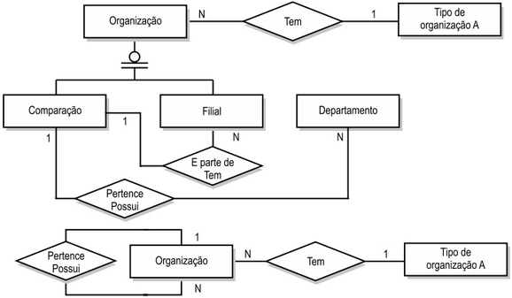
  </div>
  <div style="flex: 1; padding-left: 10px;">
    <ul>
        <li><b>Modelo conceitual</b>
            <ul>
                <li>Representa e descreve a realidade do ambiente do problema, constituindo-se em uma visão global dos <b>principais dados</b> e <b>seus relacionamentos</b>.</li>
                <li>Não retrata e nem é vinculado aos aspectos relacionados a um SGBD em específico.</li>
                <li>Deve ser sempre a primeira etapa de um projeto de banco de dados.</li>
            </ul>
        </li>
    </ul>
  </div>
</div>

<hr>

<div style="display: flex; padding:10px 0px;">
  <div style="flex: 1; padding-right: 10px;">
    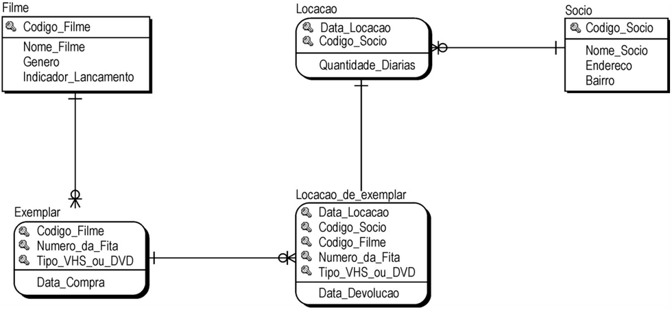
  </div>
  <div style="flex: 1; padding-left: 10px;">
    <ul>
        <li><b>Modelo lógico</b>
            <ul>
                <li>Descreve as estruturas que estarão no banco de dados de acordo com as possibilidades permitidas pela sua abordagem, mas sem considerar, ainda, características específicas de um SGBD.</li>
                <li>Resulta em um esquema lógico sob a óptica de alguma abordagem específica (as mais comuns: relacional e orientada a objetos).</li>
            </ul>
        </li>
    </ul>
  </div>
</div>

<hr>

<div style="display: flex; padding:10px 0px;">
  <div style="flex: 1; padding-right: 10px;">
    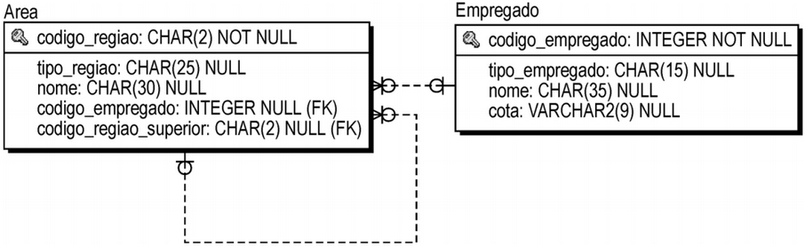
  </div>
  <div style="flex: 1; padding-left: 10px;">
    <ul>
        <li><b>Modelo físico</b>
            <ul>
                <li>É construído a partir do modelo lógico e descreve as estruturas físicas de armazenamento de dados, como: tipo e tamanho de campos, índices, domínio de preenchimento desses campos, nomenclaturas, etc.</li>
                <li>É a etapa final do projeto de banco de dados.</li>
            </ul>
        </li>
    </ul>
  </div>
</div>

### Comparação entre os modelos

| **Modelo Conceitual** | **Modelo Lógico** | **Modelo Físico** |
|---|---|---|
| Inclui construções de dados de alto nível. | Inclui entidades (tabelas), atributos (colunas/campos) e relacionamentos (chaves). | Inclui tabelas, colunas, chaves, tipos de dados, regras de validação, gatilhos (*triggers*), procedimentos armazenados, e restrições de acesso. |
| Nomes não técnicos, de forma que todos consigam entender as descrições básicas. | Nomes técnicos para entidades e atributos. | Nomes mais definidos e menos genéricos para tabelas e colunas. |

## Notação de James Martin

É também conhecida como notação **Pé de Galinha** (*Crow's foot*, pé de corvo, em Inglês).

<div style="text-align: center;">
    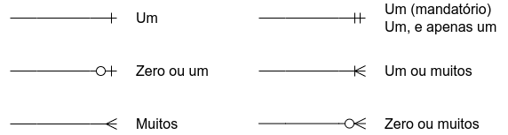
</div>

As entidades continuam como retângulos, porém, os atributos agora são escritos dentro dos retângulos. Os relacionamentos não são mais nomeados.

<div style="text-align: center;">
    
</div>

### Exemplo

Para termos um exemplo durante a aula, vou utilizar a modelagem de uma loja de Atacado, chamada *Atacadão*. A seguir, seu **modelo conceitual**:

<div style="text-align: center;">
    
</div>

A seguir, o **modelo lógico**

<div style="text-align: center;">
    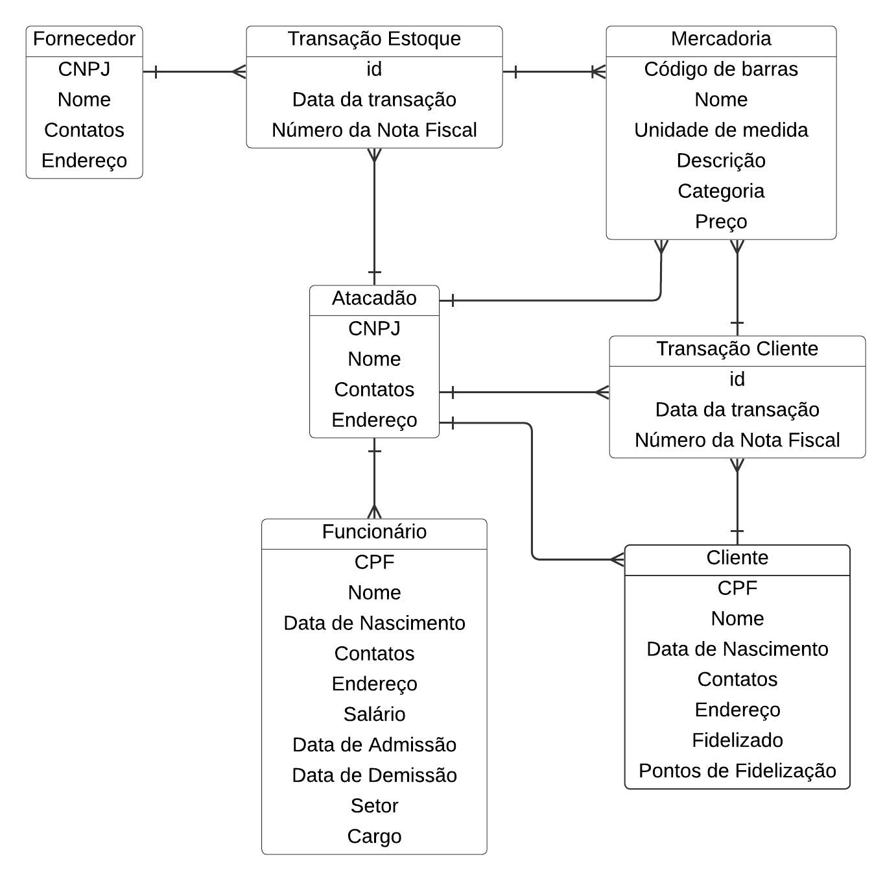
</div>

## Normalização

> **Normalização** é um procedimento que examina e **simplifica os atributos** de uma entidade com o objetivo de **evitar anomalias** que possam ocorrer na inclusão, na exclusão ou na alternação de uma ocorrência especı́fica em uma entidade.

Ao longo do tempo (a partir de 1970 até 2003) foram propostas **10 formas normais**. Entretanto, um banco de dados relacional que tenha alcançado os critérios da **Terceira Forma Normal**, já pode ser considerado normalizado, pois estará livre das anomalias de adição, edição e inclusão de dados.

As formas normais:

- Primeira Forma Normal - **1FN**.
- Segunda Forma Normal - **2FN**.
- Terceira Forma Normal - **3FN**.
- Forma Normal de Chave Elementar - **FNCE**.
- Forma Normal de Boyce-Codd - **FNBC**.
- Quarta Forma Normal - **4FN**.
- Forma Normal de Tupla Essencial - **FNTE**.
- Quinta Forma Normal - **5FN**.
- Forma Normal de Chave de Domı́nio - **FNCD**.
- Sexta Forma Normal - **6FN**.

### Primeira Forma Normal

A **1FN** estabelece que uma entidade está em conformidade se:

- Não possui atributos multivalorados ou grupos repetitivos, ou seja, os valores dos atributos devem ser **atômicos** (ou **indivisíveis**).
- Todos os atributos estão no formato atômico, ou seja, não são compostos por múltiplas partes.
- Existe uma chave primária que identifica apenas uma ocorrência.
- As ocorrências da entidade são todas distintas entre si.

Para normalizar é necessário:

1. **Identificar** a(s) **coluna**(s) que possui(em) dados multivalorados e compostos, e **removê-la**(s).
2. **Construir outra tabela** (ou seja, outra entidade) com o atributo identificado e removido e, sem seguida, estabelecendo uma relação entre as duas entidades.

Vamos normalizar o `Atacadão`:

<div style="display: flex; padding:10px 0px;">
  <div style="flex: 1; padding-right: 10px;">
    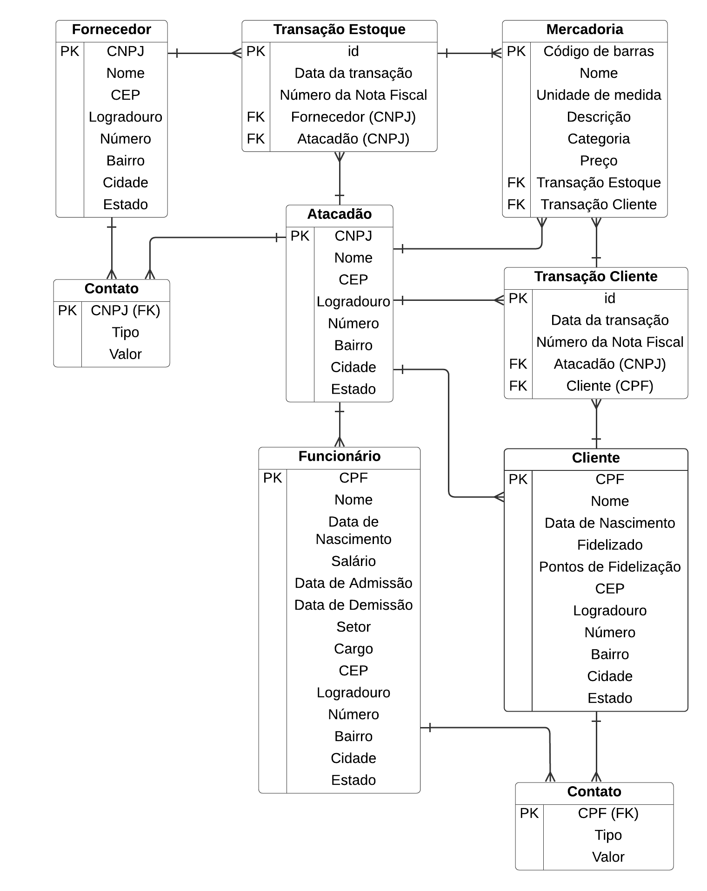
  </div>
  <div style="flex: 1; padding-left: 10px;">
    <ul>
        <li><b>Não deve haver atributo multivalorado</b>
            <ul>
                <li>O atributo <b>contatos</b>, que está presente nas entidades <b>Fornecedor</b>, <b>Atacadão</b>, <b>Funcionário</b> e <b>Cliente</b>, é um atributo <b>composto</b> e <b>multivalorado</b>.</li>
                <li>A partir disso, podemos criar uma nova entidade chamada <b>Contato</b>, com os seguintes atributos: <b>Pessoa</b> [CPF/CNPJ](FK), <b>Tipo</b> e <b>Valor</b>.</li>
            </ul>
        </li>
        <li><b>Todos os atributos devem estar no formato atômico</b>
            <ul>
                <li>O atributo <b>Endereço</b> será transformado nos atributos: <b>CEP</b>, <b>Logradouro</b>, <b>Número</b>, <b>Bairro</b>, <b>Cidade</b>, <b>Estado</b>.</li>
            </ul>
        </li>
        <li><b>Existe uma chave primária que identifica somente uma ocorrência da entidade</b>
            <ul>
                <li>As chaves primárias e estrangeiras são identificadas e rotuladas em todas as entidades.</li>
            </ul>
        </li>
    </ul>
  </div>
</div>

### Segunda Forma Normal

Uma entidade está em conformidade com a Segunda Forma Normal (**2FN**) se:

- Estiver na 1FN.
- Todos os atributos não chave **dependem totalmente** da chave primária (PK).

Exemplos:

<div style="text-align: center;">
    
    
    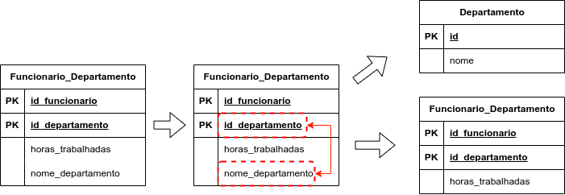
</div>

O modelo do `Atacadão` já está na **2FN**.

### Terceira Forma Normal

Uma entidade está em conformidade com a Terceira Forma Normal (**3FN**) se:

- Estiver na 2FN.
- Não haja dependências transitivas (atributos não-chave dependendo de outros não-chave).

Exemplos:

<div style="text-align: center;">
    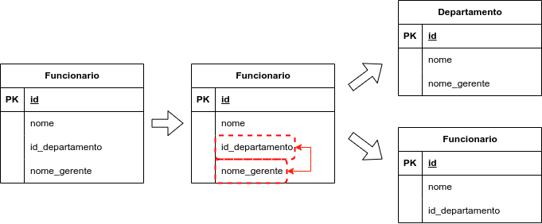
    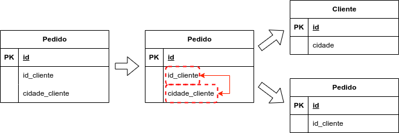
    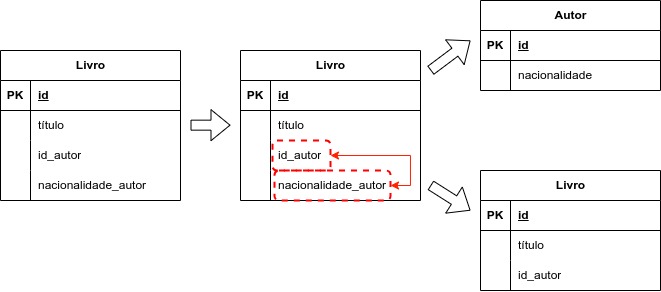
</div>

Modelo do `Atacadão` atualizado para **3FN**:

<div style="display: flex; padding:10px 0px;">
  <div style="flex: 1; padding-right: 10px;">
    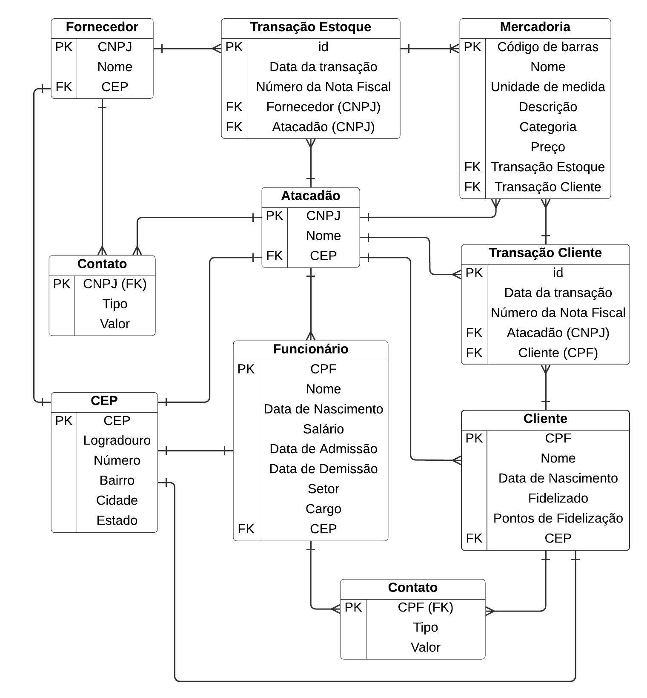
  </div>
  <div style="flex: 1; padding-left: 10px;">
    <ul>
        <li><b>Dependências transitivas</b>
            <ul>
                <li>Nas entidades <b>Fornecedor</b>, <b>Atacadão</b>, <b>Funcionário</b> e <b>Cliente</b> os atributos <b>Logradouro</b>, <b>Número</b>, <b>Bairro</b>, <b>Cidade</b> e <b>Estado</b> dependiam transitivamente de <b>CEP</b>.</li>
                <li>Uma nova entidade chamada <b>CEP</b> foi criada com esses atributos.</li>
            </ul>
        </li>
    </ul>
  </div>
</div>

### Forma Normal de Boyce-Codd

Uma entidade está em conformidade com a Forma Normal de Boyce-Codd (**FNBC**) se:

- Estiver na 3FN.
- Para toda `dependência funcional` $X \rightarrow Y$, $X$ é `superchave`.

Dada uma relação $R$ e um conjunto de atributos $X, Y \subseteq R$, é dito que $X$ determina funcionalmente $Y (X \rightarrow Y)$ se cada valor de $X$ é associado com precisamente um valor de $Y$. Em outras palavras, a dependência funcional $X \rightarrow Y$ significa que valores de $Y$ são determinados por valores de $X$. Duas **tuplas** (ou seja, duas linhas de uma tabela, ou duas instâncias de uma mesma entidade) que possuem os mesmos valores de $X$ necessariamente terão os mesmos valores de $Y$.

Exemplo:

| **EstudanteID** | **Semestre** | **Disciplinas** | **Professor** |
|---|---|---|---|
| 1234 | 6 | SISTEMAS INTELIGENTES | ROMUERE SILVA |
| 1221 | 4 | PROGRAMAÇÃO PARA A WEB I | EVANDRO SILVA |
| 1234 | 6 | GERÊNCIA DE PROJETOS | EVANDRO SILVA |
| 1201 | 1 | ALGORITMOS E PROGRAMAÇÃO I | ALCILENE DE SOUSA |
| 1201 | 1 | LÓGICA PARA COMPUTAÇÃO | JOSÉ DENES ARAÚJO |

- **Dependências funcionais**
  - EstudanteID $\rightarrow$ Semestre.
  - {EstudanteID, Disciplina} $\rightarrow$ Professor.
  - {EstudanteID, Disciplina} $\rightarrow$ {Professor, Semestre}.
  - {Semestre, Disciplina} $\rightarrow$ Professor.

Uma `superchave` é qualquer **conjunto de atributos** que identifica exclusivamente uma tupla de uma relação (ou seja, uma linha de uma tabela). 

O conjunto de todos os atributos é chamado de `superchave trivial`.

O conjunto com a menor quantidade de atributos necessários para identificar exclusivamente uma tupla é chamada de `chave candidata`. 

Exemplo:

- Tabela **Funcionario** = {`func_id`, `nome`, `cargo`, `departamento_id`}.
- Considerando que `func_id` tem valores únicos, **sua combinação com quaisquer outros atributos é uma superchave**.
- O conjunto que contém apenas o atributo `func_id` é o menor possível para identificar cada tupla, portanto esse atributo é uma `chave candidata`.

<div style="display: flex; padding:10px 0px;">
  <div style="flex: 1; padding-right: 10px;">
    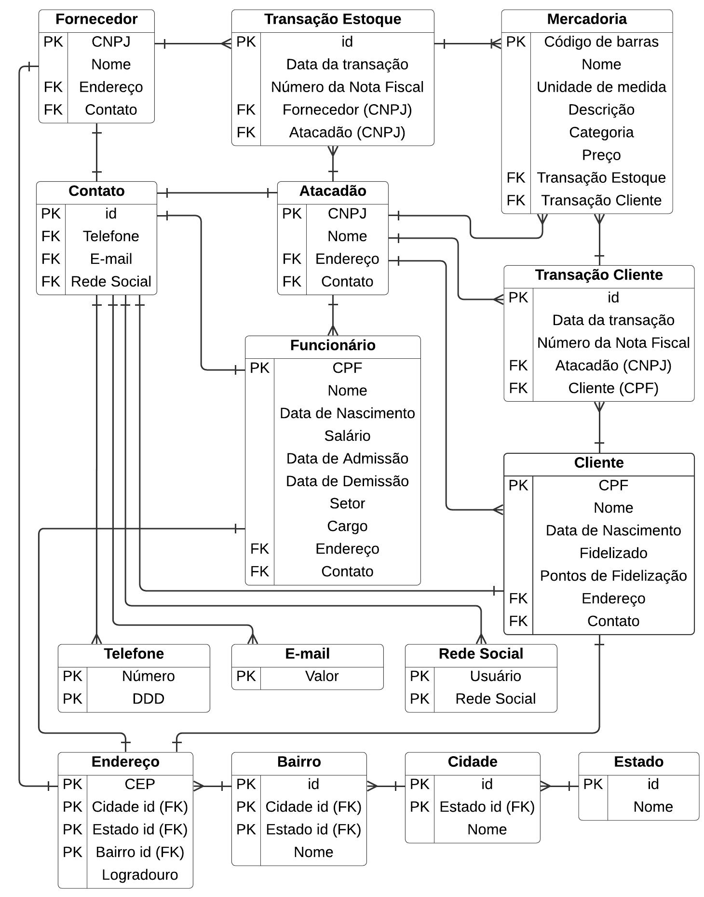
  </div>
  <div style="flex: 1; padding-left: 10px;">
    <ul>
        <li><b>Dependências transitivas</b>
            <ul>
                <li>Entidade <b>CEP</b> decomposta nas entidades <b>Estado</b>, <b>Cidade</b>, <b>Bairro</b> e <b>Endereco</b>.</li>
                <li>Entidade <b>Contato</b> decomposta nas entidades <b>Telefine</b>, <b>E-mail</b>, <b>RedeSocial</b> e <b>Contato</b>.</li>
            </ul>
        </li>
    </ul>
  </div>
</div>

### Quarta Forma Normal

Uma entidade está em conformidade com a Quarta Forma Normal (**4FN**) se:

- Estiver na FNBC.
- Não contiver **dependências multivaloradas não triviais**.

Exemplo (entidade `Funcionario`):

| **FuncionarioID** | **Habilidade** | **Idioma** |
|---|---|---|
| 1 | Jiujitsu | Português |
| 1 | Aikido | Japonês |
| 2 | Karate | Inglês |
| 3 | Krav-Magá | Hebraico |

A partir de `Funcionario` teremos as entidades `Habilidade` e `Idioma`. Além dessas duas, outras entidades para o mapeamento entre `Funcionario`, `Habilidade` e `Idioma`.

Entidade `Habilidade`:

| **HabilidadeID** | **Nome** |
|---|---|
| 1 | Jiujitsu |
| 2 | Aikido |
| 3 | Karate |
| 4 | Krav-Magá |

Entidade `Idioma`:

| **IdiomaID** | **Nome** |
|---|---|
| 1 | Português |
| 2 | Japonês |
| 3 | Inglês |
| 4 | Hebraico |

Entidade `Funcionario_Habilidade`:

| **FuncionarioID** | **HabilidadeID** |
|---|---|
| 1 | 1 |
| 1 | 2 |
| 2 | 3 |
| 3 | 4 |

Entidade `Funcionario_Idioma`:

| **FuncionarioID** | **IdiomaID** |
|---|---|
| 1 | 1 |
| 1 | 2 |
| 2 | 3 |
| 3 | 4 |


### Quinta Forma Normal

Uma entidade está em conformidade com a Quinta Forma Normal (**5FN**) se:

- Estiver na 4FN.
- O conteúdo de cada ocorrência não puder ser reconstruı́do a partir de ocorrências menores.

Deve ser aplicada sempre que existirem relacionamentos ternários ou n-ários, com o objetivo de reduzir os relacionamentos ao nível binário.

Exemplo:

<div style="text-align: center;">
        
</div>

Pode ser reorganizado da seguinte forma:

<div style="text-align: center;">
    
</div>

Entidades:

- `Veiculo` = {id, marca, ano, ...}
- `Motorista` = {id, nome, cnh, ...}
- `Corrida`= {id, id_veiculo, id_motorista}

## Bibliotecas e Frameworks para Banco de Dados com Python

Existem duas formas básicas de se implementar a comunicação de uma aplicação com o banco de dados.

1. Manipulando "diretamente" a partir de um `conector`.
2. Utilizando um `framework`.

### `Conectores`

São bibliotecas que possibilitam a conexão da aplicação com o banco de dados. Adaptadores para:

- PostgreSQL: **psycopg2**.
- MySQL: **PyMySQL**, **mysql-connector-python**.
- SQLite: **sqlite3**.

Um módulo para o `SQLite` já vem com a instalação do Python, portanto não é preciso instalar uma biblioteca para ele. Além disso, dependendo da IDE que você estiver utilizando, é bastante provável que seja possível instalar alguma extensão para esse banco.

O [`SQLite`](https://www.sqlite.org/) é um "motor" de banco de dados auto-contido, de alta confiabilidade, embutido, com todos os recursos necessários, e de domínio público. Consiste em uma biblioteca em linguagem C que implementa uma base de dados SQL embutida, e consiste no próprio servidor. Por isso que é interessante uma extensão, principalmente para visualização gráfica de tabelas, etc.

#### Principais métodos dos conectores em Python

- `connect`
  - Função global do conector para criar uma coneção com o banco de dados.
  - Retorna um objeto do tipo `Connection`.
- `Connection`
  - Classe utilizada para gerenciar todas as operações no banco de dados.
  - Principais métodos:
    - `commit`: confirma todas as operações pendentes.
    - `rollback`: desfaz todas as operações pendentes.
    - `cursor`: retorna um objeto do tipo `Cursor`.
    - `close`: encerra a conexão com o banco de dados.
- `Cursor`
  - Classe utilizada para enviar os comandos ao bando de dados.
  - Principais métodos:
    - `execute`: prepara e executa a operação passada como parâmetro.
    - `fetchone`: retorna a próxima linha encontrada por uma consulta
    - `fetchall`: retorna todas as linhas encontradas por uma consulta.

### Fluxo básico

1. Criar uma conexão com o banco de dados com a função `connect`.
2. Utilizar a conexão para criar um cursor, o qual será utilizado para enviar comandos ao banco de dados.
3. Utilizar o cursor para enviar comandos ao banco de dados.
4. Efetivar as mudanças utilizando o método `commit` da conexão.
5. Fechar o cursor e a conexão.

Exemplo de conexão com o banco:

```python
# Adaptado de : https://www.geeksforgeeks.org/python-sqlite/
import sqlite3

try:
    # Criando e conectando ao banco, e criando um cursor
    conexao = sqlite3.connect('teste.db')
    cursor = conexao.cursor()
    print('Iniciando o banco')

    # Escrevendo uma query e executando
    query = 'select sqlite_version();'
    cursor.execute(query)

    # Pegando e mostrando o resultado
    resultado = cursor.fetchall()
    print(f'A versão do SQL é {resultado}')

    # Encerrando o cursor
    cursor.close()
except sqlite3.Error as erro:
    print('Ocorreu um erro: ', erro)
finally:
    # Encerrando a conexão com o banco de dados
    if conexao:
        conexao.close()
        print('Conexão encerrada')
```

Exemplo de criação de tabela e inserção de valores:

```python
# Adaptado de: https://pythonclub.com.br/gerenciando-banco-dados-sqlite3-python-parte1.html
import sqlite3

try:
    # Conectando
    conexao = sqlite3.connect('teste.db')
    print('Conexão bem sucedida')

    # Definindo um cursor
    cursor = conexao.cursor()
    
    # Criando a tabela (schema)
    cursor.execute("""
    CREATE TABLE clientes(
        id INTEGER NOT NULL PRIMARY KEY AUTOINCREMENT,
        nome TEXT NOT NULL,
        idade INTEGER,
        cpf VARCHAR(11) NOT NULL,
        email TEXT NOT NULL,
        fone TEXT,
        cidade TEXT,
        uf VARCHAR(2) NOT NULL,
        criado_em DATE NOT NULL
    );
    """)

    print('Tabela criada com sucesso')

    # Inserindo alguns registros
    cursor.execute("""
        INSERT INTO clientes (nome, idade, cpf, email, fone, cidade, uf, criado_em)
        VALUES ('Fulano', 35, '00000000000', 'fulano@estacio.br', '(86)99999-9999', 'Teresina', 'PI', '2023-03-24')
    """)

    cursor.execute("""
        INSERT INTO clientes (nome, idade, cpf, email, fone, cidade, uf, criado_em)
        VALUES ('Cicrano', 87, '11111111111', 'cicrano@email.com', '98765-4321', 'São Paulo', 'SP', '2023-03-25')
    """)

    cursor.execute("""
        INSERT INTO clientes (nome, idade, cpf, email, fone, cidade, uf, criado_em)
        VALUES ('Beltrana', 21, '22222222222', 'beltana@email.com', '98-98765-4322', 'Caxias', 'MA', '2023-03-24')
    """)

    cursor.execute("""
        INSERT INTO clientes (nome, idade, cpf, email, fone, cidade, uf, criado_em)
        VALUES ('Derpina', 19, '33333333333', 'derpina@meme.com', '11-98765-4323', 'Campinas', 'SP', '2023-03-25')
    """)

    # Gravando no Banco
    conexao.commit()
    print('Dados inseridos com sucesso')

    cursor.close()
except sqlite3.Error as erro:
    print('Ocorreu um erro: ', erro)
finally:
    # Encerrando a conexão com o banco de dados
    if conexao:
        conexao.close()
        print('Conexão encerrada')
```

### Frameworks

Os frameworks de banco de dados **facilitam a interação com o banco de dados** ao abstrair bastante os detalhes de baixo nível da conexão e execução de querry. Normalmente eles incluem **ORMs** (*Object-Relational Mappers*), Mapeadores Objeto-Relacionais, o que permite aos desenvolvedores interagir com o banco usando objetos do Python em vez de escrever código SQL.

A seguir uma lista de alguns desses frameworks:

- [Django ORM](https://docs.djangoproject.com/en/5.2/topics/db/queries/): integrado ao framework web Django, ele fornece um ORM poderoso e abrangente para bancos de dados relacionais como PostgreSQL, MySQL, SQLite e Oracle. Oferece recursos como migrações, querysets e uma interface administrativa robusta.
- [SQLAlchemy](https://www.sqlalchemy.org/): trata-se de um ORM e kit de ferramentas SQL amplamente utilizado e altamente flexível, que pode ser usado de forma independente ou integrado a diversas estruturas web. Ele oferece suporte a uma ampla gama de bancos de dados e disponibiliza tanto um ORM de alto nível quanto uma Linguagem de Expressão SQL de baixo nível para controle preciso.
- [Peewee ORM](https://docs.peewee-orm.com/en/latest/): um ORM pequeno e expressivo, fácil de aprender e usar. Ele fornece uma API simples e intuitiva para interagir com bancos de dados e é adequado para projetos menores ou quando se prefere uma solução leve.
- [Pony ORM](https://ponyorm.org/): conhecido por sua sintaxe de consulta expressiva e capacidade de gerar consultas SQL otimizadas, ele utiliza uma abordagem diferente para mapeamento ORM, definindo entidades diretamente dentro de classes Python.
- [SQLModel](https://sqlmodel.tiangolo.com/): construído sobre Pydantic e SQLAlchemy, o SQLModel oferece uma abordagem moderna para definir modelos de banco de dados com dicas de tipo e validação de dados, tornando-o particularmente útil para aplicativos criados com FastAPI.
- [Asyncpg](https://magicstack.github.io/asyncpg/current/): uma biblioteca cliente PostgreSQL de alto desempenho para Python, projetada para operações assíncronas. Embora não seja um ORM completo, ela fornece acesso eficiente e não bloqueante a bancos de dados PostgreSQL.