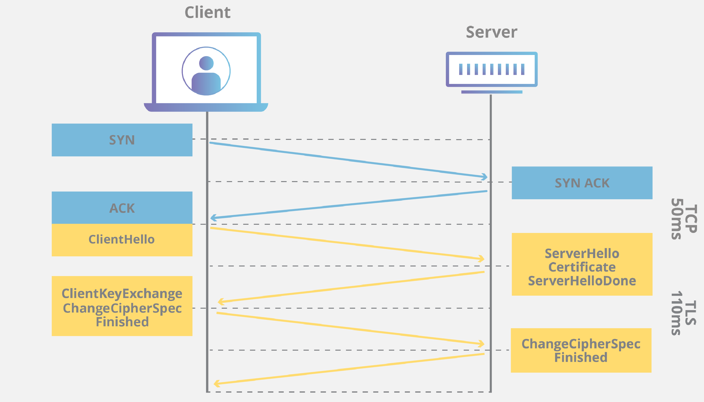

# Aula 09

Sumário

- [Aula 09](#aula-09)
  - [HTTPS](#https)
    - [TLS *Handshake*](#tls-handshake)
    - [SSL](#ssl)
  - [OWASP Risks](#owasp-risks)
  - [CORS](#cors)
  - [XSS](#xss)
  - [API Security Best Practices](#api-security-best-practices)
  - [Outros conceitos](#outros-conceitos)

## HTTPS

O *Hypertext Transfer Protocol Secure* é definido nos seguintes RFCs:

- [9110 - HTTP Semantics](https://www.rfc-editor.org/rfc/rfc9110.html), que define a estrutura central, semântica e os esquemas "http" e "https".
- [8446 - TLS 1.3](https://www.rfc-editor.org/rfc/rfc8446.html): protocolo de criptografia usado no HTTPS.
- [2818 - HTTP sobre TLS](https://www.rfc-editor.org/rfc/rfc2818.html): definição "original" do HTTPS.

O HTTPS é basicamente o HTTP executando sobre o TLS/SSL. Utiliza a porta 443, e a criptografia ocorre com a utilização do TLS (*Transport Layer Security*), de forma assíncrona:

1. **Chave privada**: controlada pelo dono do site, e fica armazenada em um servidor web para descriptografar as informações criptografadas com a chave pública.
2. **Chave pública**: disponível publicamente, via certificado SSL, para todos que queiram interagir com um servidor de uma maneira segura. As informações criptografadas com essa chave só podem ser descriptografadas pela chave privada.

Um certificado SSL pode ser comprado de algum provedor de serviço de hospedagem. Esse certificado pode ser compartilhado por vários usuários (*multi-domain SSL certificate*), ou pode ser individual (o que costuma ser mais caro). Dependendo do provedor de hospedagem, é possível ter um certificado compartilhado gratuito.

### TLS *Handshake*

<figure style="text-align:center;">
    
</figure>

Durante o *handshake* cliente e servidor fazer o seguinte:

- Especificam qual versão do TLS (TLS 1.0, 1.2, 1.3, etc.) será usado.
- Decidem quais conjuntos de cifras serão utilizados.
- Autenticam a identidade do servidor por meio da chave pública do servidor e da assinatura digital da autoridade de certificação SSL.
- Geram as chaves **de sessão** a fim de usar criptografia simétrica após a realização do *handshake*.

Etapas do *handshake* do TLS 1.3: [RFC 8446 - Seção 4](https://www.rfc-editor.org/rfc/rfc8446.html#page-24).

### SSL

Antigamente, o protocolo utilizado era o SSL (*Secure Sockets Layer* - [RFC 6101](https://datatracker.ietf.org/doc/html/rfc6101)). Ele foi desenvolvido inicialmente pela Netscape em 1995.

O seu funcionamento é basicamente o mesmo do TLS, ou seja, opera através de um *handshake*.

## [OWASP](https://owasp.org/about/) Risks

A *Open Worldwide Application Security Project* (OWASP) é uma fundação sem fins lucrativos que trabalha para melhorar a segurança de software, lançada em 1º de dezembro de 2001 e incorporada como uma organização sem fins lucrativos dos Estados Unidos em 21 de abril de 2004.

Eles se definem como uma comunidade aberta dedicada a capacitar organizações a conceber, desenvolver, adquirir, operar e manter aplicações confiáveis. Seus projetos, ferramentas, documentos, fóruns e capítulos são gratuitos e abertos a qualquer pessoa interessada em aprimorar a segurança de aplicações.

Os OWASP Risks consistem em um top 10 riscos de segurança de aplicação web. O [top 10 de 2025](https://owasp.org/Top10/2025/) inclui os seguintes riscos:

- A01:2025 - Broken Access Control
- A02:2025 - Security Misconfiguration
- A03:2025 - Software Supply Chain Failures
- A04:2025 - Cryptographic Failures
- A05:2025 - Injection
- A06:2025 - Insecure Design
- A07:2025 - Authentication Failures
- A08:2025 - Software or Data Integrity Failures
- A09:2025 - Security Logging and Alerting Failures
- A10:2025 - Mishandling of Exceptional Conditions

Eles também têm publicado o seguinte documento: [*Application Security Verification Standard*](https://raw.githubusercontent.com/OWASP/ASVS/v5.0.0/5.0/OWASP_Application_Security_Verification_Standard_5.0.0_en.pdf), também conhecido como ASVS, e está na versão 5.0.0.

## [CORS](https://developer.mozilla.org/en-US/docs/Web/HTTP/Guides/CORS)

O *Cross-Origin Resource Sharing* é um mecanismo baseado em cabeçalhos HTTP que permite a um servidor indicar qualquer origem (domínio, esquema ou porta) diferente da sua própria a partir da qual um navegador deve permitir o carregamento de recursos. Ele serve para flexibilizar de forma segura a "política de mesma origem" (*same origin policy*), que por padrão bloqueia scripts de interagir com recursos de outros domínios.

<figure style="text-align:center;">
    
</figure>

Seu funcionamento se baseia em adicionar novos cabeçalhos HTTP que permitem aos servidores descreverem quais origens são permitidas de lerem uma determinada informação de um navegador web.

[Mais detalhes](https://rbika.com/blog/understanding-cors).

## XSS

[*Cross-site scripting* - MDN](https://developer.mozilla.org/en-US/docs/Web/Security/Attacks/XSS)

[*Cross-site scripting* - OWASP](https://owasp.org/www-community/attacks/xss/)

## API Security Best Practices

[link](https://roadmap.sh/api-security-best-practices)

## Outros conceitos

[Hardened server](https://www.sophos.com/en-us/cybersecurity-explained/what-is-server-hardening).

[*Content Security Policy* (CSP)](https://developer.mozilla.org/en-US/docs/Web/HTTP/Guides/CSP)