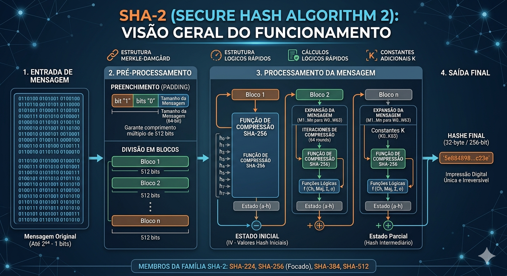
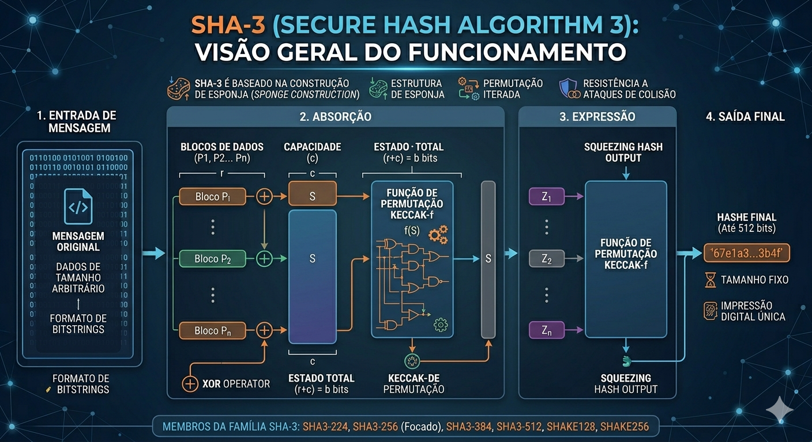

# Aula 10

**Sumário**

- [Aula 10](#aula-10)
  - [MD5](#md5)
    - [Algoritmo](#algoritmo)
      - [Passo 1 - Adição de bits de preenchimento](#passo-1---adição-de-bits-de-preenchimento)
      - [Passo 2 - Anexar o comprimento](#passo-2---anexar-o-comprimento)
      - [Passo 3 - Inicializar o *buffer* MD](#passo-3---inicializar-o-buffer-md)
      - [Passos 4 e 5](#passos-4-e-5)
    - [Segurança](#segurança)
  - [SHA](#sha)
  - [`bcrypt` e `scrypt`](#bcrypt-e-scrypt)
  - [Para pesquisar](#para-pesquisar)

## [MD5](https://www.rfc-editor.org/rfc/rfc1321.html)

O *Message-Digest Algorithm* é uma **função hash** que recebe como entrada uma mensagem de comprimento arbitrário e produz como saída uma "impressão digital" ou "resumo de mensagem" de 128 bits. Foi criado com o intuito de ser utilizado em aplicações de assinatura digital onde uma grade arquivo precisa ser comprimido de forma segura antes de ser criptografado. Isso faz com que ele possa ser usado como um *checksum* para verificar a **integridade dos dados**.

### Algoritmo

A mensagem pode ser composta por uma quantidade arbitrária de $b$ bits não negativos, ou seja, $b \geq 0$, e não pode ser múltiplo de 8. A mensagem então é percebida como um conjunto de bits: $m_{0}m{1} ... m_{b-1}$. A partir disso são aplicados 5 passos.

#### Passo 1 - Adição de bits de preenchimento

A mensagem $m$ é estendida de forma que **seu comprimento** seja congruente a 448 modulo 512. Em outras palavras são adicionados bits até que $b\text{ mod }512 = 448\text{ mod }512$. O preenchimento sempre vai ocorrer, mesmo se a mensagem já seja congruente a 448, modulo 512. O primeiro bit adicionado é $1$ e os demais são $0$.

A operação $mod$ com valores binários  `x % d` é equivalente a `x & (d-1)`. Suponha o seguinte valor: `1010100001`, e `512 = 1000000000`. Portanto, $1010100001\text{ mod }1000000000 \equiv 1010100001\text{ \& }0111111111 = 0010100001$. Supondo que o valor seja a mensagem, seu comprimento é 10, portanto `1010`, logo:

1. `1010` \% `1000000000` = `1010` = $10$.
2. Mensagem:`1010100001`**1**. Comprimento $11$: `1011` \% `1000000000` = `1011` = $11$.
3. Mensagem: `10101000011`**0**. Comprimento $12$: `1100` \% `1000000000` = `1100` = $12$.
4. Mensagem: `101010000110`**0**. Comprimento $13$: `1101` \% `1000000000` = `1101` = $13$.
5. $\dots$

Ou seja, a mensagem vai sendo preenchida até estar faltando 64 bits para um comprimento que seja múltiplo de 512.

#### Passo 2 - Anexar o comprimento

O comprimento da mensagem em bits $b$ (antes do preenchimento do Passo 1), expresso em 64 bits, é anexado ao fim da mensagem. Se o comprimento for maior do que 64 bits, os 64 bits de baixa ordem (da direita para a esquerda) de $b$ são usados.

#### Passo 3 - Inicializar o *buffer* MD

Um *buffer* de 4 palavras (A,B,C,D) é usado para computar a *message digest* (resumo da mensagem). Cada uma das palavras (A, B, C, D) é um registrador de 32 bits. Os registradores são inicializados com os seguintes valores em hexadecimal:

- **A**: `01 23 45 67`
- **B**: `89 ab cd ef`
- **C**: `fe dc ba 98`
- **D**: `76 54 32 10`

#### Passos 4 e 5

**Desafio**: Implementar de acordo com o [RFC 1321](https://www.rfc-editor.org/rfc/rfc1321.html)

### Segurança

Os hashes gerados pelo MD5 não são mais considerados criptograficamente seguros, porque:

1. Ataques de força bruta já são rápidos o suficiente. Ou seja, uma senha criptografada com MD5 já está passível de ser quebrada em pouco tempo (dependendo da máquina).
2. Já foi tão amplamente usado que existem bases de dados enormes de senhas e seus respectivos hashes. Portanto, há enormes chances de senhas simples e curtas já estarem disponíveis para consulta.
3. **Colisões**: isso acontece quando entradas diferentes geram o mesmo hash. Já foi reportado que em um Pentium 4 2,6 GHz conseguiram gerar colisões em 10 segundos.

**Alternativas**:

- SHA (*Secure Hash Algorithm*).
- Outros algoritmos de hash mais recentes (suportados pelo TLS 1.3).

## [SHA](https://www.rfc-editor.org/rfc/rfc3174)

O *Secure Hash Algorithm 1* (SHA-1) é uma versão modificada do MD5 e transforma um valor de entrada em uma saída de 160 bits. Foi projetado pela Agência Nacional de Segurança (NSA) dos Estados Unidados. Apesar de ainda ser amplamente utilizado já foi quebrado criptograficamente e no seu lugar devem ser usados o SHA-2 ou SHA-3.

O **SHA-2** compartilha da mesma filosofia de design do SHA-1 e consiste de seis funções hash que produzem hashes de tamanhos diferentes: SHA-224, SHA-256, SHA-384, SHA-512, SHA-512/224 e SHA-512/256. Eles são descritos no [RFC 6234](https://www.rfc-editor.org/rfc/rfc6234). É o padrão atual da indústria, utilizado em certificados SSL/TLS, assinaturas digitais e criptomoedas (como o Bitcoin).

<figure style="text-align:center;">
  
</figure>

O **SHA-3** (originalmente chamado de [Kecckak](https://keccak.team/)) é o mais recente e é [especificado](https://www.nist.gov/publications/sha-3-standard-permutation-based-hash-and-extendable-output-functions) pelo NIST (*National Institute of Standards and Technology*). Ele é fruto de uma [competição](https://csrc.nist.gov/projects/hash-functions/sha-3-project).

<figure style="text-align:center;">
  
</figure>

<!--
Comparação das funções SHA

| Algoritmo e variante | Tamanho de saída | Tamanho de estado interno (bits) | Tamanho do bloco | Rodadas | Operações | Ano de publicação |
|---|---|---|---|---|---|---|
| MD5 (como referência) | 128 | 128 (4 x 32) | 512 | 4 (16 operações em cada rodada) | AND, XOR, OR, ROT, ADD (mod 2^32) | 1992 |
| SHA-0 | 160 | 160 (5 x 32) | 512 | 80 | AND, XOR, OR, ROT, ADD (mod 2^32) | 1993 |
| SHA-1 | 160 | 160 (5 x 32) | 512 | 80 | AND, XOR, OR, ROT, ADD (mod 2^32) | 1995 |
| SHA-2 (SHA-224) | 224 | 256 (8 x 32) | 512 | 64 | AND, XOR, ROT, SHR, ADD (mod 2^32) | 2004 |
-->

## `bcrypt` e [`scrypt`](https://www.tarsnap.com/scrypt.html)

O **bcrypt** é um algoritmo de hashing de senhas criado em 1999 por Niels Provos e David Mazières. Ele foi projetado para ser deliberadamente lento e caro de computar. Ele usa um algoritmo de codificação adaptativo. Ele repete um processo de hash várias vezes (chamado de "fator de custo"), tornando o hash resultante resistente a ataques de força bruta, mesmo com hardware potente. Ele também incorpora automaticamente um "salt" (um valor aleatório) ao hash para evitar ataques de tabela de arco-íris (*Rainbow Tables*).

É extremamente popular para hash e armazenamento de senhas em bancos de dados de aplicações web e móveis. É a opção padrão em muitos frameworks modernos (como **Ruby on Rails**, **Django**, e **Laravel**) para gerenciamento de usuários.

O **scrypt** é um algoritmo de hash de senhas mais recente, criado por Colin Percival em 2009. Ele foi projetado não apenas para ser lento em termos de CPU, mas também para ser intensivo em termos de memória. Ele opera de forma semelhante ao bcrypt, mas introduz um requisito significativo de RAM. O algoritmo exige que uma grande quantidade de memória seja acessada e manipulada durante o processo de hash. Isso torna extremamente caro e ineficiente criar hardware personalizado para realizar ataques de força bruta em massa contra o scrypt.

É usado principalmente em sistemas onde a segurança máxima é a prioridade mais alta e onde o uso intensivo de recursos do servidor para hash é aceitável. Ele é amplamente utilizado em criptomoedas (como o Litecoin e o **Dogecoin**) como prova de trabalho e para gerar chaves de criptografia para carteiras de criptomoedas, bem como para hash de senhas em sistemas de arquivos criptografados e bancos de dados de alta segurança.

**Bcrypt** e **scrypt** são parentes próximos no mundo da criptografia. Ambos são funções de derivação de chave (KDFs) projetadas para tornar o hash de senhas um processo lento e caro, ao contrário de funções como SHA-256, que são otimizadas para velocidade.

## Para pesquisar

**Argon2**