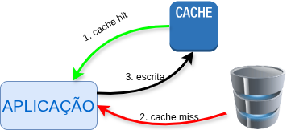
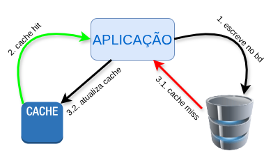

# Aula 12

## *Caching*

O armazenamento em cache é uma técnica utilizada para guardar cópias de dados em um local de armazenamento temporário, permitindo que solicitações futuras desses dados sejam atendidas **mais rapidamente**. Esse armazenamento temporário, conhecido como cache, pode estar localizado **mais próximo da origem da solicitação do que a fonte original dos dados**, **reduzindo a latência** e **melhorando o desempenho da aplicação**. Ao recuperar os dados do(a) cache em vez da fonte original, as aplicações podem responder com mais rapidez e eficiência.

O(A) cache do lado do cliente armazena dados localmente nos dispositivos dos usuários para melhorar o desempenho e reduzir a carga do servidor. Utiliza cabeçalhos de cache HTTP, *service workers* e APIs de armazenamento local. Os arquivos são armazenados até que seu **TTL** (*Time To Live*) expira, ou até que o(a) cache fique lotado.

Outros tipos de cache são o(a) cache DNS e caches de servidores **CDN** (*Content Delivery Network*). O(A) cache DNS armazena os IPs dos sites visitados evitando a necessidade de consulta aos servidores DNS.

O(A) cache CDN funciona armazenando conteúdos (como imagens, vídeos e páginas web) em servidores proxy que estão mais próximos do usuários finais do que o servidores de origem e, por isso, conseguem entregar os conteúdos de forma mais rápida.

### Estratégias de *caching*

#### Cache-Aside

Ou "cache de lado/aparte". O(A) cache fica em um servidor secundário e o aplicativo se comunica diretamente tanto com o(a) cache quanto com o banco de dados. Não há conexão entre o cache e o banco de dados principal. Todas as operações de cache e banco de dados são gerenciadas pelo aplicativo.

<figure style="text-align:center;">
    
</figure>

1. A aplicação verifica primeio o(a) cache.
2. Se os dados são encontrados houve um *cache hit* (acerto de cache). Os dados são lidos e retornados ao cliente.
3. Se os dados não são encontrados, houve um *cache miss* (falha de cache). Nesse caso a aplicação faz a requisição para o servidor, e quando recebe o conteúdo, armazena também no(a) cache.

Os exemplos mais comuns: [Redis](https://redis.io/) e [Memcached](https://github.com/memcached/memcached#readme).

#### Read-Through

Nessa estratégia o(a) cache fica entre a aplicação e o banco de dados. Se houver um *cache miss* o(a) cache carrega os dados do servidor, armazena em si, e envia os dados para a aplicação.

<figure style="text-align:center;">
    
</figure>

As duas principais diferenças em relação ao *Cache-Aside* são:

- O(A) cache é quem busca os dados no servidor.
- Os dados presentes no(a) cache não podem ser diferentes daquele do servidor.

#### Write-Through

Os dados são primeiros escritos no(a) cache e o(a) cache escreve no banco de dados.

<figure style="text-align:center;">
    
</figure>

#### Write-Around

Os dados são escritos diretamente no banco de dados e somente os dados que são lidos é que são armazenados no(a) cache.

<figure style="text-align:center;">
    
</figure>

#### Write-Back

A aplicação escreve no(a) cache constantemente. Posteriormente o(a) cache escreve no banco de dados.

Neste caso a atualização do banco de dados é **assíncrona**, e a diferença principal para o *Write-Through* é que neste a atualização do banco de dados é feita de forma **síncrona**, ou imediata.

<figure style="text-align:center;">
    
</figure>

## Atividade

1. A turma deve ser dividida em 5 grupos
   1. Cada grupo ficará responsável por uma estratégia de caching.
2. Cada grupo deverá apresentar **vantagens**, **desvantagens** e **3 casos de uso**.

## Tarefa de casa

1. Estudar e resumir o [RFC 9111 - HTTP Caching](https://www.rfc-editor.org/rfc/rfc9111.html).
2. Enviar o resumo **manuscrito** para o meu e-mail (`pdf`, `png` ou `jpeg`) até o próximo sábado 09/05/26 às 23:59.
   1. O assunto do e-mail deve ser: PWeb2 - Resumo HTTP Caching - Nome.

---

    
<b>Fontes</b>:

    <ul>
        <li><a href="https://aws.amazon.com/pt/caching/">Visão geral do armazenamento em cache</a></li>
        <li><a href="https://www.cloudflare.com/en-gb/learning/cdn/what-is-caching/">What is caching?</a></li>
        <li><a href="https://codeahoy.com/2017/08/11/caching-strategies-and-how-to-choose-the-right-one/">Caching Strategies and How to Choose the Right One</a></li>
        <li><a href="https://blog.bytebytego.com/p/top-caching-strategies">Top caching strategies</a></li>
    </ul>

