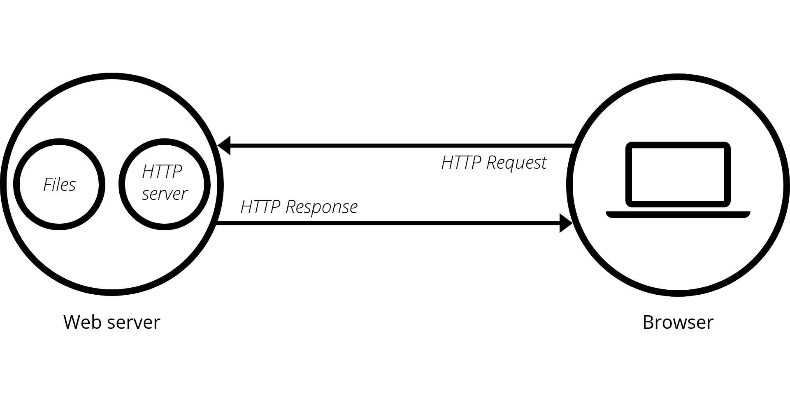
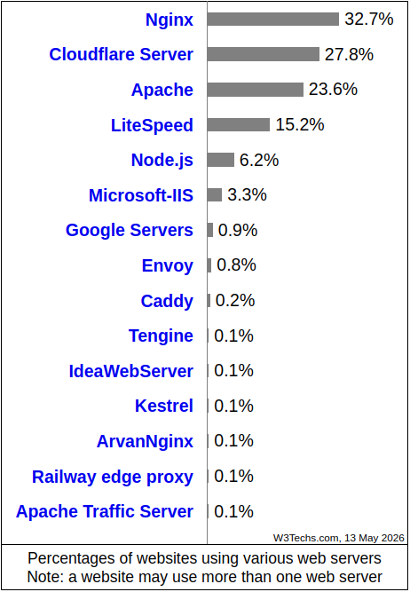

# Aula 13

## Servidores Web[^1]

[^1]: Fonte: [O que é um servidor web (web server)?](https://developer.mozilla.org/pt-BR/docs/Learn_web_development/Howto/Web_mechanics/What_is_a_web_server)

O termo Servidor Web pode se referir ao hardware ou software, ou ambos juntos.

- **Hardware**: é um computador que armazena arquivos que compõem os sites (por exemplo, documentos HTML, imagens, folhas de estilo, e arquivos JavaScript) e os entrega para o dispositivo do usuário final. Está conectado a Internet e pode ser acessado através do seu nome de domínio (DNS).
- **Software**: inclui diversos componentes que controlam como os usuários acessam os arquivos hospedados, no mínimo um **servidor HTTP**.
  - Um servidor HTTP é um software que compreende URLs (endereços web) e HTTP (o protocolo que seu navegador utiliza para visualizar páginas web.

Em um nível mais básico, o navegador fará uma requisição utilizando o protocolo HTTP sempre que necessitar de um um arquivo hospedado em um servidor web. Quando a requisição alcançar o servidor web correto (hardware), o servidor HTTP (software) enviará o documento requerido, também via HTTP.

<figure style="text-align:center;">
    
</figure>

Para publicar um website, é necessário ou um servidor web estático ou um dinâmico.

- **Servidor estático**: consiste em um computador (hardware) com um servidor HTTP (software). É chamado "estático" porque o servidor envia seus arquivos tal como foram criados e armazenados (hospedados) ao navegador.
- **Servidor dinâmico**: consiste em um servidor web estático com software adicional, mais comumente um servidor de aplicações (application server) e um banco de dados (database). É chamado "dinâmico" porque o servidor de aplicações atualiza os arquivos hospedados antes de enviá-los ao navegador através do servidor HTTP.

O mercado de servidores web de acordo com a [W3Techs](https://w3techs.com/technologies/overview/web_server):

<figure style="text-align:center;">
    
</figure>

[**Comparação entre servidores web**](https://en.wikipedia.org/wiki/Comparison_of_web_server_software)

## [**Nginx**](https://nginx.org/)

É um servidor web HTTP [*open-source*](https://github.com/nginx/nginx) e também:

- *Reverse proxy*[^2]: um servidor que atua como intermediário entre as necessidades externas e internas (como navegadores da web) e os servidores internos. Ele serve como um elo entre o cliente e o servidor, recebendo as solicitações do servidor e encaminhando-as para o servidor correto. Suas principais funções e benfícios são: 
  - **Balanceamento de carga**.
  - **Segurança aprimorada**: oculta a identidade e o endereço IP dos servidores de back-end da internet, protegendo-os contra ataques.
  - **Terminação SSL/TLS** (gerencia conexões HTTPS criptografadas, aliviando a carga dos servidores).
  - **Caching**.
  - **Compressão**: otimiza a transmissão de dados ao comprimir o conteúdo, diminuindo o tempo de carregamento.
- Servidor proxy TCP/UDP.
- Servidor proxy de e-mail.

[^2]: Para entender melhor a diferença entre um *servidor proxy* e um *servidor proxy reverso* [clique aqui](https://www.geeksforgeeks.org/computer-networks/difference-between-a-proxy-server-and-a-reverse-proxy-server/).

## [Apache HTTP Server](https://httpd.apache.org/)

De acordo com o site oficial, o *Apache HTTP Server Project* é um esforço para desenvolver e manter um servidor HTTP de [código aberto](https://github.com/apache/httpd) para sistemas operacionais modernos, incluindo UNIX e Windows. O objetivo deste projeto é fornecer um servidor seguro, eficiente e extensível que ofereça serviços HTTP em conformidade com os padrões HTTP atuais.

É um projeto da [*The Apache Software Foundation*](https://www.apache.org/).

Ele oferece suporte a uma variedade de recursos, muitos implementados como módulos compilados que estendem a funcionalidade principal: 

- Esquemas de **autenticação**: *mod_access*, *mod_auth*, *mod_digest* e *mod_auth_digest*.
- **Suporte a linguagens de programação do lado do servidor**. 
- Suporte a **SSL/TLS** (*mod_ssl*) .
- Módulo de proxy (**mod_proxy**).
- Módulo de reescrita de URLs (**mod_rewrite**), arquivos de log personalizados (**mod_log_config**) e suporte a filtragem (**mod_include** e **mod_ext_filter**).
- Módulos de compressão.
- etc.

## Breve comparação

O **Nginx** geralmente é superior para alto tráfego, conteúdo estático e proxy devido à sua **arquitetura orientada a eventos**, enquanto o **Apache** se destaca em flexibilidade, facilidade de configuração (`.htaccess`) e gerenciamento de conteúdo dinâmico. O **Nginx** é 2 a 3 vezes mais rápido no serviço de conteúdo estático e usa menos memória, tornando-o ideal para VPS (*Virtual Private Server*) modernos.

- **Arquitetura**: O Nginx utiliza uma abordagem assíncrona, orientada a eventos, lidando com milhares de conexões com poucos recursos. O Apache tradicionalmente utiliza uma abordagem orientada a processos, atribuindo threads às requisições, embora possua um módulo baseado em eventos (Event MPM).
- **Desempenho**: O Nginx supera o Apache sob carga pesada e concorrência.
- **Configuração**: O Apache suporta configuração descentralizada (`.htaccess` em cada diretório), o que é ideal para hospedagem compartilhada. O Nginx utiliza a configuração centralizada, que é mais segura e geralmente mais rápida.
- **Casos de uso**: O Nginx é melhor para sites de alto tráfego, *reverse proxying* e conteúdo estático. O Apache é melhor para projetos que requerem alta personalização, módulos especializados, ou ambientes de hospedagem compartilhada.

## Exemplo

Exemplo de uso do Nginx e Apache2, retirados [desse site](https://medium.com/@muhammadimron1410/guide-to-creating-a-simple-web-server-using-nginx-and-apache2-ae7d27b421c6).